

# Module `0x1::account`

-  [Resource `Account`](#0x1_account_Account)
-  [Struct `KeyRotationEvent`](#0x1_account_KeyRotationEvent)
-  [Struct `CoinRegisterEvent`](#0x1_account_CoinRegisterEvent)
-  [Struct `CapabilityOffer`](#0x1_account_CapabilityOffer)
-  [Struct `RotationCapability`](#0x1_account_RotationCapability)
-  [Struct `SignerCapability`](#0x1_account_SignerCapability)
-  [Resource `OriginatingAddress`](#0x1_account_OriginatingAddress)
-  [Struct `RotationProofChallenge`](#0x1_account_RotationProofChallenge)
-  [Struct `RotationCapabilityOfferProofChallenge`](#0x1_account_RotationCapabilityOfferProofChallenge)
-  [Struct `SignerCapabilityOfferProofChallenge`](#0x1_account_SignerCapabilityOfferProofChallenge)
-  [Struct `SignerCapabilityOfferProofChallengeV2`](#0x1_account_SignerCapabilityOfferProofChallengeV2)
-  [Constants](#@Constants_0)
-  [Function `create_signer`](#0x1_account_create_signer)
-  [Function `initialize`](#0x1_account_initialize)
-  [Function `create_account`](#0x1_account_create_account)
-  [Function `create_account_unchecked`](#0x1_account_create_account_unchecked)
-  [Function `exists_at`](#0x1_account_exists_at)
-  [Function `get_guid_next_creation_num`](#0x1_account_get_guid_next_creation_num)
-  [Function `get_sequence_number`](#0x1_account_get_sequence_number)
-  [Function `increment_sequence_number`](#0x1_account_increment_sequence_number)
-  [Function `get_authentication_key`](#0x1_account_get_authentication_key)
-  [Function `rotate_authentication_key_internal`](#0x1_account_rotate_authentication_key_internal)
-  [Function `assert_valid_signature_and_get_auth_key`](#0x1_account_assert_valid_signature_and_get_auth_key)
-  [Function `rotate_authentication_key`](#0x1_account_rotate_authentication_key)
-  [Function `offer_signer_capability`](#0x1_account_offer_signer_capability)
-  [Function `revoke_signer_capability`](#0x1_account_revoke_signer_capability)
-  [Function `create_authorized_signer`](#0x1_account_create_authorized_signer)
-  [Function `create_resource_address`](#0x1_account_create_resource_address)
-  [Function `create_resource_account`](#0x1_account_create_resource_account)
-  [Function `create_framework_reserved_account`](#0x1_account_create_framework_reserved_account)
-  [Function `create_guid`](#0x1_account_create_guid)
-  [Function `new_event_handle`](#0x1_account_new_event_handle)
-  [Function `register_coin`](#0x1_account_register_coin)
-  [Function `create_signer_with_capability`](#0x1_account_create_signer_with_capability)
-  [Function `get_signer_capability_address`](#0x1_account_get_signer_capability_address)
-  [Specification](#@Specification_1)
    -  [Function `create_signer`](#@Specification_1_create_signer)

<pre><code><b>use</b> <a href="../../aptos-stdlib/../move-stdlib/doc/bcs.md#0x1_bcs">0x1::bcs</a>;
<b>use</b> <a href="../../aptos-stdlib/doc/ed25519.md#0x1_ed25519">0x1::ed25519</a>;
<b>use</b> <a href="../../aptos-stdlib/../move-stdlib/doc/error.md#0x1_error">0x1::error</a>;
<b>use</b> <a href="event.md#0x1_event">0x1::event</a>;
<b>use</b> <a href="../../aptos-stdlib/doc/from_bcs.md#0x1_from_bcs">0x1::from_bcs</a>;
<b>use</b> <a href="guid.md#0x1_guid">0x1::guid</a>;
<b>use</b> <a href="../../aptos-stdlib/doc/hash.md#0x1_hash">0x1::hash</a>;
<b>use</b> <a href="../../aptos-stdlib/doc/multi_ed25519.md#0x1_multi_ed25519">0x1::multi_ed25519</a>;
<b>use</b> <a href="../../aptos-stdlib/../move-stdlib/doc/option.md#0x1_option">0x1::option</a>;
<b>use</b> <a href="../../aptos-stdlib/../move-stdlib/doc/signer.md#0x1_signer">0x1::signer</a>;
<b>use</b> <a href="system_addresses.md#0x1_system_addresses">0x1::system_addresses</a>;
<b>use</b> <a href="../../aptos-stdlib/doc/table.md#0x1_table">0x1::table</a>;
<b>use</b> <a href="../../aptos-stdlib/doc/type_info.md#0x1_type_info">0x1::type_info</a>;
<b>use</b> <a href="../../aptos-stdlib/../move-stdlib/doc/vector.md#0x1_vector">0x1::vector</a>;
</code></pre>

Show all the modules that "account" depends on directly or indirectly

Show all the modules that depend on "account" directly or indirectly

## Resource `Account`

Resource representing an account.

<pre><code><b>struct</b> <a href="account.md#0x1_account_Account">Account</a> <b>has</b> store, key
</code></pre>

Fields

<dl>
<dt>
<code>authentication_key: <a href="../../aptos-stdlib/../move-stdlib/doc/vector.md#0x1_vector">vector</a>&lt;u8&gt;</code>
</dt>
<dd>

</dd>
<dt>
<code>sequence_number: u64</code>
</dt>
<dd>

</dd>
<dt>
<code>guid_creation_num: u64</code>
</dt>
<dd>

</dd>
<dt>
<code>coin_register_events: <a href="event.md#0x1_event_EventHandle">event::EventHandle</a>&lt;<a href="account.md#0x1_account_CoinRegisterEvent">account::CoinRegisterEvent</a>&gt;</code>
</dt>
<dd>

</dd>
<dt>
<code>key_rotation_events: <a href="event.md#0x1_event_EventHandle">event::EventHandle</a>&lt;<a href="account.md#0x1_account_KeyRotationEvent">account::KeyRotationEvent</a>&gt;</code>
</dt>
<dd>

</dd>
<dt>
<code>rotation_capability_offer: <a href="account.md#0x1_account_CapabilityOffer">account::CapabilityOffer</a>&lt;<a href="account.md#0x1_account_RotationCapability">account::RotationCapability</a>&gt;</code>
</dt>
<dd>

</dd>
<dt>
<code>signer_capability_offer: <a href="account.md#0x1_account_CapabilityOffer">account::CapabilityOffer</a>&lt;<a href="account.md#0x1_account_SignerCapability">account::SignerCapability</a>&gt;</code>
</dt>
<dd>

</dd>
</dl>

## Struct `KeyRotationEvent`

<pre><code><b>struct</b> <a href="account.md#0x1_account_KeyRotationEvent">KeyRotationEvent</a> <b>has</b> drop, store
</code></pre>

Fields

<dl>
<dt>
<code>old_authentication_key: <a href="../../aptos-stdlib/../move-stdlib/doc/vector.md#0x1_vector">vector</a>&lt;u8&gt;</code>
</dt>
<dd>

</dd>
<dt>
<code>new_authentication_key: <a href="../../aptos-stdlib/../move-stdlib/doc/vector.md#0x1_vector">vector</a>&lt;u8&gt;</code>
</dt>
<dd>

</dd>
</dl>

## Struct `CoinRegisterEvent`

<pre><code><b>struct</b> <a href="account.md#0x1_account_CoinRegisterEvent">CoinRegisterEvent</a> <b>has</b> drop, store
</code></pre>

Fields

<dl>
<dt>
<code><a href="../../aptos-stdlib/doc/type_info.md#0x1_type_info">type_info</a>: <a href="../../aptos-stdlib/doc/type_info.md#0x1_type_info_TypeInfo">type_info::TypeInfo</a></code>
</dt>
<dd>

</dd>
</dl>

## Struct `CapabilityOffer`

<pre><code><b>struct</b> <a href="account.md#0x1_account_CapabilityOffer">CapabilityOffer</a>&lt;T&gt; <b>has</b> store
</code></pre>

Fields

<dl>
<dt>
<code>for: <a href="../../aptos-stdlib/../move-stdlib/doc/option.md#0x1_option_Option">option::Option</a>&lt;<b>address</b>&gt;</code>
</dt>
<dd>

</dd>
</dl>

## Struct `RotationCapability`

<pre><code><b>struct</b> <a href="account.md#0x1_account_RotationCapability">RotationCapability</a> <b>has</b> drop, store
</code></pre>

Fields

<dl>
<dt>
<code><a href="account.md#0x1_account">account</a>: <b>address</b></code>
</dt>
<dd>

</dd>
</dl>

## Struct `SignerCapability`

<pre><code><b>struct</b> <a href="account.md#0x1_account_SignerCapability">SignerCapability</a> <b>has</b> drop, store
</code></pre>

Fields

<dl>
<dt>
<code><a href="account.md#0x1_account">account</a>: <b>address</b></code>
</dt>
<dd>

</dd>
</dl>

## Resource `OriginatingAddress`

<pre><code><b>struct</b> <a href="account.md#0x1_account_OriginatingAddress">OriginatingAddress</a> <b>has</b> key
</code></pre>

Fields

<dl>
<dt>
<code>address_map: <a href="../../aptos-stdlib/doc/table.md#0x1_table_Table">table::Table</a>&lt;<b>address</b>, <b>address</b>&gt;</code>
</dt>
<dd>

</dd>
</dl>

## Struct `RotationProofChallenge`

This structs stores the challenge message that should be signed during key rotation. First, this struct is
signed by the account owner's current public key, which proves possession of a capability to rotate the key.
Second, this struct is signed by the new public key that the account owner wants to rotate to, which proves
knowledge of this new public key's associated secret key. These two signatures cannot be replayed in another
context because they include the TXN's unique sequence number.

<pre><code><b>struct</b> <a href="account.md#0x1_account_RotationProofChallenge">RotationProofChallenge</a> <b>has</b> <b>copy</b>, drop
</code></pre>

Fields

<dl>
<dt>
<code>sequence_number: u64</code>
</dt>
<dd>

</dd>
<dt>
<code>originator: <b>address</b></code>
</dt>
<dd>

</dd>
<dt>
<code>current_auth_key: <b>address</b></code>
</dt>
<dd>

</dd>
<dt>
<code>new_public_key: <a href="../../aptos-stdlib/../move-stdlib/doc/vector.md#0x1_vector">vector</a>&lt;u8&gt;</code>
</dt>
<dd>

</dd>
</dl>

## Struct `RotationCapabilityOfferProofChallenge`

<pre><code><b>struct</b> <a href="account.md#0x1_account_RotationCapabilityOfferProofChallenge">RotationCapabilityOfferProofChallenge</a> <b>has</b> drop
</code></pre>

Fields

<dl>
<dt>
<code>sequence_number: u64</code>
</dt>
<dd>

</dd>
<dt>
<code>recipient_address: <b>address</b></code>
</dt>
<dd>

</dd>
</dl>

## Struct `SignerCapabilityOfferProofChallenge`

<pre><code><b>struct</b> <a href="account.md#0x1_account_SignerCapabilityOfferProofChallenge">SignerCapabilityOfferProofChallenge</a> <b>has</b> drop
</code></pre>

Fields

<dl>
<dt>
<code>sequence_number: u64</code>
</dt>
<dd>

</dd>
<dt>
<code>recipient_address: <b>address</b></code>
</dt>
<dd>

</dd>
</dl>

## Struct `SignerCapabilityOfferProofChallengeV2`

<pre><code><b>struct</b> <a href="account.md#0x1_account_SignerCapabilityOfferProofChallengeV2">SignerCapabilityOfferProofChallengeV2</a> <b>has</b> drop
</code></pre>

Fields

<dl>
<dt>
<code>sequence_number: u64</code>
</dt>
<dd>

</dd>
<dt>
<code>source_address: <b>address</b></code>
</dt>
<dd>

</dd>
<dt>
<code>recipient_address: <b>address</b></code>
</dt>
<dd>

</dd>
</dl>

## Constants

<pre><code><b>const</b> <a href="account.md#0x1_account_MAX_U64">MAX_U64</a>: u128 = 18446744073709551615;
</code></pre>

Scheme identifier used when hashing an account's address together with a seed to derive the address (not the
authentication key) of a resource account. This is an abuse of the notion of a scheme identifier which, for now,
serves to domain separate hashes used to derive resource account addresses from hashes used to derive
authentication keys. Without such separation, an adversary could create (and get a signer for) a resource account
whose address matches an existing address of a MultiEd25519 wallet.

<pre><code><b>const</b> <a href="account.md#0x1_account_DERIVE_RESOURCE_ACCOUNT_SCHEME">DERIVE_RESOURCE_ACCOUNT_SCHEME</a>: u8 = 255;
</code></pre>

Account already exists

<pre><code><b>const</b> <a href="account.md#0x1_account_EACCOUNT_ALREADY_EXISTS">EACCOUNT_ALREADY_EXISTS</a>: u64 = 1;
</code></pre>

An attempt to create a resource account on an account that has a committed transaction

<pre><code><b>const</b> <a href="account.md#0x1_account_EACCOUNT_ALREADY_USED">EACCOUNT_ALREADY_USED</a>: u64 = 16;
</code></pre>

Account does not exist

<pre><code><b>const</b> <a href="account.md#0x1_account_EACCOUNT_DOES_NOT_EXIST">EACCOUNT_DOES_NOT_EXIST</a>: u64 = 2;
</code></pre>

Cannot create account because address is reserved

<pre><code><b>const</b> <a href="account.md#0x1_account_ECANNOT_RESERVED_ADDRESS">ECANNOT_RESERVED_ADDRESS</a>: u64 = 5;
</code></pre>

Scheme identifier for Ed25519 signatures used to derive authentication keys for Ed25519 public keys.

<pre><code><b>const</b> <a href="account.md#0x1_account_ED25519_SCHEME">ED25519_SCHEME</a>: u8 = 0;
</code></pre>

The caller does not have a valid rotation capability offer from the other account

<pre><code><b>const</b> <a href="account.md#0x1_account_EINVALID_ACCEPT_ROTATION_CAPABILITY">EINVALID_ACCEPT_ROTATION_CAPABILITY</a>: u64 = 10;
</code></pre>

Abort the transaction if the expected originating address is different from the originating addres on-chain

<pre><code><b>const</b> <a href="account.md#0x1_account_EINVALID_ORIGINATING_ADDRESS">EINVALID_ORIGINATING_ADDRESS</a>: u64 = 13;
</code></pre>

Specified proof of knowledge required to prove ownership of a public key is invalid

<pre><code><b>const</b> <a href="account.md#0x1_account_EINVALID_PROOF_OF_KNOWLEDGE">EINVALID_PROOF_OF_KNOWLEDGE</a>: u64 = 8;
</code></pre>

Specified scheme required to proceed with the smart contract operation - can only be ED25519_SCHEME(0) OR MULTI_ED25519_SCHEME(1)

<pre><code><b>const</b> <a href="account.md#0x1_account_EINVALID_SCHEME">EINVALID_SCHEME</a>: u64 = 12;
</code></pre>

The provided authentication key has an invalid length

<pre><code><b>const</b> <a href="account.md#0x1_account_EMALFORMED_AUTHENTICATION_KEY">EMALFORMED_AUTHENTICATION_KEY</a>: u64 = 4;
</code></pre>

The caller does not have a digital-signature-based capability to call this function

<pre><code><b>const</b> <a href="account.md#0x1_account_ENO_CAPABILITY">ENO_CAPABILITY</a>: u64 = 9;
</code></pre>

The signer capability doesn't exist at the given address

<pre><code><b>const</b> <a href="account.md#0x1_account_ENO_SUCH_SIGNER_CAPABILITY">ENO_SUCH_SIGNER_CAPABILITY</a>: u64 = 14;
</code></pre>

Address to create is not a valid reserved address for Aptos framework

<pre><code><b>const</b> <a href="account.md#0x1_account_ENO_VALID_FRAMEWORK_RESERVED_ADDRESS">ENO_VALID_FRAMEWORK_RESERVED_ADDRESS</a>: u64 = 11;
</code></pre>

Transaction exceeded its allocated max gas

<pre><code><b>const</b> <a href="account.md#0x1_account_EOUT_OF_GAS">EOUT_OF_GAS</a>: u64 = 6;
</code></pre>

An attempt to create a resource account on a claimed account

<pre><code><b>const</b> <a href="account.md#0x1_account_ERESOURCE_ACCCOUNT_EXISTS">ERESOURCE_ACCCOUNT_EXISTS</a>: u64 = 15;
</code></pre>

Sequence number exceeds the maximum value for a u64

<pre><code><b>const</b> <a href="account.md#0x1_account_ESEQUENCE_NUMBER_TOO_BIG">ESEQUENCE_NUMBER_TOO_BIG</a>: u64 = 3;
</code></pre>

Specified current public key is not correct

<pre><code><b>const</b> <a href="account.md#0x1_account_EWRONG_CURRENT_PUBLIC_KEY">EWRONG_CURRENT_PUBLIC_KEY</a>: u64 = 7;
</code></pre>

Scheme identifier for MultiEd25519 signatures used to derive authentication keys for MultiEd25519 public keys.

<pre><code><b>const</b> <a href="account.md#0x1_account_MULTI_ED25519_SCHEME">MULTI_ED25519_SCHEME</a>: u8 = 1;
</code></pre>

<pre><code><b>const</b> <a href="account.md#0x1_account_ZERO_AUTH_KEY">ZERO_AUTH_KEY</a>: <a href="../../aptos-stdlib/../move-stdlib/doc/vector.md#0x1_vector">vector</a>&lt;u8&gt; = [0, 0, 0, 0, 0, 0, 0, 0, 0, 0, 0, 0, 0, 0, 0, 0, 0, 0, 0, 0, 0, 0, 0, 0, 0, 0, 0, 0, 0, 0, 0, 0];
</code></pre>

## Function `create_signer`

<pre><code><b>fun</b> <a href="account.md#0x1_account_create_signer">create_signer</a>(addr: <b>address</b>): <a href="../../aptos-stdlib/../move-stdlib/doc/signer.md#0x1_signer">signer</a>
</code></pre>

Implementation

<pre><code><b>native</b> <b>fun</b> <a href="account.md#0x1_account_create_signer">create_signer</a>(addr: <b>address</b>): <a href="../../aptos-stdlib/../move-stdlib/doc/signer.md#0x1_signer">signer</a>;
</code></pre>

Show all the functions that "create_signer" calls

Show all the functions that call "create_signer"

## Function `initialize`

Only called during genesis to initialize system resources for this module.

<pre><code><b>public</b>(<b>friend</b>) <b>fun</b> <a href="account.md#0x1_account_initialize">initialize</a>(aptos_framework: &<a href="../../aptos-stdlib/../move-stdlib/doc/signer.md#0x1_signer">signer</a>)
</code></pre>

Implementation

<pre><code><b>public</b>(<b>friend</b>) <b>fun</b> <a href="account.md#0x1_account_initialize">initialize</a>(aptos_framework: &<a href="../../aptos-stdlib/../move-stdlib/doc/signer.md#0x1_signer">signer</a>) {
    <a href="system_addresses.md#0x1_system_addresses_assert_aptos_framework">system_addresses::assert_aptos_framework</a>(aptos_framework);
    <b>move_to</b>(aptos_framework, <a href="account.md#0x1_account_OriginatingAddress">OriginatingAddress</a> {
        address_map: <a href="../../aptos-stdlib/doc/table.md#0x1_table_new">table::new</a>(),
    });
}
</code></pre>

Show all the functions that "initialize" calls

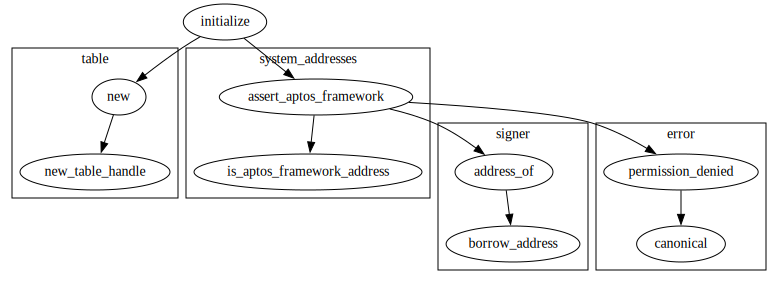

Show all the functions that call "initialize"

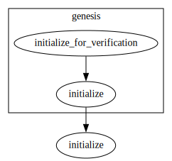

## Function `create_account`

Publishes a new <code><a href="account.md#0x1_account_Account">Account</a></code> resource under <code>new_address</code>. A signer representing <code>new_address</code>
is returned. This way, the caller of this function can publish additional resources under
<code>new_address</code>.

<pre><code><b>public</b>(<b>friend</b>) <b>fun</b> <a href="account.md#0x1_account_create_account">create_account</a>(new_address: <b>address</b>): <a href="../../aptos-stdlib/../move-stdlib/doc/signer.md#0x1_signer">signer</a>
</code></pre>

Implementation

<pre><code><b>public</b>(<b>friend</b>) <b>fun</b> <a href="account.md#0x1_account_create_account">create_account</a>(new_address: <b>address</b>): <a href="../../aptos-stdlib/../move-stdlib/doc/signer.md#0x1_signer">signer</a> {
    // there cannot be an <a href="account.md#0x1_account_Account">Account</a> resource under new_addr already.
    <b>assert</b>!(!<b>exists</b>&lt;<a href="account.md#0x1_account_Account">Account</a>&gt;(new_address), <a href="../../aptos-stdlib/../move-stdlib/doc/error.md#0x1_error_already_exists">error::already_exists</a>(<a href="account.md#0x1_account_EACCOUNT_ALREADY_EXISTS">EACCOUNT_ALREADY_EXISTS</a>));

    // NOTE: @core_resources gets created via a `create_account` call, so we do not <b>include</b> it below.
    <b>assert</b>!(
        new_address != @vm_reserved && new_address != @aptos_framework && new_address != @aptos_token,
        <a href="../../aptos-stdlib/../move-stdlib/doc/error.md#0x1_error_invalid_argument">error::invalid_argument</a>(<a href="account.md#0x1_account_ECANNOT_RESERVED_ADDRESS">ECANNOT_RESERVED_ADDRESS</a>)
    );

    <a href="account.md#0x1_account_create_account_unchecked">create_account_unchecked</a>(new_address)
}
</code></pre>

Show all the functions that "create_account" calls

Show all the functions that call "create_account"

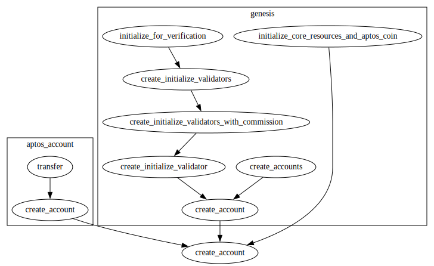

## Function `create_account_unchecked`

<pre><code><b>fun</b> <a href="account.md#0x1_account_create_account_unchecked">create_account_unchecked</a>(new_address: <b>address</b>): <a href="../../aptos-stdlib/../move-stdlib/doc/signer.md#0x1_signer">signer</a>
</code></pre>

Implementation

<pre><code><b>fun</b> <a href="account.md#0x1_account_create_account_unchecked">create_account_unchecked</a>(new_address: <b>address</b>): <a href="../../aptos-stdlib/../move-stdlib/doc/signer.md#0x1_signer">signer</a> {
    <b>let</b> new_account = <a href="account.md#0x1_account_create_signer">create_signer</a>(new_address);
    <b>let</b> authentication_key = <a href="../../aptos-stdlib/../move-stdlib/doc/bcs.md#0x1_bcs_to_bytes">bcs::to_bytes</a>(&new_address);
    <b>assert</b>!(
        <a href="../../aptos-stdlib/../move-stdlib/doc/vector.md#0x1_vector_length">vector::length</a>(&authentication_key) == 32,
        <a href="../../aptos-stdlib/../move-stdlib/doc/error.md#0x1_error_invalid_argument">error::invalid_argument</a>(<a href="account.md#0x1_account_EMALFORMED_AUTHENTICATION_KEY">EMALFORMED_AUTHENTICATION_KEY</a>)
    );

    <b>let</b> guid_creation_num = 0;

    <b>let</b> guid_for_coin = <a href="guid.md#0x1_guid_create">guid::create</a>(new_address, &<b>mut</b> guid_creation_num);
    <b>let</b> coin_register_events = <a href="event.md#0x1_event_new_event_handle">event::new_event_handle</a>&lt;<a href="account.md#0x1_account_CoinRegisterEvent">CoinRegisterEvent</a>&gt;(guid_for_coin);

    <b>let</b> guid_for_rotation = <a href="guid.md#0x1_guid_create">guid::create</a>(new_address, &<b>mut</b> guid_creation_num);
    <b>let</b> key_rotation_events = <a href="event.md#0x1_event_new_event_handle">event::new_event_handle</a>&lt;<a href="account.md#0x1_account_KeyRotationEvent">KeyRotationEvent</a>&gt;(guid_for_rotation);

    <b>move_to</b>(
        &new_account,
        <a href="account.md#0x1_account_Account">Account</a> {
            authentication_key,
            sequence_number: 0,
            guid_creation_num,
            coin_register_events,
            key_rotation_events,
            rotation_capability_offer: <a href="account.md#0x1_account_CapabilityOffer">CapabilityOffer</a> { for: <a href="../../aptos-stdlib/../move-stdlib/doc/option.md#0x1_option_none">option::none</a>() },
            signer_capability_offer: <a href="account.md#0x1_account_CapabilityOffer">CapabilityOffer</a> { for: <a href="../../aptos-stdlib/../move-stdlib/doc/option.md#0x1_option_none">option::none</a>() },
        }
    );

    new_account
}
</code></pre>

Show all the functions that "create_account_unchecked" calls

Show all the functions that call "create_account_unchecked"

## Function `exists_at`

<pre><code><b>public</b> <b>fun</b> <a href="account.md#0x1_account_exists_at">exists_at</a>(addr: <b>address</b>): bool
</code></pre>

Implementation

<pre><code><b>public</b> <b>fun</b> <a href="account.md#0x1_account_exists_at">exists_at</a>(addr: <b>address</b>): bool {
    <b>exists</b>&lt;<a href="account.md#0x1_account_Account">Account</a>&gt;(addr)
}
</code></pre>

Show all the functions that "exists_at" calls

Show all the functions that call "exists_at"

## Function `get_guid_next_creation_num`

<pre><code><b>public</b> <b>fun</b> <a href="account.md#0x1_account_get_guid_next_creation_num">get_guid_next_creation_num</a>(addr: <b>address</b>): u64
</code></pre>

Implementation

<pre><code><b>public</b> <b>fun</b> <a href="account.md#0x1_account_get_guid_next_creation_num">get_guid_next_creation_num</a>(addr: <b>address</b>): u64 <b>acquires</b> <a href="account.md#0x1_account_Account">Account</a> {
    <b>borrow_global</b>&lt;<a href="account.md#0x1_account_Account">Account</a>&gt;(addr).guid_creation_num
}
</code></pre>

Show all the functions that "get_guid_next_creation_num" calls

Show all the functions that call "get_guid_next_creation_num"

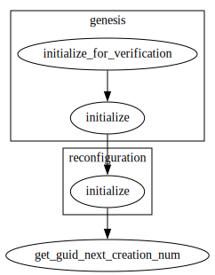

## Function `get_sequence_number`

<pre><code><b>public</b> <b>fun</b> <a href="account.md#0x1_account_get_sequence_number">get_sequence_number</a>(addr: <b>address</b>): u64
</code></pre>

Implementation

<pre><code><b>public</b> <b>fun</b> <a href="account.md#0x1_account_get_sequence_number">get_sequence_number</a>(addr: <b>address</b>): u64 <b>acquires</b> <a href="account.md#0x1_account_Account">Account</a> {
    <b>borrow_global</b>&lt;<a href="account.md#0x1_account_Account">Account</a>&gt;(addr).sequence_number
}
</code></pre>

Show all the functions that "get_sequence_number" calls

Show all the functions that call "get_sequence_number"

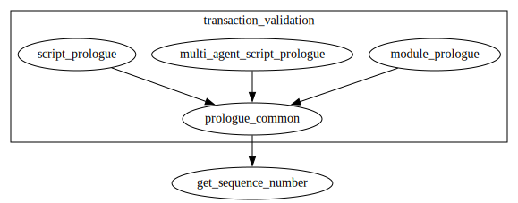

## Function `increment_sequence_number`

<pre><code><b>public</b>(<b>friend</b>) <b>fun</b> <a href="account.md#0x1_account_increment_sequence_number">increment_sequence_number</a>(addr: <b>address</b>)
</code></pre>

Implementation

<pre><code><b>public</b>(<b>friend</b>) <b>fun</b> <a href="account.md#0x1_account_increment_sequence_number">increment_sequence_number</a>(addr: <b>address</b>) <b>acquires</b> <a href="account.md#0x1_account_Account">Account</a> {
    <b>let</b> sequence_number = &<b>mut</b> <b>borrow_global_mut</b>&lt;<a href="account.md#0x1_account_Account">Account</a>&gt;(addr).sequence_number;

    <b>assert</b>!(
        (*sequence_number <b>as</b> u128) &lt; <a href="account.md#0x1_account_MAX_U64">MAX_U64</a>,
        <a href="../../aptos-stdlib/../move-stdlib/doc/error.md#0x1_error_out_of_range">error::out_of_range</a>(<a href="account.md#0x1_account_ESEQUENCE_NUMBER_TOO_BIG">ESEQUENCE_NUMBER_TOO_BIG</a>)
    );

    *sequence_number = *sequence_number + 1;
}
</code></pre>

Show all the functions that "increment_sequence_number" calls

Show all the functions that call "increment_sequence_number"

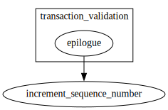

## Function `get_authentication_key`

<pre><code><b>public</b> <b>fun</b> <a href="account.md#0x1_account_get_authentication_key">get_authentication_key</a>(addr: <b>address</b>): <a href="../../aptos-stdlib/../move-stdlib/doc/vector.md#0x1_vector">vector</a>&lt;u8&gt;
</code></pre>

Implementation

<pre><code><b>public</b> <b>fun</b> <a href="account.md#0x1_account_get_authentication_key">get_authentication_key</a>(addr: <b>address</b>): <a href="../../aptos-stdlib/../move-stdlib/doc/vector.md#0x1_vector">vector</a>&lt;u8&gt; <b>acquires</b> <a href="account.md#0x1_account_Account">Account</a> {
    *&<b>borrow_global</b>&lt;<a href="account.md#0x1_account_Account">Account</a>&gt;(addr).authentication_key
}
</code></pre>

Show all the functions that "get_authentication_key" calls

Show all the functions that call "get_authentication_key"

## Function `rotate_authentication_key_internal`

<pre><code><b>public</b>(<b>friend</b>) <b>fun</b> <a href="account.md#0x1_account_rotate_authentication_key_internal">rotate_authentication_key_internal</a>(<a href="account.md#0x1_account">account</a>: &<a href="../../aptos-stdlib/../move-stdlib/doc/signer.md#0x1_signer">signer</a>, new_auth_key: <a href="../../aptos-stdlib/../move-stdlib/doc/vector.md#0x1_vector">vector</a>&lt;u8&gt;)
</code></pre>

Implementation

<pre><code><b>public</b>(<b>friend</b>) <b>fun</b> <a href="account.md#0x1_account_rotate_authentication_key_internal">rotate_authentication_key_internal</a>(<a href="account.md#0x1_account">account</a>: &<a href="../../aptos-stdlib/../move-stdlib/doc/signer.md#0x1_signer">signer</a>, new_auth_key: <a href="../../aptos-stdlib/../move-stdlib/doc/vector.md#0x1_vector">vector</a>&lt;u8&gt;) <b>acquires</b> <a href="account.md#0x1_account_Account">Account</a> {
    <b>let</b> addr = <a href="../../aptos-stdlib/../move-stdlib/doc/signer.md#0x1_signer_address_of">signer::address_of</a>(<a href="account.md#0x1_account">account</a>);
    <b>assert</b>!(<a href="account.md#0x1_account_exists_at">exists_at</a>(addr), <a href="../../aptos-stdlib/../move-stdlib/doc/error.md#0x1_error_not_found">error::not_found</a>(<a href="account.md#0x1_account_EACCOUNT_DOES_NOT_EXIST">EACCOUNT_DOES_NOT_EXIST</a>));
    <b>assert</b>!(
        <a href="../../aptos-stdlib/../move-stdlib/doc/vector.md#0x1_vector_length">vector::length</a>(&new_auth_key) == 32,
        <a href="../../aptos-stdlib/../move-stdlib/doc/error.md#0x1_error_invalid_argument">error::invalid_argument</a>(<a href="account.md#0x1_account_EMALFORMED_AUTHENTICATION_KEY">EMALFORMED_AUTHENTICATION_KEY</a>)
    );
    <b>let</b> account_resource = <b>borrow_global_mut</b>&lt;<a href="account.md#0x1_account_Account">Account</a>&gt;(addr);
    account_resource.authentication_key = new_auth_key;
}
</code></pre>

Show all the functions that "rotate_authentication_key_internal" calls

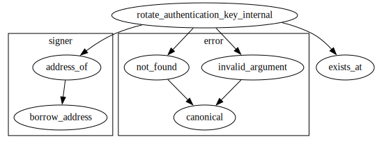

Show all the functions that call "rotate_authentication_key_internal"

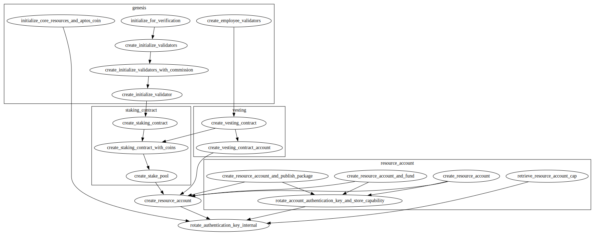

## Function `assert_valid_signature_and_get_auth_key`

<pre><code><b>fun</b> <a href="account.md#0x1_account_assert_valid_signature_and_get_auth_key">assert_valid_signature_and_get_auth_key</a>(scheme: u8, public_key_bytes: <a href="../../aptos-stdlib/../move-stdlib/doc/vector.md#0x1_vector">vector</a>&lt;u8&gt;, signature: <a href="../../aptos-stdlib/../move-stdlib/doc/vector.md#0x1_vector">vector</a>&lt;u8&gt;, challenge: &<a href="account.md#0x1_account_RotationProofChallenge">account::RotationProofChallenge</a>): <a href="../../aptos-stdlib/../move-stdlib/doc/vector.md#0x1_vector">vector</a>&lt;u8&gt;
</code></pre>

Implementation

<pre><code><b>fun</b> <a href="account.md#0x1_account_assert_valid_signature_and_get_auth_key">assert_valid_signature_and_get_auth_key</a>(scheme: u8, public_key_bytes: <a href="../../aptos-stdlib/../move-stdlib/doc/vector.md#0x1_vector">vector</a>&lt;u8&gt;, signature: <a href="../../aptos-stdlib/../move-stdlib/doc/vector.md#0x1_vector">vector</a>&lt;u8&gt;, challenge: &<a href="account.md#0x1_account_RotationProofChallenge">RotationProofChallenge</a>): <a href="../../aptos-stdlib/../move-stdlib/doc/vector.md#0x1_vector">vector</a>&lt;u8&gt; {
    <b>if</b> (scheme == <a href="account.md#0x1_account_ED25519_SCHEME">ED25519_SCHEME</a>) {
        <b>let</b> pk = <a href="../../aptos-stdlib/doc/ed25519.md#0x1_ed25519_new_unvalidated_public_key_from_bytes">ed25519::new_unvalidated_public_key_from_bytes</a>(public_key_bytes);
        <b>let</b> sig = <a href="../../aptos-stdlib/doc/ed25519.md#0x1_ed25519_new_signature_from_bytes">ed25519::new_signature_from_bytes</a>(signature);
        <b>assert</b>!(<a href="../../aptos-stdlib/doc/ed25519.md#0x1_ed25519_signature_verify_strict_t">ed25519::signature_verify_strict_t</a>(&sig, &pk, *challenge), std::error::invalid_argument(<a href="account.md#0x1_account_EINVALID_PROOF_OF_KNOWLEDGE">EINVALID_PROOF_OF_KNOWLEDGE</a>));
        <a href="../../aptos-stdlib/doc/ed25519.md#0x1_ed25519_unvalidated_public_key_to_authentication_key">ed25519::unvalidated_public_key_to_authentication_key</a>(&pk)
    } <b>else</b> <b>if</b> (scheme == <a href="account.md#0x1_account_MULTI_ED25519_SCHEME">MULTI_ED25519_SCHEME</a>) {
        <b>let</b> pk = <a href="../../aptos-stdlib/doc/multi_ed25519.md#0x1_multi_ed25519_new_unvalidated_public_key_from_bytes">multi_ed25519::new_unvalidated_public_key_from_bytes</a>(public_key_bytes);
        <b>let</b> sig = <a href="../../aptos-stdlib/doc/multi_ed25519.md#0x1_multi_ed25519_new_signature_from_bytes">multi_ed25519::new_signature_from_bytes</a>(signature);
        <b>assert</b>!(<a href="../../aptos-stdlib/doc/multi_ed25519.md#0x1_multi_ed25519_signature_verify_strict_t">multi_ed25519::signature_verify_strict_t</a>(&sig, &pk, *challenge), std::error::invalid_argument(<a href="account.md#0x1_account_EINVALID_PROOF_OF_KNOWLEDGE">EINVALID_PROOF_OF_KNOWLEDGE</a>));
        <a href="../../aptos-stdlib/doc/multi_ed25519.md#0x1_multi_ed25519_unvalidated_public_key_to_authentication_key">multi_ed25519::unvalidated_public_key_to_authentication_key</a>(&pk)
    } <b>else</b> {
        <b>abort</b> <a href="../../aptos-stdlib/../move-stdlib/doc/error.md#0x1_error_invalid_argument">error::invalid_argument</a>(<a href="account.md#0x1_account_EINVALID_SCHEME">EINVALID_SCHEME</a>)
    }
}
</code></pre>

Show all the functions that "assert_valid_signature_and_get_auth_key" calls

Show all the functions that call "assert_valid_signature_and_get_auth_key"

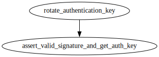

## Function `rotate_authentication_key`

Generic authentication key rotation function that allows the user to rotate their authentication key from any scheme to any scheme.
To authorize the rotation, we need two signatures:
- the first signature <code>cap_rotate_key</code> refers to the signature by the account owner's current key on a valid <code><a href="account.md#0x1_account_RotationProofChallenge">RotationProofChallenge</a></code>,
demonstrating that the user intends to and has the capability to rotate the authentication key of this account;
- the second signature <code>cap_update_table</code> refers to the signature by the new key (that the account owner wants to rotate to) on a
valid <code><a href="account.md#0x1_account_RotationProofChallenge">RotationProofChallenge</a></code>, demonstrating that the user owns the new private key, and has the authority to update the
<code><a href="account.md#0x1_account_OriginatingAddress">OriginatingAddress</a></code> map with the new address mapping <new_address, originating_address>.
To verify signatures, we need their corresponding public key and public key scheme: we use <code>from_scheme</code> and <code>from_public_key_bytes</code>
to verify <code>cap_rotate_key</code>, and <code>to_scheme</code> and <code>to_public_key_bytes</code> to verify <code>cap_update_table</code>.
A scheme of 0 refers to an Ed25519 key and a scheme of 1 refers to Multi-Ed25519 keys.
<code>originating <b>address</b></code> refers to an account's original/first address.

<pre><code><b>public</b> <b>fun</b> <a href="account.md#0x1_account_rotate_authentication_key">rotate_authentication_key</a>(<a href="account.md#0x1_account">account</a>: &<a href="../../aptos-stdlib/../move-stdlib/doc/signer.md#0x1_signer">signer</a>, from_scheme: u8, from_public_key_bytes: <a href="../../aptos-stdlib/../move-stdlib/doc/vector.md#0x1_vector">vector</a>&lt;u8&gt;, to_scheme: u8, to_public_key_bytes: <a href="../../aptos-stdlib/../move-stdlib/doc/vector.md#0x1_vector">vector</a>&lt;u8&gt;, cap_rotate_key: <a href="../../aptos-stdlib/../move-stdlib/doc/vector.md#0x1_vector">vector</a>&lt;u8&gt;, cap_update_table: <a href="../../aptos-stdlib/../move-stdlib/doc/vector.md#0x1_vector">vector</a>&lt;u8&gt;)
</code></pre>

Implementation

<pre><code><b>public</b> entry <b>fun</b> <a href="account.md#0x1_account_rotate_authentication_key">rotate_authentication_key</a>(
    <a href="account.md#0x1_account">account</a>: &<a href="../../aptos-stdlib/../move-stdlib/doc/signer.md#0x1_signer">signer</a>,
    from_scheme: u8,
    from_public_key_bytes: <a href="../../aptos-stdlib/../move-stdlib/doc/vector.md#0x1_vector">vector</a>&lt;u8&gt;,
    to_scheme: u8,
    to_public_key_bytes: <a href="../../aptos-stdlib/../move-stdlib/doc/vector.md#0x1_vector">vector</a>&lt;u8&gt;,
    cap_rotate_key: <a href="../../aptos-stdlib/../move-stdlib/doc/vector.md#0x1_vector">vector</a>&lt;u8&gt;,
    cap_update_table: <a href="../../aptos-stdlib/../move-stdlib/doc/vector.md#0x1_vector">vector</a>&lt;u8&gt;,
) <b>acquires</b> <a href="account.md#0x1_account_Account">Account</a>, <a href="account.md#0x1_account_OriginatingAddress">OriginatingAddress</a> {
    <b>let</b> addr = <a href="../../aptos-stdlib/../move-stdlib/doc/signer.md#0x1_signer_address_of">signer::address_of</a>(<a href="account.md#0x1_account">account</a>);
    <b>assert</b>!(<a href="account.md#0x1_account_exists_at">exists_at</a>(addr), <a href="../../aptos-stdlib/../move-stdlib/doc/error.md#0x1_error_not_found">error::not_found</a>(<a href="account.md#0x1_account_EACCOUNT_DOES_NOT_EXIST">EACCOUNT_DOES_NOT_EXIST</a>));
    <b>let</b> account_resource = <b>borrow_global_mut</b>&lt;<a href="account.md#0x1_account_Account">Account</a>&gt;(addr);

    // Verify the given `from_public_key_bytes` matches this <a href="account.md#0x1_account">account</a>'s current authentication key.
    <b>if</b> (from_scheme == <a href="account.md#0x1_account_ED25519_SCHEME">ED25519_SCHEME</a>) {
        <b>let</b> from_pk = <a href="../../aptos-stdlib/doc/ed25519.md#0x1_ed25519_new_unvalidated_public_key_from_bytes">ed25519::new_unvalidated_public_key_from_bytes</a>(from_public_key_bytes);
        <b>let</b> from_auth_key = <a href="../../aptos-stdlib/doc/ed25519.md#0x1_ed25519_unvalidated_public_key_to_authentication_key">ed25519::unvalidated_public_key_to_authentication_key</a>(&from_pk);
        <b>assert</b>!(account_resource.authentication_key == from_auth_key, <a href="../../aptos-stdlib/../move-stdlib/doc/error.md#0x1_error_unauthenticated">error::unauthenticated</a>(<a href="account.md#0x1_account_EWRONG_CURRENT_PUBLIC_KEY">EWRONG_CURRENT_PUBLIC_KEY</a>));
    } <b>else</b> <b>if</b> (from_scheme == <a href="account.md#0x1_account_MULTI_ED25519_SCHEME">MULTI_ED25519_SCHEME</a>) {
        <b>let</b> from_pk = <a href="../../aptos-stdlib/doc/multi_ed25519.md#0x1_multi_ed25519_new_unvalidated_public_key_from_bytes">multi_ed25519::new_unvalidated_public_key_from_bytes</a>(from_public_key_bytes);
        <b>let</b> from_auth_key = <a href="../../aptos-stdlib/doc/multi_ed25519.md#0x1_multi_ed25519_unvalidated_public_key_to_authentication_key">multi_ed25519::unvalidated_public_key_to_authentication_key</a>(&from_pk);
        <b>assert</b>!(account_resource.authentication_key == from_auth_key, <a href="../../aptos-stdlib/../move-stdlib/doc/error.md#0x1_error_unauthenticated">error::unauthenticated</a>(<a href="account.md#0x1_account_EWRONG_CURRENT_PUBLIC_KEY">EWRONG_CURRENT_PUBLIC_KEY</a>));
    } <b>else</b> {
        <b>abort</b> <a href="../../aptos-stdlib/../move-stdlib/doc/error.md#0x1_error_invalid_argument">error::invalid_argument</a>(<a href="account.md#0x1_account_EINVALID_SCHEME">EINVALID_SCHEME</a>)
    };

    // Construct a valid `<a href="account.md#0x1_account_RotationProofChallenge">RotationProofChallenge</a>` that `cap_rotate_key` and `cap_update_table` will validate against.
    <b>let</b> curr_auth_key_as_address = <a href="../../aptos-stdlib/doc/from_bcs.md#0x1_from_bcs_to_address">from_bcs::to_address</a>(account_resource.authentication_key);
    <b>let</b> challenge = <a href="account.md#0x1_account_RotationProofChallenge">RotationProofChallenge</a> {
        sequence_number: account_resource.sequence_number,
        originator: addr,
        current_auth_key: curr_auth_key_as_address,
        new_public_key: to_public_key_bytes,
    };

    // Assert the challenges signed by the current and new keys are valid
    <b>let</b> curr_auth_key = <a href="account.md#0x1_account_assert_valid_signature_and_get_auth_key">assert_valid_signature_and_get_auth_key</a>(from_scheme, from_public_key_bytes, cap_rotate_key, &challenge);
    <b>let</b> new_auth_key = <a href="account.md#0x1_account_assert_valid_signature_and_get_auth_key">assert_valid_signature_and_get_auth_key</a>(to_scheme, to_public_key_bytes, cap_update_table, &challenge);

    // Update the `<a href="account.md#0x1_account_OriginatingAddress">OriginatingAddress</a>` <a href="../../aptos-stdlib/doc/table.md#0x1_table">table</a>, so that we can find the originating <b>address</b> using the latest <b>address</b>
    // in the <a href="event.md#0x1_event">event</a> of key recovery
    <b>let</b> address_map = &<b>mut</b> <b>borrow_global_mut</b>&lt;<a href="account.md#0x1_account_OriginatingAddress">OriginatingAddress</a>&gt;(@aptos_framework).address_map;
    <b>let</b> new_auth_key_as_address = <a href="../../aptos-stdlib/doc/from_bcs.md#0x1_from_bcs_to_address">from_bcs::to_address</a>(new_auth_key);
    <b>if</b> (<a href="../../aptos-stdlib/doc/table.md#0x1_table_contains">table::contains</a>(address_map, curr_auth_key_as_address)) {
        // Assert that we're calling from the <a href="account.md#0x1_account">account</a> <b>with</b> the originating <b>address</b>.
        // For example, <b>if</b> we have already rotated from keypair_a <b>to</b> keypair_b, and are trying <b>to</b> rotate from
        // keypair_b <b>to</b> keypair_c, we could call `rotate_authentication_key` from address_a or address_b.
        // Here, we wanted <b>to</b> enforce the standard that we expect the call <b>to</b> come from the <a href="../../aptos-stdlib/../move-stdlib/doc/signer.md#0x1_signer">signer</a> <b>with</b> <b>address</b> a.
        // If a <a href="../../aptos-stdlib/../move-stdlib/doc/signer.md#0x1_signer">signer</a> <b>with</b> <b>address</b> b calls this function <b>with</b> two valid signatures, it will <b>abort</b> at this step,
        // because <b>address</b> b is not the <a href="account.md#0x1_account">account</a>'s originating <b>address</b>.
        // This means that after key rotation, the <a href="account.md#0x1_account">account</a>'s <b>address</b> should be the same, but their <b>public</b> key
        // and private key should be updated <b>to</b> the new ones.
        <b>assert</b>!(addr == <a href="../../aptos-stdlib/doc/table.md#0x1_table_remove">table::remove</a>(address_map, curr_auth_key_as_address), <a href="../../aptos-stdlib/../move-stdlib/doc/error.md#0x1_error_not_found">error::not_found</a>(<a href="account.md#0x1_account_EINVALID_ORIGINATING_ADDRESS">EINVALID_ORIGINATING_ADDRESS</a>));
    };
    <a href="../../aptos-stdlib/doc/table.md#0x1_table_add">table::add</a>(address_map, new_auth_key_as_address, addr);

    <a href="event.md#0x1_event_emit_event">event::emit_event</a>&lt;<a href="account.md#0x1_account_KeyRotationEvent">KeyRotationEvent</a>&gt;(
        &<b>mut</b> account_resource.key_rotation_events,
        <a href="account.md#0x1_account_KeyRotationEvent">KeyRotationEvent</a> {
            old_authentication_key: curr_auth_key,
            new_authentication_key: new_auth_key,
        }
    );

    account_resource.authentication_key = new_auth_key;
}
</code></pre>

Show all the functions that "rotate_authentication_key" calls

Show all the functions that call "rotate_authentication_key"

## Function `offer_signer_capability`

Offers signer capability on behalf of <code><a href="account.md#0x1_account">account</a></code> to the account at address <code>recipient_address</code>.
An account can delegate its signer capability to only one other address at one time.
<code>signer_capability_key_bytes</code> is the <code><a href="account.md#0x1_account_SignerCapabilityOfferProofChallengeV2">SignerCapabilityOfferProofChallengeV2</a></code> signed by the account owner's key
<code>account_scheme</code> is the scheme of the account (ed25519 or multi_ed25519).
<code>account_public_key_bytes</code> is the public key of the account owner.
<code>recipient_address</code> is the address of the recipient of the signer capability - note that if there's an existing
<code>recipient_address</code> in the account owner's <code>SignerCapabilityOffer</code>, this will replace the
previous <code>recipient_address</code> upon successful verification (the previous recipient will no longer have access
to the account owner's signer capability).

<pre><code><b>public</b> <b>fun</b> <a href="account.md#0x1_account_offer_signer_capability">offer_signer_capability</a>(<a href="account.md#0x1_account">account</a>: &<a href="../../aptos-stdlib/../move-stdlib/doc/signer.md#0x1_signer">signer</a>, signer_capability_sig_bytes: <a href="../../aptos-stdlib/../move-stdlib/doc/vector.md#0x1_vector">vector</a>&lt;u8&gt;, account_scheme: u8, account_public_key_bytes: <a href="../../aptos-stdlib/../move-stdlib/doc/vector.md#0x1_vector">vector</a>&lt;u8&gt;, recipient_address: <b>address</b>)
</code></pre>

Implementation

<pre><code><b>public</b> entry <b>fun</b> <a href="account.md#0x1_account_offer_signer_capability">offer_signer_capability</a>(
    <a href="account.md#0x1_account">account</a>: &<a href="../../aptos-stdlib/../move-stdlib/doc/signer.md#0x1_signer">signer</a>,
    signer_capability_sig_bytes: <a href="../../aptos-stdlib/../move-stdlib/doc/vector.md#0x1_vector">vector</a>&lt;u8&gt;,
    account_scheme: u8,
    account_public_key_bytes: <a href="../../aptos-stdlib/../move-stdlib/doc/vector.md#0x1_vector">vector</a>&lt;u8&gt;,
    recipient_address: <b>address</b>
) <b>acquires</b> <a href="account.md#0x1_account_Account">Account</a> {
    <b>let</b> source_address = <a href="../../aptos-stdlib/../move-stdlib/doc/signer.md#0x1_signer_address_of">signer::address_of</a>(<a href="account.md#0x1_account">account</a>);
    <b>assert</b>!(<a href="account.md#0x1_account_exists_at">exists_at</a>(recipient_address), <a href="../../aptos-stdlib/../move-stdlib/doc/error.md#0x1_error_not_found">error::not_found</a>(<a href="account.md#0x1_account_EACCOUNT_DOES_NOT_EXIST">EACCOUNT_DOES_NOT_EXIST</a>));

    <b>let</b> account_resource = <b>borrow_global_mut</b>&lt;<a href="account.md#0x1_account_Account">Account</a>&gt;(source_address);

    // Proof that this <a href="account.md#0x1_account">account</a> intends <b>to</b> delegate its <a href="../../aptos-stdlib/../move-stdlib/doc/signer.md#0x1_signer">signer</a> capability <b>to</b> another <a href="account.md#0x1_account">account</a>.
    <b>let</b> proof_challenge = <a href="account.md#0x1_account_SignerCapabilityOfferProofChallengeV2">SignerCapabilityOfferProofChallengeV2</a> {
        sequence_number: account_resource.sequence_number,
        source_address,
        recipient_address,
    };

    // Verify that the `<a href="account.md#0x1_account_SignerCapabilityOfferProofChallengeV2">SignerCapabilityOfferProofChallengeV2</a>` <b>has</b> the right information and is signed by the <a href="account.md#0x1_account">account</a> owner's key
    <b>if</b> (account_scheme == <a href="account.md#0x1_account_ED25519_SCHEME">ED25519_SCHEME</a>) {
        <b>let</b> pubkey = <a href="../../aptos-stdlib/doc/ed25519.md#0x1_ed25519_new_unvalidated_public_key_from_bytes">ed25519::new_unvalidated_public_key_from_bytes</a>(account_public_key_bytes);
        <b>let</b> expected_auth_key = <a href="../../aptos-stdlib/doc/ed25519.md#0x1_ed25519_unvalidated_public_key_to_authentication_key">ed25519::unvalidated_public_key_to_authentication_key</a>(&pubkey);
        <b>assert</b>!(account_resource.authentication_key == expected_auth_key, <a href="../../aptos-stdlib/../move-stdlib/doc/error.md#0x1_error_invalid_argument">error::invalid_argument</a>(<a href="account.md#0x1_account_EWRONG_CURRENT_PUBLIC_KEY">EWRONG_CURRENT_PUBLIC_KEY</a>));

        <b>let</b> signer_capability_sig = <a href="../../aptos-stdlib/doc/ed25519.md#0x1_ed25519_new_signature_from_bytes">ed25519::new_signature_from_bytes</a>(signer_capability_sig_bytes);
        <b>assert</b>!(<a href="../../aptos-stdlib/doc/ed25519.md#0x1_ed25519_signature_verify_strict_t">ed25519::signature_verify_strict_t</a>(&signer_capability_sig, &pubkey, proof_challenge), <a href="../../aptos-stdlib/../move-stdlib/doc/error.md#0x1_error_invalid_argument">error::invalid_argument</a>(<a href="account.md#0x1_account_EINVALID_PROOF_OF_KNOWLEDGE">EINVALID_PROOF_OF_KNOWLEDGE</a>));
    } <b>else</b> <b>if</b> (account_scheme == <a href="account.md#0x1_account_MULTI_ED25519_SCHEME">MULTI_ED25519_SCHEME</a>) {
        <b>let</b> pubkey = <a href="../../aptos-stdlib/doc/multi_ed25519.md#0x1_multi_ed25519_new_unvalidated_public_key_from_bytes">multi_ed25519::new_unvalidated_public_key_from_bytes</a>(account_public_key_bytes);
        <b>let</b> expected_auth_key = <a href="../../aptos-stdlib/doc/multi_ed25519.md#0x1_multi_ed25519_unvalidated_public_key_to_authentication_key">multi_ed25519::unvalidated_public_key_to_authentication_key</a>(&pubkey);
        <b>assert</b>!(account_resource.authentication_key == expected_auth_key, <a href="../../aptos-stdlib/../move-stdlib/doc/error.md#0x1_error_invalid_argument">error::invalid_argument</a>(<a href="account.md#0x1_account_EWRONG_CURRENT_PUBLIC_KEY">EWRONG_CURRENT_PUBLIC_KEY</a>));

        <b>let</b> signer_capability_sig = <a href="../../aptos-stdlib/doc/multi_ed25519.md#0x1_multi_ed25519_new_signature_from_bytes">multi_ed25519::new_signature_from_bytes</a>(signer_capability_sig_bytes);
        <b>assert</b>!(<a href="../../aptos-stdlib/doc/multi_ed25519.md#0x1_multi_ed25519_signature_verify_strict_t">multi_ed25519::signature_verify_strict_t</a>(&signer_capability_sig, &pubkey, proof_challenge), <a href="../../aptos-stdlib/../move-stdlib/doc/error.md#0x1_error_invalid_argument">error::invalid_argument</a>(<a href="account.md#0x1_account_EINVALID_PROOF_OF_KNOWLEDGE">EINVALID_PROOF_OF_KNOWLEDGE</a>));
    } <b>else</b> {
        <b>abort</b> <a href="../../aptos-stdlib/../move-stdlib/doc/error.md#0x1_error_invalid_argument">error::invalid_argument</a>(<a href="account.md#0x1_account_EINVALID_SCHEME">EINVALID_SCHEME</a>)
    };

    // Update the existing <a href="../../aptos-stdlib/../move-stdlib/doc/signer.md#0x1_signer">signer</a> capability offer or put in a new <a href="../../aptos-stdlib/../move-stdlib/doc/signer.md#0x1_signer">signer</a> capability offer for the recipient.
    <a href="../../aptos-stdlib/../move-stdlib/doc/option.md#0x1_option_swap_or_fill">option::swap_or_fill</a>(&<b>mut</b> account_resource.signer_capability_offer.for, recipient_address);
}
</code></pre>

Show all the functions that "offer_signer_capability" calls

Show all the functions that call "offer_signer_capability"

## Function `revoke_signer_capability`

Revoke the account owner's signer capability offer for <code>to_be_revoked_address</code> (i.e., the address that
has a signer capability offer from <code><a href="account.md#0x1_account">account</a></code> but will be revoked in this function).

<pre><code><b>public</b> <b>fun</b> <a href="account.md#0x1_account_revoke_signer_capability">revoke_signer_capability</a>(<a href="account.md#0x1_account">account</a>: &<a href="../../aptos-stdlib/../move-stdlib/doc/signer.md#0x1_signer">signer</a>, to_be_revoked_address: <b>address</b>)
</code></pre>

Implementation

<pre><code><b>public</b> entry <b>fun</b> <a href="account.md#0x1_account_revoke_signer_capability">revoke_signer_capability</a>(<a href="account.md#0x1_account">account</a>: &<a href="../../aptos-stdlib/../move-stdlib/doc/signer.md#0x1_signer">signer</a>, to_be_revoked_address: <b>address</b>) <b>acquires</b> <a href="account.md#0x1_account_Account">Account</a> {
    <b>assert</b>!(<a href="account.md#0x1_account_exists_at">exists_at</a>(to_be_revoked_address), <a href="../../aptos-stdlib/../move-stdlib/doc/error.md#0x1_error_not_found">error::not_found</a>(<a href="account.md#0x1_account_EACCOUNT_DOES_NOT_EXIST">EACCOUNT_DOES_NOT_EXIST</a>));
    <b>let</b> addr = <a href="../../aptos-stdlib/../move-stdlib/doc/signer.md#0x1_signer_address_of">signer::address_of</a>(<a href="account.md#0x1_account">account</a>);
    <b>let</b> account_resource = <b>borrow_global_mut</b>&lt;<a href="account.md#0x1_account_Account">Account</a>&gt;(addr);
    <b>assert</b>!(<a href="../../aptos-stdlib/../move-stdlib/doc/option.md#0x1_option_contains">option::contains</a>(&account_resource.signer_capability_offer.for, &to_be_revoked_address), <a href="../../aptos-stdlib/../move-stdlib/doc/error.md#0x1_error_not_found">error::not_found</a>(<a href="account.md#0x1_account_ENO_SUCH_SIGNER_CAPABILITY">ENO_SUCH_SIGNER_CAPABILITY</a>));
    <a href="../../aptos-stdlib/../move-stdlib/doc/option.md#0x1_option_extract">option::extract</a>(&<b>mut</b> account_resource.signer_capability_offer.for);
}
</code></pre>

Show all the functions that "revoke_signer_capability" calls

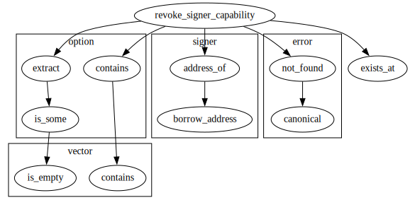

Show all the functions that call "revoke_signer_capability"

## Function `create_authorized_signer`

Return an authorized signer of the offerer, if there's an existing signer capability offer for <code><a href="account.md#0x1_account">account</a></code>
at the offerer's address.

<pre><code><b>public</b> <b>fun</b> <a href="account.md#0x1_account_create_authorized_signer">create_authorized_signer</a>(<a href="account.md#0x1_account">account</a>: &<a href="../../aptos-stdlib/../move-stdlib/doc/signer.md#0x1_signer">signer</a>, offerer_address: <b>address</b>): <a href="../../aptos-stdlib/../move-stdlib/doc/signer.md#0x1_signer">signer</a>
</code></pre>

Implementation

<pre><code><b>public</b> <b>fun</b> <a href="account.md#0x1_account_create_authorized_signer">create_authorized_signer</a>(<a href="account.md#0x1_account">account</a>: &<a href="../../aptos-stdlib/../move-stdlib/doc/signer.md#0x1_signer">signer</a>, offerer_address: <b>address</b>): <a href="../../aptos-stdlib/../move-stdlib/doc/signer.md#0x1_signer">signer</a> <b>acquires</b> <a href="account.md#0x1_account_Account">Account</a> {
    <b>assert</b>!(<a href="account.md#0x1_account_exists_at">exists_at</a>(offerer_address), <a href="../../aptos-stdlib/../move-stdlib/doc/error.md#0x1_error_not_found">error::not_found</a>(<a href="account.md#0x1_account_EACCOUNT_DOES_NOT_EXIST">EACCOUNT_DOES_NOT_EXIST</a>));

    // Check <b>if</b> there's an existing <a href="../../aptos-stdlib/../move-stdlib/doc/signer.md#0x1_signer">signer</a> capability offer from the offerer.
    <b>let</b> account_resource = <b>borrow_global</b>&lt;<a href="account.md#0x1_account_Account">Account</a>&gt;(offerer_address);
    <b>let</b> addr = <a href="../../aptos-stdlib/../move-stdlib/doc/signer.md#0x1_signer_address_of">signer::address_of</a>(<a href="account.md#0x1_account">account</a>);
    <b>assert</b>!(<a href="../../aptos-stdlib/../move-stdlib/doc/option.md#0x1_option_contains">option::contains</a>(&account_resource.signer_capability_offer.for, &addr), <a href="../../aptos-stdlib/../move-stdlib/doc/error.md#0x1_error_not_found">error::not_found</a>(<a href="account.md#0x1_account_ENO_SUCH_SIGNER_CAPABILITY">ENO_SUCH_SIGNER_CAPABILITY</a>));

    <a href="account.md#0x1_account_create_signer">create_signer</a>(offerer_address)
}
</code></pre>

Show all the functions that "create_authorized_signer" calls

Show all the functions that call "create_authorized_signer"

## Function `create_resource_address`

Basic account creation methods.
This is a helper function to compute resource addresses. Computation of the address
involves the use of a cryptographic hash operation and should be use thoughtfully.

<pre><code><b>public</b> <b>fun</b> <a href="account.md#0x1_account_create_resource_address">create_resource_address</a>(source: &<b>address</b>, seed: <a href="../../aptos-stdlib/../move-stdlib/doc/vector.md#0x1_vector">vector</a>&lt;u8&gt;): <b>address</b>
</code></pre>

Implementation

<pre><code><b>public</b> <b>fun</b> <a href="account.md#0x1_account_create_resource_address">create_resource_address</a>(source: &<b>address</b>, seed: <a href="../../aptos-stdlib/../move-stdlib/doc/vector.md#0x1_vector">vector</a>&lt;u8&gt;): <b>address</b> {
    <b>let</b> bytes = <a href="../../aptos-stdlib/../move-stdlib/doc/bcs.md#0x1_bcs_to_bytes">bcs::to_bytes</a>(source);
    <a href="../../aptos-stdlib/../move-stdlib/doc/vector.md#0x1_vector_append">vector::append</a>(&<b>mut</b> bytes, seed);
    <a href="../../aptos-stdlib/../move-stdlib/doc/vector.md#0x1_vector_push_back">vector::push_back</a>(&<b>mut</b> bytes, <a href="account.md#0x1_account_DERIVE_RESOURCE_ACCOUNT_SCHEME">DERIVE_RESOURCE_ACCOUNT_SCHEME</a>);
    <a href="../../aptos-stdlib/doc/from_bcs.md#0x1_from_bcs_to_address">from_bcs::to_address</a>(<a href="../../aptos-stdlib/doc/hash.md#0x1_hash_sha3_256">hash::sha3_256</a>(bytes))
}
</code></pre>

Show all the functions that "create_resource_address" calls

Show all the functions that call "create_resource_address"

## Function `create_resource_account`

A resource account is used to manage resources independent of an account managed by a user.
In Aptos a resource account is created based upon the sha3 256 of the source's address and additional seed data.
A resource account can only be created once, this is designated by setting the
<code>Account::signer_capbility_offer::for</code> to the address of the resource account. While an entity may call
<code>create_account</code> to attempt to claim an account ahead of the creation of a resource account, if found Aptos will
transition ownership of the account over to the resource account. This is done by validating that the account has
yet to execute any transactions and that the <code>Account::signer_capbility_offer::for</code> is none. The probability of a
collision where someone has legitimately produced a private key that maps to a resource account address is less
than <code>(1/2)^(256)</code>.

<pre><code><b>public</b> <b>fun</b> <a href="account.md#0x1_account_create_resource_account">create_resource_account</a>(source: &<a href="../../aptos-stdlib/../move-stdlib/doc/signer.md#0x1_signer">signer</a>, seed: <a href="../../aptos-stdlib/../move-stdlib/doc/vector.md#0x1_vector">vector</a>&lt;u8&gt;): (<a href="../../aptos-stdlib/../move-stdlib/doc/signer.md#0x1_signer">signer</a>, <a href="account.md#0x1_account_SignerCapability">account::SignerCapability</a>)
</code></pre>

Implementation

<pre><code><b>public</b> <b>fun</b> <a href="account.md#0x1_account_create_resource_account">create_resource_account</a>(source: &<a href="../../aptos-stdlib/../move-stdlib/doc/signer.md#0x1_signer">signer</a>, seed: <a href="../../aptos-stdlib/../move-stdlib/doc/vector.md#0x1_vector">vector</a>&lt;u8&gt;): (<a href="../../aptos-stdlib/../move-stdlib/doc/signer.md#0x1_signer">signer</a>, <a href="account.md#0x1_account_SignerCapability">SignerCapability</a>) <b>acquires</b> <a href="account.md#0x1_account_Account">Account</a> {
    <b>let</b> resource_addr = <a href="account.md#0x1_account_create_resource_address">create_resource_address</a>(&<a href="../../aptos-stdlib/../move-stdlib/doc/signer.md#0x1_signer_address_of">signer::address_of</a>(source), seed);
    <b>let</b> resource = <b>if</b> (<a href="account.md#0x1_account_exists_at">exists_at</a>(resource_addr)) {
        <b>let</b> <a href="account.md#0x1_account">account</a> = <b>borrow_global</b>&lt;<a href="account.md#0x1_account_Account">Account</a>&gt;(resource_addr);
        <b>assert</b>!(
            <a href="../../aptos-stdlib/../move-stdlib/doc/option.md#0x1_option_is_none">option::is_none</a>(&<a href="account.md#0x1_account">account</a>.signer_capability_offer.for),
            <a href="../../aptos-stdlib/../move-stdlib/doc/error.md#0x1_error_already_exists">error::already_exists</a>(<a href="account.md#0x1_account_ERESOURCE_ACCCOUNT_EXISTS">ERESOURCE_ACCCOUNT_EXISTS</a>),
        );
        <b>assert</b>!(
            <a href="account.md#0x1_account">account</a>.sequence_number == 0,
            <a href="../../aptos-stdlib/../move-stdlib/doc/error.md#0x1_error_invalid_state">error::invalid_state</a>(<a href="account.md#0x1_account_EACCOUNT_ALREADY_USED">EACCOUNT_ALREADY_USED</a>),
        );
        <a href="account.md#0x1_account_create_signer">create_signer</a>(resource_addr)
    } <b>else</b> {
        <a href="account.md#0x1_account_create_account_unchecked">create_account_unchecked</a>(resource_addr)
    };

    // By default, only the <a href="account.md#0x1_account_SignerCapability">SignerCapability</a> should have control over the resource <a href="account.md#0x1_account">account</a> and not the auth key.
    // If the source <a href="account.md#0x1_account">account</a> wants direct control via auth key, they would need <b>to</b> explicitly rotate the auth key
    // of the resource <a href="account.md#0x1_account">account</a> using the <a href="account.md#0x1_account_SignerCapability">SignerCapability</a>.
    <a href="account.md#0x1_account_rotate_authentication_key_internal">rotate_authentication_key_internal</a>(&resource, <a href="account.md#0x1_account_ZERO_AUTH_KEY">ZERO_AUTH_KEY</a>);

    <b>let</b> <a href="account.md#0x1_account">account</a> = <b>borrow_global_mut</b>&lt;<a href="account.md#0x1_account_Account">Account</a>&gt;(resource_addr);
    <a href="account.md#0x1_account">account</a>.signer_capability_offer.for = <a href="../../aptos-stdlib/../move-stdlib/doc/option.md#0x1_option_some">option::some</a>(resource_addr);
    <b>let</b> signer_cap = <a href="account.md#0x1_account_SignerCapability">SignerCapability</a> { <a href="account.md#0x1_account">account</a>: resource_addr };
    (resource, signer_cap)
}
</code></pre>

Show all the functions that "create_resource_account" calls

Show all the functions that call "create_resource_account"

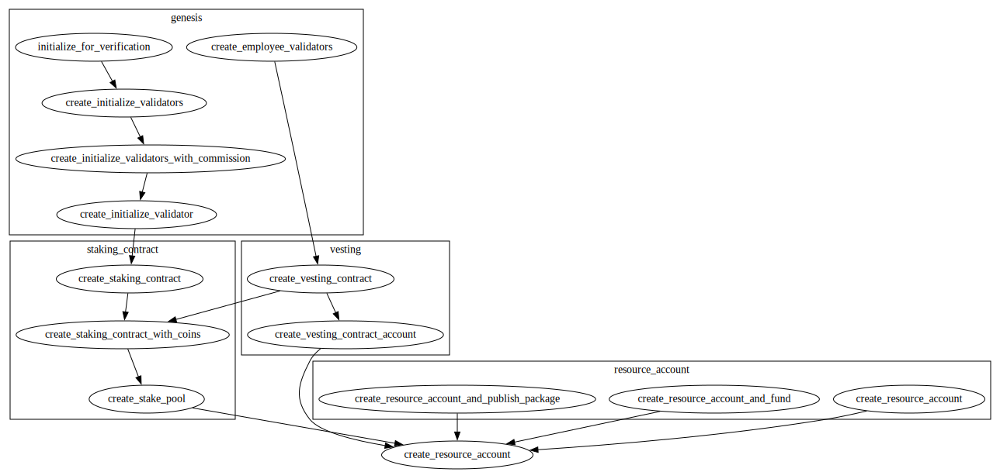

## Function `create_framework_reserved_account`

create the account for system reserved addresses

<pre><code><b>public</b>(<b>friend</b>) <b>fun</b> <a href="account.md#0x1_account_create_framework_reserved_account">create_framework_reserved_account</a>(addr: <b>address</b>): (<a href="../../aptos-stdlib/../move-stdlib/doc/signer.md#0x1_signer">signer</a>, <a href="account.md#0x1_account_SignerCapability">account::SignerCapability</a>)
</code></pre>

Implementation

<pre><code><b>public</b>(<b>friend</b>) <b>fun</b> <a href="account.md#0x1_account_create_framework_reserved_account">create_framework_reserved_account</a>(addr: <b>address</b>): (<a href="../../aptos-stdlib/../move-stdlib/doc/signer.md#0x1_signer">signer</a>, <a href="account.md#0x1_account_SignerCapability">SignerCapability</a>) {
    <b>assert</b>!(
        addr == @0x1 ||
            addr == @0x2 ||
            addr == @0x3 ||
            addr == @0x4 ||
            addr == @0x5 ||
            addr == @0x6 ||
            addr == @0x7 ||
            addr == @0x8 ||
            addr == @0x9 ||
            addr == @0xa,
        <a href="../../aptos-stdlib/../move-stdlib/doc/error.md#0x1_error_permission_denied">error::permission_denied</a>(<a href="account.md#0x1_account_ENO_VALID_FRAMEWORK_RESERVED_ADDRESS">ENO_VALID_FRAMEWORK_RESERVED_ADDRESS</a>),
    );
    <b>let</b> <a href="../../aptos-stdlib/../move-stdlib/doc/signer.md#0x1_signer">signer</a> = <a href="account.md#0x1_account_create_account_unchecked">create_account_unchecked</a>(addr);
    <b>let</b> signer_cap = <a href="account.md#0x1_account_SignerCapability">SignerCapability</a> { <a href="account.md#0x1_account">account</a>: addr };
    (<a href="../../aptos-stdlib/../move-stdlib/doc/signer.md#0x1_signer">signer</a>, signer_cap)
}
</code></pre>

Show all the functions that "create_framework_reserved_account" calls

Show all the functions that call "create_framework_reserved_account"

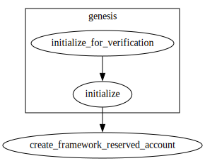

## Function `create_guid`

GUID management methods.

<pre><code><b>public</b> <b>fun</b> <a href="account.md#0x1_account_create_guid">create_guid</a>(account_signer: &<a href="../../aptos-stdlib/../move-stdlib/doc/signer.md#0x1_signer">signer</a>): <a href="guid.md#0x1_guid_GUID">guid::GUID</a>
</code></pre>

Implementation

<pre><code><b>public</b> <b>fun</b> <a href="account.md#0x1_account_create_guid">create_guid</a>(account_signer: &<a href="../../aptos-stdlib/../move-stdlib/doc/signer.md#0x1_signer">signer</a>): <a href="guid.md#0x1_guid_GUID">guid::GUID</a> <b>acquires</b> <a href="account.md#0x1_account_Account">Account</a> {
    <b>let</b> addr = <a href="../../aptos-stdlib/../move-stdlib/doc/signer.md#0x1_signer_address_of">signer::address_of</a>(account_signer);
    <b>let</b> <a href="account.md#0x1_account">account</a> = <b>borrow_global_mut</b>&lt;<a href="account.md#0x1_account_Account">Account</a>&gt;(addr);
    <a href="guid.md#0x1_guid_create">guid::create</a>(addr, &<b>mut</b> <a href="account.md#0x1_account">account</a>.guid_creation_num)
}
</code></pre>

Show all the functions that "create_guid" calls

Show all the functions that call "create_guid"

## Function `new_event_handle`

GUID management methods.

<pre><code><b>public</b> <b>fun</b> <a href="account.md#0x1_account_new_event_handle">new_event_handle</a>&lt;T: drop, store&gt;(<a href="account.md#0x1_account">account</a>: &<a href="../../aptos-stdlib/../move-stdlib/doc/signer.md#0x1_signer">signer</a>): <a href="event.md#0x1_event_EventHandle">event::EventHandle</a>&lt;T&gt;
</code></pre>

Implementation

<pre><code><b>public</b> <b>fun</b> <a href="account.md#0x1_account_new_event_handle">new_event_handle</a>&lt;T: drop + store&gt;(<a href="account.md#0x1_account">account</a>: &<a href="../../aptos-stdlib/../move-stdlib/doc/signer.md#0x1_signer">signer</a>): EventHandle&lt;T&gt; <b>acquires</b> <a href="account.md#0x1_account_Account">Account</a> {
    <a href="event.md#0x1_event_new_event_handle">event::new_event_handle</a>(<a href="account.md#0x1_account_create_guid">create_guid</a>(<a href="account.md#0x1_account">account</a>))
}
</code></pre>

Show all the functions that "new_event_handle" calls

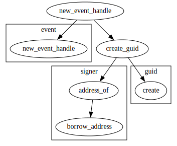

Show all the functions that call "new_event_handle"

## Function `register_coin`

Coin management methods.

<pre><code><b>public</b>(<b>friend</b>) <b>fun</b> <a href="account.md#0x1_account_register_coin">register_coin</a>&lt;CoinType&gt;(account_addr: <b>address</b>)
</code></pre>

Implementation

<pre><code><b>public</b>(<b>friend</b>) <b>fun</b> <a href="account.md#0x1_account_register_coin">register_coin</a>&lt;CoinType&gt;(account_addr: <b>address</b>) <b>acquires</b> <a href="account.md#0x1_account_Account">Account</a> {
    <b>let</b> <a href="account.md#0x1_account">account</a> = <b>borrow_global_mut</b>&lt;<a href="account.md#0x1_account_Account">Account</a>&gt;(account_addr);
    <a href="event.md#0x1_event_emit_event">event::emit_event</a>&lt;<a href="account.md#0x1_account_CoinRegisterEvent">CoinRegisterEvent</a>&gt;(
        &<b>mut</b> <a href="account.md#0x1_account">account</a>.coin_register_events,
        <a href="account.md#0x1_account_CoinRegisterEvent">CoinRegisterEvent</a> {
            <a href="../../aptos-stdlib/doc/type_info.md#0x1_type_info">type_info</a>: <a href="../../aptos-stdlib/doc/type_info.md#0x1_type_info_type_of">type_info::type_of</a>&lt;CoinType&gt;(),
        },
    );
}
</code></pre>

Show all the functions that "register_coin" calls

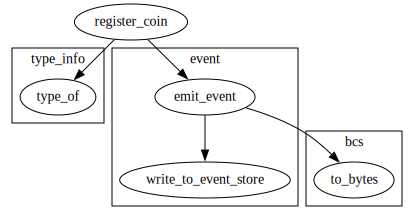

Show all the functions that call "register_coin"

## Function `create_signer_with_capability`

Capability based functions for efficient use.

<pre><code><b>public</b> <b>fun</b> <a href="account.md#0x1_account_create_signer_with_capability">create_signer_with_capability</a>(capability: &<a href="account.md#0x1_account_SignerCapability">account::SignerCapability</a>): <a href="../../aptos-stdlib/../move-stdlib/doc/signer.md#0x1_signer">signer</a>
</code></pre>

Implementation

<pre><code><b>public</b> <b>fun</b> <a href="account.md#0x1_account_create_signer_with_capability">create_signer_with_capability</a>(capability: &<a href="account.md#0x1_account_SignerCapability">SignerCapability</a>): <a href="../../aptos-stdlib/../move-stdlib/doc/signer.md#0x1_signer">signer</a> {
    <b>let</b> addr = &capability.<a href="account.md#0x1_account">account</a>;
    <a href="account.md#0x1_account_create_signer">create_signer</a>(*addr)
}
</code></pre>

Show all the functions that "create_signer_with_capability" calls

Show all the functions that call "create_signer_with_capability"

## Function `get_signer_capability_address`

<pre><code><b>public</b> <b>fun</b> <a href="account.md#0x1_account_get_signer_capability_address">get_signer_capability_address</a>(capability: &<a href="account.md#0x1_account_SignerCapability">account::SignerCapability</a>): <b>address</b>
</code></pre>

Implementation

<pre><code><b>public</b> <b>fun</b> <a href="account.md#0x1_account_get_signer_capability_address">get_signer_capability_address</a>(capability: &<a href="account.md#0x1_account_SignerCapability">SignerCapability</a>): <b>address</b> {
    capability.<a href="account.md#0x1_account">account</a>
}
</code></pre>

Show all the functions that "get_signer_capability_address" calls

Show all the functions that call "get_signer_capability_address"

## Specification

### Function `create_signer`

<pre><code><b>fun</b> <a href="account.md#0x1_account_create_signer">create_signer</a>(addr: <b>address</b>): <a href="../../aptos-stdlib/../move-stdlib/doc/signer.md#0x1_signer">signer</a>
</code></pre>

<pre><code><b>pragma</b> opaque;
</code></pre>

[move-book]: https://move-language.github.io/move/introduction.html
