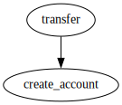
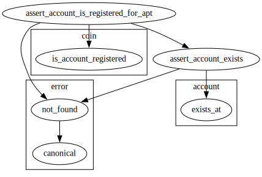
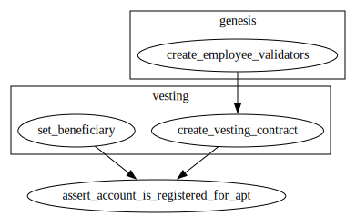

# Module `0x1::aptos_account`

-  [Constants](#@Constants_0)
-  [Function `create_account`](#0x1_aptos_account_create_account)
-  [Function `transfer`](#0x1_aptos_account_transfer)
-  [Function `assert_account_exists`](#0x1_aptos_account_assert_account_exists)
-  [Function `assert_account_is_registered_for_apt`](#0x1_aptos_account_assert_account_is_registered_for_apt)

<pre><code><b>use</b> <a href="account.md#0x1_account">0x1::account</a>;
<b>use</b> <a href="aptos_coin.md#0x1_aptos_coin">0x1::aptos_coin</a>;
<b>use</b> <a href="coin.md#0x1_coin">0x1::coin</a>;
<b>use</b> <a href="../../aptos-stdlib/../move-stdlib/doc/error.md#0x1_error">0x1::error</a>;
</code></pre>

Show all the modules that "aptos_account" depends on directly or indirectly

Show all the modules that depend on "aptos_account" directly or indirectly

## Constants

Account does not exist.

<pre><code><b>const</b> <a href="aptos_account.md#0x1_aptos_account_EACCOUNT_NOT_FOUND">EACCOUNT_NOT_FOUND</a>: u64 = 1;
</code></pre>

Account is not registered to receive APT.

<pre><code><b>const</b> <a href="aptos_account.md#0x1_aptos_account_EACCOUNT_NOT_REGISTERED_FOR_APT">EACCOUNT_NOT_REGISTERED_FOR_APT</a>: u64 = 2;
</code></pre>

## Function `create_account`

Basic account creation methods.

<pre><code><b>public</b> <b>fun</b> <a href="aptos_account.md#0x1_aptos_account_create_account">create_account</a>(auth_key: <b>address</b>)
</code></pre>

Implementation

<pre><code><b>public</b> entry <b>fun</b> <a href="aptos_account.md#0x1_aptos_account_create_account">create_account</a>(auth_key: <b>address</b>) {
    <b>let</b> <a href="../../aptos-stdlib/../move-stdlib/doc/signer.md#0x1_signer">signer</a> = <a href="account.md#0x1_account_create_account">account::create_account</a>(auth_key);
    <a href="coin.md#0x1_coin_register">coin::register</a>&lt;AptosCoin&gt;(&<a href="../../aptos-stdlib/../move-stdlib/doc/signer.md#0x1_signer">signer</a>);
}
</code></pre>

Show all the functions that "create_account" calls

Show all the functions that call "create_account"

## Function `transfer`

<pre><code><b>public</b> <b>fun</b> <a href="aptos_account.md#0x1_aptos_account_transfer">transfer</a>(source: &<a href="../../aptos-stdlib/../move-stdlib/doc/signer.md#0x1_signer">signer</a>, <b>to</b>: <b>address</b>, amount: u64)
</code></pre>

Implementation

<pre><code><b>public</b> entry <b>fun</b> <a href="aptos_account.md#0x1_aptos_account_transfer">transfer</a>(source: &<a href="../../aptos-stdlib/../move-stdlib/doc/signer.md#0x1_signer">signer</a>, <b>to</b>: <b>address</b>, amount: u64) {
    <b>if</b> (!<a href="account.md#0x1_account_exists_at">account::exists_at</a>(<b>to</b>)) {
        <a href="aptos_account.md#0x1_aptos_account_create_account">create_account</a>(<b>to</b>)
    };
    <a href="coin.md#0x1_coin_transfer">coin::transfer</a>&lt;AptosCoin&gt;(source, <b>to</b>, amount)
}
</code></pre>

Show all the functions that "transfer" calls

Show all the functions that call "transfer"

## Function `assert_account_exists`

<pre><code><b>public</b> <b>fun</b> <a href="aptos_account.md#0x1_aptos_account_assert_account_exists">assert_account_exists</a>(addr: <b>address</b>)
</code></pre>

Implementation

<pre><code><b>public</b> <b>fun</b> <a href="aptos_account.md#0x1_aptos_account_assert_account_exists">assert_account_exists</a>(addr: <b>address</b>) {
    <b>assert</b>!(<a href="account.md#0x1_account_exists_at">account::exists_at</a>(addr), <a href="../../aptos-stdlib/../move-stdlib/doc/error.md#0x1_error_not_found">error::not_found</a>(<a href="aptos_account.md#0x1_aptos_account_EACCOUNT_NOT_FOUND">EACCOUNT_NOT_FOUND</a>));
}
</code></pre>

Show all the functions that "assert_account_exists" calls

Show all the functions that call "assert_account_exists"

## Function `assert_account_is_registered_for_apt`

<pre><code><b>public</b> <b>fun</b> <a href="aptos_account.md#0x1_aptos_account_assert_account_is_registered_for_apt">assert_account_is_registered_for_apt</a>(addr: <b>address</b>)
</code></pre>

Implementation

<pre><code><b>public</b> <b>fun</b> <a href="aptos_account.md#0x1_aptos_account_assert_account_is_registered_for_apt">assert_account_is_registered_for_apt</a>(addr: <b>address</b>) {
    <a href="aptos_account.md#0x1_aptos_account_assert_account_exists">assert_account_exists</a>(addr);
    <b>assert</b>!(<a href="coin.md#0x1_coin_is_account_registered">coin::is_account_registered</a>&lt;AptosCoin&gt;(addr), <a href="../../aptos-stdlib/../move-stdlib/doc/error.md#0x1_error_not_found">error::not_found</a>(<a href="aptos_account.md#0x1_aptos_account_EACCOUNT_NOT_REGISTERED_FOR_APT">EACCOUNT_NOT_REGISTERED_FOR_APT</a>));
}
</code></pre>

Show all the functions that "assert_account_is_registered_for_apt" calls

Show all the functions that call "assert_account_is_registered_for_apt"

[move-book]: https://move-language.github.io/move/introduction.html
