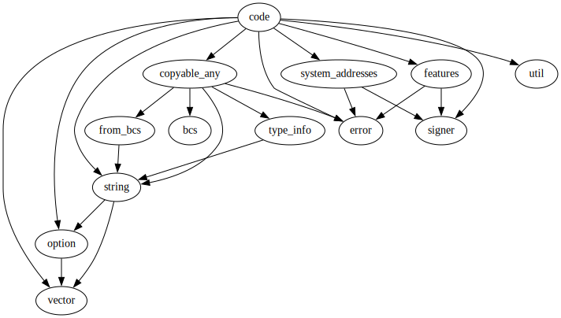
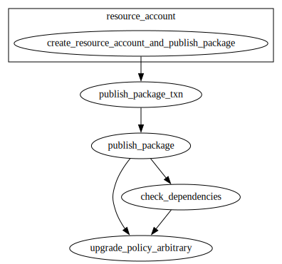
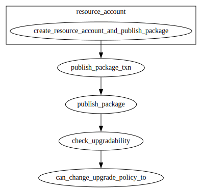
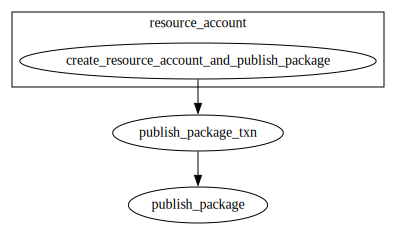
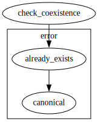
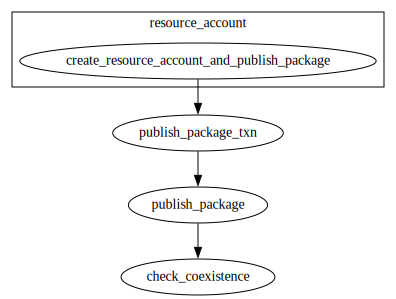
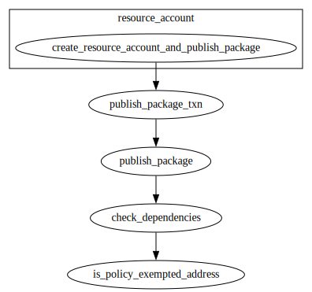
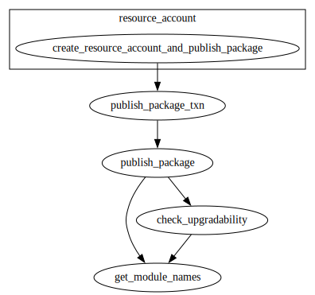
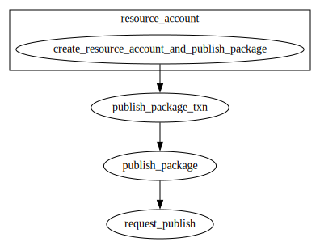
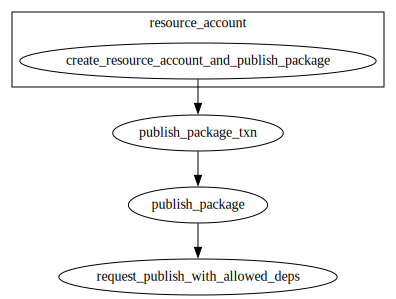

# Module `0x1::code`

This module supports functionality related to code management.

-  [Resource `PackageRegistry`](#0x1_code_PackageRegistry)
-  [Struct `PackageMetadata`](#0x1_code_PackageMetadata)
-  [Struct `PackageDep`](#0x1_code_PackageDep)
-  [Struct `ModuleMetadata`](#0x1_code_ModuleMetadata)
-  [Struct `UpgradePolicy`](#0x1_code_UpgradePolicy)
-  [Struct `AllowedDep`](#0x1_code_AllowedDep)
-  [Constants](#@Constants_0)
-  [Function `upgrade_policy_arbitrary`](#0x1_code_upgrade_policy_arbitrary)
-  [Function `upgrade_policy_compat`](#0x1_code_upgrade_policy_compat)
-  [Function `upgrade_policy_immutable`](#0x1_code_upgrade_policy_immutable)
-  [Function `can_change_upgrade_policy_to`](#0x1_code_can_change_upgrade_policy_to)
-  [Function `initialize`](#0x1_code_initialize)
-  [Function `publish_package`](#0x1_code_publish_package)
-  [Function `publish_package_txn`](#0x1_code_publish_package_txn)
-  [Function `check_upgradability`](#0x1_code_check_upgradability)
-  [Function `check_coexistence`](#0x1_code_check_coexistence)
-  [Function `check_dependencies`](#0x1_code_check_dependencies)
-  [Function `is_policy_exempted_address`](#0x1_code_is_policy_exempted_address)
-  [Function `get_module_names`](#0x1_code_get_module_names)
-  [Function `request_publish`](#0x1_code_request_publish)
-  [Function `request_publish_with_allowed_deps`](#0x1_code_request_publish_with_allowed_deps)
-  [Specification](#@Specification_1)
    -  [Function `request_publish`](#@Specification_1_request_publish)
    -  [Function `request_publish_with_allowed_deps`](#@Specification_1_request_publish_with_allowed_deps)

<pre><code><b>use</b> <a href="../../aptos-stdlib/doc/copyable_any.md#0x1_copyable_any">0x1::copyable_any</a>;
<b>use</b> <a href="../../aptos-stdlib/../move-stdlib/doc/error.md#0x1_error">0x1::error</a>;
<b>use</b> <a href="../../aptos-stdlib/../move-stdlib/doc/features.md#0x1_features">0x1::features</a>;
<b>use</b> <a href="../../aptos-stdlib/../move-stdlib/doc/option.md#0x1_option">0x1::option</a>;
<b>use</b> <a href="../../aptos-stdlib/../move-stdlib/doc/signer.md#0x1_signer">0x1::signer</a>;
<b>use</b> <a href="../../aptos-stdlib/../move-stdlib/doc/string.md#0x1_string">0x1::string</a>;
<b>use</b> <a href="system_addresses.md#0x1_system_addresses">0x1::system_addresses</a>;
<b>use</b> <a href="util.md#0x1_util">0x1::util</a>;
<b>use</b> <a href="../../aptos-stdlib/../move-stdlib/doc/vector.md#0x1_vector">0x1::vector</a>;
</code></pre>

Show all the modules that "code" depends on directly or indirectly

Show all the modules that depend on "code" directly or indirectly

## Resource `PackageRegistry`

The package registry at the given address.

<pre><code><b>struct</b> <a href="code.md#0x1_code_PackageRegistry">PackageRegistry</a> <b>has</b> drop, store, key
</code></pre>

Fields

<dl>
<dt>
<code>packages: <a href="../../aptos-stdlib/../move-stdlib/doc/vector.md#0x1_vector">vector</a>&lt;<a href="code.md#0x1_code_PackageMetadata">code::PackageMetadata</a>&gt;</code>
</dt>
<dd>
 Packages installed at this address.
</dd>
</dl>

## Struct `PackageMetadata`

Metadata for a package. All byte blobs are represented as base64-of-gzipped-bytes

<pre><code><b>struct</b> <a href="code.md#0x1_code_PackageMetadata">PackageMetadata</a> <b>has</b> drop, store
</code></pre>

Fields

<dl>
<dt>
<code>name: <a href="../../aptos-stdlib/../move-stdlib/doc/string.md#0x1_string_String">string::String</a></code>
</dt>
<dd>
 Name of this package.
</dd>
<dt>
<code>upgrade_policy: <a href="code.md#0x1_code_UpgradePolicy">code::UpgradePolicy</a></code>
</dt>
<dd>
 The upgrade policy of this package.
</dd>
<dt>
<code>upgrade_number: u64</code>
</dt>
<dd>
 The numbers of times this module has been upgraded. Also serves as the on-chain version.
 This field will be automatically assigned on successful upgrade.
</dd>
<dt>
<code>source_digest: <a href="../../aptos-stdlib/../move-stdlib/doc/string.md#0x1_string_String">string::String</a></code>
</dt>
<dd>
 The source digest of the sources in the package. This is constructed by first building the
 sha256 of each individual source, than sorting them alphabetically, and sha256 them again.
</dd>
<dt>
<code>manifest: <a href="../../aptos-stdlib/../move-stdlib/doc/vector.md#0x1_vector">vector</a>&lt;u8&gt;</code>
</dt>
<dd>
 The package manifest, in the Move.toml format. Gzipped text.
</dd>
<dt>
<code>modules: <a href="../../aptos-stdlib/../move-stdlib/doc/vector.md#0x1_vector">vector</a>&lt;<a href="code.md#0x1_code_ModuleMetadata">code::ModuleMetadata</a>&gt;</code>
</dt>
<dd>
 The list of modules installed by this package.
</dd>
<dt>
<code>deps: <a href="../../aptos-stdlib/../move-stdlib/doc/vector.md#0x1_vector">vector</a>&lt;<a href="code.md#0x1_code_PackageDep">code::PackageDep</a>&gt;</code>
</dt>
<dd>
 Holds PackageDeps.
</dd>
<dt>
<code>extension: <a href="../../aptos-stdlib/../move-stdlib/doc/option.md#0x1_option_Option">option::Option</a>&lt;<a href="../../aptos-stdlib/doc/copyable_any.md#0x1_copyable_any_Any">copyable_any::Any</a>&gt;</code>
</dt>
<dd>
 For future extension
</dd>
</dl>

## Struct `PackageDep`

A dependency to a package published at address

<pre><code><b>struct</b> <a href="code.md#0x1_code_PackageDep">PackageDep</a> <b>has</b> <b>copy</b>, drop, store
</code></pre>

Fields

<dl>
<dt>
<code><a href="account.md#0x1_account">account</a>: <b>address</b></code>
</dt>
<dd>

</dd>
<dt>
<code>package_name: <a href="../../aptos-stdlib/../move-stdlib/doc/string.md#0x1_string_String">string::String</a></code>
</dt>
<dd>

</dd>
</dl>

## Struct `ModuleMetadata`

Metadata about a module in a package.

<pre><code><b>struct</b> <a href="code.md#0x1_code_ModuleMetadata">ModuleMetadata</a> <b>has</b> drop, store
</code></pre>

Fields

<dl>
<dt>
<code>name: <a href="../../aptos-stdlib/../move-stdlib/doc/string.md#0x1_string_String">string::String</a></code>
</dt>
<dd>
 Name of the module.
</dd>
<dt>
<code>source: <a href="../../aptos-stdlib/../move-stdlib/doc/vector.md#0x1_vector">vector</a>&lt;u8&gt;</code>
</dt>
<dd>
 Source text, gzipped String. Empty if not provided.
</dd>
<dt>
<code>source_map: <a href="../../aptos-stdlib/../move-stdlib/doc/vector.md#0x1_vector">vector</a>&lt;u8&gt;</code>
</dt>
<dd>
 Source map, in compressed BCS. Empty if not provided.
</dd>
<dt>
<code>extension: <a href="../../aptos-stdlib/../move-stdlib/doc/option.md#0x1_option_Option">option::Option</a>&lt;<a href="../../aptos-stdlib/doc/copyable_any.md#0x1_copyable_any_Any">copyable_any::Any</a>&gt;</code>
</dt>
<dd>
 For future extensions.
</dd>
</dl>

## Struct `UpgradePolicy`

Describes an upgrade policy

<pre><code><b>struct</b> <a href="code.md#0x1_code_UpgradePolicy">UpgradePolicy</a> <b>has</b> <b>copy</b>, drop, store
</code></pre>

Fields

<dl>
<dt>
<code>policy: u8</code>
</dt>
<dd>

</dd>
</dl>

## Struct `AllowedDep`

A helper type for request_publish_with_allowed_deps

<pre><code><b>struct</b> <a href="code.md#0x1_code_AllowedDep">AllowedDep</a> <b>has</b> drop
</code></pre>

Fields

<dl>
<dt>
<code><a href="account.md#0x1_account">account</a>: <b>address</b></code>
</dt>
<dd>
 Address of the module.
</dd>
<dt>
<code>module_name: <a href="../../aptos-stdlib/../move-stdlib/doc/string.md#0x1_string_String">string::String</a></code>
</dt>
<dd>
 Name of the module. If this is the empty string, then this serves as a wildcard for
 all modules from this address. This is used for speeding up dependency checking for packages from
 well-known framework addresses, where we can assume that there are no malicious packages.
</dd>
</dl>

## Constants

A dependency to an <code>arbitrary</code> package must be on the same address.

<pre><code><b>const</b> <a href="code.md#0x1_code_EDEP_ARBITRARY_NOT_SAME_ADDRESS">EDEP_ARBITRARY_NOT_SAME_ADDRESS</a>: u64 = 7;
</code></pre>

A dependency cannot have a weaker upgrade policy.

<pre><code><b>const</b> <a href="code.md#0x1_code_EDEP_WEAKER_POLICY">EDEP_WEAKER_POLICY</a>: u64 = 6;
</code></pre>

Creating a package with incompatible upgrade policy is disabled.

<pre><code><b>const</b> <a href="code.md#0x1_code_EINCOMPATIBLE_POLICY_DISABLED">EINCOMPATIBLE_POLICY_DISABLED</a>: u64 = 8;
</code></pre>

Cannot delete a module that was published in the same package

<pre><code><b>const</b> <a href="code.md#0x1_code_EMODULE_MISSING">EMODULE_MISSING</a>: u64 = 4;
</code></pre>

Package contains duplicate module names with existing modules publised in other packages on this address

<pre><code><b>const</b> <a href="code.md#0x1_code_EMODULE_NAME_CLASH">EMODULE_NAME_CLASH</a>: u64 = 1;
</code></pre>

Dependency could not be resolved to any published package.

<pre><code><b>const</b> <a href="code.md#0x1_code_EPACKAGE_DEP_MISSING">EPACKAGE_DEP_MISSING</a>: u64 = 5;
</code></pre>

Cannot upgrade an immutable package

<pre><code><b>const</b> <a href="code.md#0x1_code_EUPGRADE_IMMUTABLE">EUPGRADE_IMMUTABLE</a>: u64 = 2;
</code></pre>

Cannot downgrade a package's upgradability policy

<pre><code><b>const</b> <a href="code.md#0x1_code_EUPGRADE_WEAKER_POLICY">EUPGRADE_WEAKER_POLICY</a>: u64 = 3;
</code></pre>

## Function `upgrade_policy_arbitrary`

Whether unconditional code upgrade with no compatibility check is allowed. This
publication mode should only be used for modules which aren't shared with user others.
The developer is responsible for not breaking memory layout of any resources he already
stored on chain.

<pre><code><b>public</b> <b>fun</b> <a href="code.md#0x1_code_upgrade_policy_arbitrary">upgrade_policy_arbitrary</a>(): <a href="code.md#0x1_code_UpgradePolicy">code::UpgradePolicy</a>
</code></pre>

Implementation

<pre><code><b>public</b> <b>fun</b> <a href="code.md#0x1_code_upgrade_policy_arbitrary">upgrade_policy_arbitrary</a>(): <a href="code.md#0x1_code_UpgradePolicy">UpgradePolicy</a> {
    <a href="code.md#0x1_code_UpgradePolicy">UpgradePolicy</a> { policy: 0 }
}
</code></pre>

Show all the functions that "upgrade_policy_arbitrary" calls

Show all the functions that call "upgrade_policy_arbitrary"

## Function `upgrade_policy_compat`

Whether a compatibility check should be performed for upgrades. The check only passes if
a new module has (a) the same public functions (b) for existing resources, no layout change.

<pre><code><b>public</b> <b>fun</b> <a href="code.md#0x1_code_upgrade_policy_compat">upgrade_policy_compat</a>(): <a href="code.md#0x1_code_UpgradePolicy">code::UpgradePolicy</a>
</code></pre>

Implementation

<pre><code><b>public</b> <b>fun</b> <a href="code.md#0x1_code_upgrade_policy_compat">upgrade_policy_compat</a>(): <a href="code.md#0x1_code_UpgradePolicy">UpgradePolicy</a> {
    <a href="code.md#0x1_code_UpgradePolicy">UpgradePolicy</a> { policy: 1 }
}
</code></pre>

Show all the functions that "upgrade_policy_compat" calls

Show all the functions that call "upgrade_policy_compat"

## Function `upgrade_policy_immutable`

Whether the modules in the package are immutable and cannot be upgraded.

<pre><code><b>public</b> <b>fun</b> <a href="code.md#0x1_code_upgrade_policy_immutable">upgrade_policy_immutable</a>(): <a href="code.md#0x1_code_UpgradePolicy">code::UpgradePolicy</a>
</code></pre>

Implementation

<pre><code><b>public</b> <b>fun</b> <a href="code.md#0x1_code_upgrade_policy_immutable">upgrade_policy_immutable</a>(): <a href="code.md#0x1_code_UpgradePolicy">UpgradePolicy</a> {
    <a href="code.md#0x1_code_UpgradePolicy">UpgradePolicy</a> { policy: 2 }
}
</code></pre>

Show all the functions that "upgrade_policy_immutable" calls

Show all the functions that call "upgrade_policy_immutable"

## Function `can_change_upgrade_policy_to`

Whether the upgrade policy can be changed. In general, the policy can be only
strengthened but not weakened.

<pre><code><b>public</b> <b>fun</b> <a href="code.md#0x1_code_can_change_upgrade_policy_to">can_change_upgrade_policy_to</a>(from: <a href="code.md#0x1_code_UpgradePolicy">code::UpgradePolicy</a>, <b>to</b>: <a href="code.md#0x1_code_UpgradePolicy">code::UpgradePolicy</a>): bool
</code></pre>

Implementation

<pre><code><b>public</b> <b>fun</b> <a href="code.md#0x1_code_can_change_upgrade_policy_to">can_change_upgrade_policy_to</a>(from: <a href="code.md#0x1_code_UpgradePolicy">UpgradePolicy</a>, <b>to</b>: <a href="code.md#0x1_code_UpgradePolicy">UpgradePolicy</a>): bool {
    from.policy &lt;= <b>to</b>.policy
}
</code></pre>

Show all the functions that "can_change_upgrade_policy_to" calls

Show all the functions that call "can_change_upgrade_policy_to"

## Function `initialize`

Initialize package metadata for Genesis.

<pre><code><b>fun</b> <a href="code.md#0x1_code_initialize">initialize</a>(aptos_framework: &<a href="../../aptos-stdlib/../move-stdlib/doc/signer.md#0x1_signer">signer</a>, package_owner: &<a href="../../aptos-stdlib/../move-stdlib/doc/signer.md#0x1_signer">signer</a>, metadata: <a href="code.md#0x1_code_PackageMetadata">code::PackageMetadata</a>)
</code></pre>

Implementation

<pre><code><b>fun</b> <a href="code.md#0x1_code_initialize">initialize</a>(aptos_framework: &<a href="../../aptos-stdlib/../move-stdlib/doc/signer.md#0x1_signer">signer</a>, package_owner: &<a href="../../aptos-stdlib/../move-stdlib/doc/signer.md#0x1_signer">signer</a>, metadata: <a href="code.md#0x1_code_PackageMetadata">PackageMetadata</a>)
<b>acquires</b> <a href="code.md#0x1_code_PackageRegistry">PackageRegistry</a> {
    <a href="system_addresses.md#0x1_system_addresses_assert_aptos_framework">system_addresses::assert_aptos_framework</a>(aptos_framework);
    <b>let</b> addr = <a href="../../aptos-stdlib/../move-stdlib/doc/signer.md#0x1_signer_address_of">signer::address_of</a>(package_owner);
    <b>if</b> (!<b>exists</b>&lt;<a href="code.md#0x1_code_PackageRegistry">PackageRegistry</a>&gt;(addr)) {
        <b>move_to</b>(package_owner, <a href="code.md#0x1_code_PackageRegistry">PackageRegistry</a> { packages: <a href="../../aptos-stdlib/../move-stdlib/doc/vector.md#0x1_vector">vector</a>[metadata] })
    } <b>else</b> {
        <a href="../../aptos-stdlib/../move-stdlib/doc/vector.md#0x1_vector_push_back">vector::push_back</a>(&<b>mut</b> <b>borrow_global_mut</b>&lt;<a href="code.md#0x1_code_PackageRegistry">PackageRegistry</a>&gt;(addr).packages, metadata)
    }
}
</code></pre>

Show all the functions that "initialize" calls

Show all the functions that call "initialize"

## Function `publish_package`

Publishes a package at the given signer's address. The caller must provide package metadata describing the
package.

<pre><code><b>public</b> <b>fun</b> <a href="code.md#0x1_code_publish_package">publish_package</a>(owner: &<a href="../../aptos-stdlib/../move-stdlib/doc/signer.md#0x1_signer">signer</a>, pack: <a href="code.md#0x1_code_PackageMetadata">code::PackageMetadata</a>, <a href="code.md#0x1_code">code</a>: <a href="../../aptos-stdlib/../move-stdlib/doc/vector.md#0x1_vector">vector</a>&lt;<a href="../../aptos-stdlib/../move-stdlib/doc/vector.md#0x1_vector">vector</a>&lt;u8&gt;&gt;)
</code></pre>

Implementation

<pre><code><b>public</b> <b>fun</b> <a href="code.md#0x1_code_publish_package">publish_package</a>(owner: &<a href="../../aptos-stdlib/../move-stdlib/doc/signer.md#0x1_signer">signer</a>, pack: <a href="code.md#0x1_code_PackageMetadata">PackageMetadata</a>, <a href="code.md#0x1_code">code</a>: <a href="../../aptos-stdlib/../move-stdlib/doc/vector.md#0x1_vector">vector</a>&lt;<a href="../../aptos-stdlib/../move-stdlib/doc/vector.md#0x1_vector">vector</a>&lt;u8&gt;&gt;) <b>acquires</b> <a href="code.md#0x1_code_PackageRegistry">PackageRegistry</a> {
    // Disallow incompatible upgrade mode. Governance can decide later <b>if</b> this should be reconsidered.
    <b>assert</b>!(
        pack.upgrade_policy.policy &gt; <a href="code.md#0x1_code_upgrade_policy_arbitrary">upgrade_policy_arbitrary</a>().policy,
        <a href="../../aptos-stdlib/../move-stdlib/doc/error.md#0x1_error_invalid_argument">error::invalid_argument</a>(<a href="code.md#0x1_code_EINCOMPATIBLE_POLICY_DISABLED">EINCOMPATIBLE_POLICY_DISABLED</a>),
    );

    <b>let</b> addr = <a href="../../aptos-stdlib/../move-stdlib/doc/signer.md#0x1_signer_address_of">signer::address_of</a>(owner);
    <b>if</b> (!<b>exists</b>&lt;<a href="code.md#0x1_code_PackageRegistry">PackageRegistry</a>&gt;(addr)) {
        <b>move_to</b>(owner, <a href="code.md#0x1_code_PackageRegistry">PackageRegistry</a> { packages: <a href="../../aptos-stdlib/../move-stdlib/doc/vector.md#0x1_vector_empty">vector::empty</a>() })
    };

    // Checks for valid dependencies <b>to</b> other packages
    <b>let</b> allowed_deps = <a href="code.md#0x1_code_check_dependencies">check_dependencies</a>(addr, &pack);

    // Check package against conflicts
    <b>let</b> module_names = <a href="code.md#0x1_code_get_module_names">get_module_names</a>(&pack);
    <b>let</b> packages = &<b>mut</b> <b>borrow_global_mut</b>&lt;<a href="code.md#0x1_code_PackageRegistry">PackageRegistry</a>&gt;(addr).packages;
    <b>let</b> len = <a href="../../aptos-stdlib/../move-stdlib/doc/vector.md#0x1_vector_length">vector::length</a>(packages);
    <b>let</b> index = len;
    <b>let</b> i = 0;
    <b>let</b> upgrade_number = 0;
    <b>while</b> (i &lt; len) {
        <b>let</b> <b>old</b> = <a href="../../aptos-stdlib/../move-stdlib/doc/vector.md#0x1_vector_borrow">vector::borrow</a>(packages, i);
        <b>if</b> (<b>old</b>.name == pack.name) {
            upgrade_number = <b>old</b>.upgrade_number + 1;
            <a href="code.md#0x1_code_check_upgradability">check_upgradability</a>(<b>old</b>, &pack, &module_names);
            index = i;
        } <b>else</b> {
            <a href="code.md#0x1_code_check_coexistence">check_coexistence</a>(<b>old</b>, &module_names)
        };
        i = i + 1;
    };

    // Assign the upgrade counter.
    *&<b>mut</b> pack.upgrade_number = upgrade_number;

    // Update registry
    <b>let</b> policy = pack.upgrade_policy;
    <b>if</b> (index &lt; len) {
        *<a href="../../aptos-stdlib/../move-stdlib/doc/vector.md#0x1_vector_borrow_mut">vector::borrow_mut</a>(packages, index) = pack
    } <b>else</b> {
        <a href="../../aptos-stdlib/../move-stdlib/doc/vector.md#0x1_vector_push_back">vector::push_back</a>(packages, pack)
    };

    // Request publish
    <b>if</b> (<a href="../../aptos-stdlib/../move-stdlib/doc/features.md#0x1_features_code_dependency_check_enabled">features::code_dependency_check_enabled</a>())
        <a href="code.md#0x1_code_request_publish_with_allowed_deps">request_publish_with_allowed_deps</a>(addr, module_names, allowed_deps, <a href="code.md#0x1_code">code</a>, policy.policy)
    <b>else</b>
    // The new `request_publish_with_allowed_deps` <b>has</b> not yet rolled out, so call downwards
    // compatible <a href="code.md#0x1_code">code</a>.
        <a href="code.md#0x1_code_request_publish">request_publish</a>(addr, module_names, <a href="code.md#0x1_code">code</a>, policy.policy)
}
</code></pre>

Show all the functions that "publish_package" calls

Show all the functions that call "publish_package"

## Function `publish_package_txn`

Same as <code>publish_package</code> but as an entry function which can be called as a transaction. Because
of current restrictions for txn parameters, the metadata needs to be passed in serialized form.

<pre><code><b>public</b> <b>fun</b> <a href="code.md#0x1_code_publish_package_txn">publish_package_txn</a>(owner: &<a href="../../aptos-stdlib/../move-stdlib/doc/signer.md#0x1_signer">signer</a>, metadata_serialized: <a href="../../aptos-stdlib/../move-stdlib/doc/vector.md#0x1_vector">vector</a>&lt;u8&gt;, <a href="code.md#0x1_code">code</a>: <a href="../../aptos-stdlib/../move-stdlib/doc/vector.md#0x1_vector">vector</a>&lt;<a href="../../aptos-stdlib/../move-stdlib/doc/vector.md#0x1_vector">vector</a>&lt;u8&gt;&gt;)
</code></pre>

Implementation

<pre><code><b>public</b> entry <b>fun</b> <a href="code.md#0x1_code_publish_package_txn">publish_package_txn</a>(owner: &<a href="../../aptos-stdlib/../move-stdlib/doc/signer.md#0x1_signer">signer</a>, metadata_serialized: <a href="../../aptos-stdlib/../move-stdlib/doc/vector.md#0x1_vector">vector</a>&lt;u8&gt;, <a href="code.md#0x1_code">code</a>: <a href="../../aptos-stdlib/../move-stdlib/doc/vector.md#0x1_vector">vector</a>&lt;<a href="../../aptos-stdlib/../move-stdlib/doc/vector.md#0x1_vector">vector</a>&lt;u8&gt;&gt;)
<b>acquires</b> <a href="code.md#0x1_code_PackageRegistry">PackageRegistry</a> {
    <a href="code.md#0x1_code_publish_package">publish_package</a>(owner, <a href="util.md#0x1_util_from_bytes">util::from_bytes</a>&lt;<a href="code.md#0x1_code_PackageMetadata">PackageMetadata</a>&gt;(metadata_serialized), <a href="code.md#0x1_code">code</a>)
}
</code></pre>

Show all the functions that "publish_package_txn" calls

Show all the functions that call "publish_package_txn"

## Function `check_upgradability`

Checks whether the given package is upgradable, and returns true if a compatibility check is needed.

<pre><code><b>fun</b> <a href="code.md#0x1_code_check_upgradability">check_upgradability</a>(old_pack: &<a href="code.md#0x1_code_PackageMetadata">code::PackageMetadata</a>, new_pack: &<a href="code.md#0x1_code_PackageMetadata">code::PackageMetadata</a>, new_modules: &<a href="../../aptos-stdlib/../move-stdlib/doc/vector.md#0x1_vector">vector</a>&lt;<a href="../../aptos-stdlib/../move-stdlib/doc/string.md#0x1_string_String">string::String</a>&gt;)
</code></pre>

Implementation

<pre><code><b>fun</b> <a href="code.md#0x1_code_check_upgradability">check_upgradability</a>(
    old_pack: &<a href="code.md#0x1_code_PackageMetadata">PackageMetadata</a>, new_pack: &<a href="code.md#0x1_code_PackageMetadata">PackageMetadata</a>, new_modules: &<a href="../../aptos-stdlib/../move-stdlib/doc/vector.md#0x1_vector">vector</a>&lt;String&gt;) {
    <b>assert</b>!(old_pack.upgrade_policy.policy &lt; <a href="code.md#0x1_code_upgrade_policy_immutable">upgrade_policy_immutable</a>().policy,
        <a href="../../aptos-stdlib/../move-stdlib/doc/error.md#0x1_error_invalid_argument">error::invalid_argument</a>(<a href="code.md#0x1_code_EUPGRADE_IMMUTABLE">EUPGRADE_IMMUTABLE</a>));
    <b>assert</b>!(<a href="code.md#0x1_code_can_change_upgrade_policy_to">can_change_upgrade_policy_to</a>(old_pack.upgrade_policy, new_pack.upgrade_policy),
        <a href="../../aptos-stdlib/../move-stdlib/doc/error.md#0x1_error_invalid_argument">error::invalid_argument</a>(<a href="code.md#0x1_code_EUPGRADE_WEAKER_POLICY">EUPGRADE_WEAKER_POLICY</a>));
    <b>let</b> old_modules = <a href="code.md#0x1_code_get_module_names">get_module_names</a>(old_pack);
    <b>let</b> i = 0;
    <b>while</b> (i &lt; <a href="../../aptos-stdlib/../move-stdlib/doc/vector.md#0x1_vector_length">vector::length</a>(&old_modules)) {
        <b>assert</b>!(
            <a href="../../aptos-stdlib/../move-stdlib/doc/vector.md#0x1_vector_contains">vector::contains</a>(new_modules, <a href="../../aptos-stdlib/../move-stdlib/doc/vector.md#0x1_vector_borrow">vector::borrow</a>(&old_modules, i)),
            <a href="code.md#0x1_code_EMODULE_MISSING">EMODULE_MISSING</a>
        );
        i = i + 1;
    }
}
</code></pre>

Show all the functions that "check_upgradability" calls

Show all the functions that call "check_upgradability"

## Function `check_coexistence`

Checks whether a new package with given names can co-exist with old package.

<pre><code><b>fun</b> <a href="code.md#0x1_code_check_coexistence">check_coexistence</a>(old_pack: &<a href="code.md#0x1_code_PackageMetadata">code::PackageMetadata</a>, new_modules: &<a href="../../aptos-stdlib/../move-stdlib/doc/vector.md#0x1_vector">vector</a>&lt;<a href="../../aptos-stdlib/../move-stdlib/doc/string.md#0x1_string_String">string::String</a>&gt;)
</code></pre>

Implementation

<pre><code><b>fun</b> <a href="code.md#0x1_code_check_coexistence">check_coexistence</a>(old_pack: &<a href="code.md#0x1_code_PackageMetadata">PackageMetadata</a>, new_modules: &<a href="../../aptos-stdlib/../move-stdlib/doc/vector.md#0x1_vector">vector</a>&lt;String&gt;) {
    // The modules introduced by each package must not overlap <b>with</b> `names`.
    <b>let</b> i = 0;
    <b>while</b> (i &lt; <a href="../../aptos-stdlib/../move-stdlib/doc/vector.md#0x1_vector_length">vector::length</a>(&old_pack.modules)) {
        <b>let</b> old_mod = <a href="../../aptos-stdlib/../move-stdlib/doc/vector.md#0x1_vector_borrow">vector::borrow</a>(&old_pack.modules, i);
        <b>let</b> j = 0;
        <b>while</b> (j &lt; <a href="../../aptos-stdlib/../move-stdlib/doc/vector.md#0x1_vector_length">vector::length</a>(new_modules)) {
            <b>let</b> name = <a href="../../aptos-stdlib/../move-stdlib/doc/vector.md#0x1_vector_borrow">vector::borrow</a>(new_modules, j);
            <b>assert</b>!(&old_mod.name != name, <a href="../../aptos-stdlib/../move-stdlib/doc/error.md#0x1_error_already_exists">error::already_exists</a>(<a href="code.md#0x1_code_EMODULE_NAME_CLASH">EMODULE_NAME_CLASH</a>));
            j = j + 1;
        };
        i = i + 1;
    }
}
</code></pre>

Show all the functions that "check_coexistence" calls

Show all the functions that call "check_coexistence"

## Function `check_dependencies`

Check that the upgrade policies of all packages are equal or higher quality than this package. Also
compute the list of module dependencies which are allowed by the package metadata. The later
is passed on to the native layer to verify that bytecode dependencies are actually what is pretended here.

<pre><code><b>fun</b> <a href="code.md#0x1_code_check_dependencies">check_dependencies</a>(publish_address: <b>address</b>, pack: &<a href="code.md#0x1_code_PackageMetadata">code::PackageMetadata</a>): <a href="../../aptos-stdlib/../move-stdlib/doc/vector.md#0x1_vector">vector</a>&lt;<a href="code.md#0x1_code_AllowedDep">code::AllowedDep</a>&gt;
</code></pre>

Implementation

<pre><code><b>fun</b> <a href="code.md#0x1_code_check_dependencies">check_dependencies</a>(publish_address: <b>address</b>, pack: &<a href="code.md#0x1_code_PackageMetadata">PackageMetadata</a>): <a href="../../aptos-stdlib/../move-stdlib/doc/vector.md#0x1_vector">vector</a>&lt;<a href="code.md#0x1_code_AllowedDep">AllowedDep</a>&gt;
<b>acquires</b> <a href="code.md#0x1_code_PackageRegistry">PackageRegistry</a> {
    <b>let</b> allowed_module_deps = <a href="../../aptos-stdlib/../move-stdlib/doc/vector.md#0x1_vector_empty">vector::empty</a>();
    <b>let</b> deps = &pack.deps;
    <b>let</b> i = 0;
    <b>let</b> n = <a href="../../aptos-stdlib/../move-stdlib/doc/vector.md#0x1_vector_length">vector::length</a>(deps);
    <b>while</b> (i &lt; n) {
        <b>let</b> dep = <a href="../../aptos-stdlib/../move-stdlib/doc/vector.md#0x1_vector_borrow">vector::borrow</a>(deps, i);
        <b>assert</b>!(<b>exists</b>&lt;<a href="code.md#0x1_code_PackageRegistry">PackageRegistry</a>&gt;(dep.<a href="account.md#0x1_account">account</a>), <a href="../../aptos-stdlib/../move-stdlib/doc/error.md#0x1_error_not_found">error::not_found</a>(<a href="code.md#0x1_code_EPACKAGE_DEP_MISSING">EPACKAGE_DEP_MISSING</a>));
        <b>if</b> (<a href="code.md#0x1_code_is_policy_exempted_address">is_policy_exempted_address</a>(dep.<a href="account.md#0x1_account">account</a>)) {
            // Allow all modules from this <b>address</b>, by using "" <b>as</b> a wildcard in the <a href="code.md#0x1_code_AllowedDep">AllowedDep</a>
            <b>let</b> <a href="account.md#0x1_account">account</a> = dep.<a href="account.md#0x1_account">account</a>;
            <b>let</b> module_name = <a href="../../aptos-stdlib/../move-stdlib/doc/string.md#0x1_string_utf8">string::utf8</a>(b"");
            <a href="../../aptos-stdlib/../move-stdlib/doc/vector.md#0x1_vector_push_back">vector::push_back</a>(&<b>mut</b> allowed_module_deps, <a href="code.md#0x1_code_AllowedDep">AllowedDep</a> { <a href="account.md#0x1_account">account</a>, module_name });
            i = i + 1;
            <b>continue</b>
        };
        <b>let</b> registry = <b>borrow_global</b>&lt;<a href="code.md#0x1_code_PackageRegistry">PackageRegistry</a>&gt;(dep.<a href="account.md#0x1_account">account</a>);
        <b>let</b> j = 0;
        <b>let</b> m = <a href="../../aptos-stdlib/../move-stdlib/doc/vector.md#0x1_vector_length">vector::length</a>(&registry.packages);
        <b>let</b> found = <b>false</b>;
        <b>while</b> (j &lt; m) {
            <b>let</b> dep_pack = <a href="../../aptos-stdlib/../move-stdlib/doc/vector.md#0x1_vector_borrow">vector::borrow</a>(&registry.packages, j);
            <b>if</b> (dep_pack.name == dep.package_name) {
                found = <b>true</b>;
                // Check policy
                <b>assert</b>!(
                    dep_pack.upgrade_policy.policy &gt;= pack.upgrade_policy.policy,
                    <a href="../../aptos-stdlib/../move-stdlib/doc/error.md#0x1_error_invalid_argument">error::invalid_argument</a>(<a href="code.md#0x1_code_EDEP_WEAKER_POLICY">EDEP_WEAKER_POLICY</a>)
                );
                <b>if</b> (dep_pack.upgrade_policy == <a href="code.md#0x1_code_upgrade_policy_arbitrary">upgrade_policy_arbitrary</a>()) {
                    <b>assert</b>!(
                        dep.<a href="account.md#0x1_account">account</a> == publish_address,
                        <a href="../../aptos-stdlib/../move-stdlib/doc/error.md#0x1_error_invalid_argument">error::invalid_argument</a>(<a href="code.md#0x1_code_EDEP_ARBITRARY_NOT_SAME_ADDRESS">EDEP_ARBITRARY_NOT_SAME_ADDRESS</a>)
                    )
                };
                // Add allowed deps
                <b>let</b> k = 0;
                <b>let</b> r = <a href="../../aptos-stdlib/../move-stdlib/doc/vector.md#0x1_vector_length">vector::length</a>(&dep_pack.modules);
                <b>while</b> (k &lt; r) {
                    <b>let</b> <a href="account.md#0x1_account">account</a> = dep.<a href="account.md#0x1_account">account</a>;
                    <b>let</b> module_name = <a href="../../aptos-stdlib/../move-stdlib/doc/vector.md#0x1_vector_borrow">vector::borrow</a>(&dep_pack.modules, k).name;
                    <a href="../../aptos-stdlib/../move-stdlib/doc/vector.md#0x1_vector_push_back">vector::push_back</a>(&<b>mut</b> allowed_module_deps, <a href="code.md#0x1_code_AllowedDep">AllowedDep</a> { <a href="account.md#0x1_account">account</a>, module_name });
                    k = k + 1;
                };
                <b>break</b>
            };
            j = j + 1;
        };
        <b>assert</b>!(found, <a href="../../aptos-stdlib/../move-stdlib/doc/error.md#0x1_error_not_found">error::not_found</a>(<a href="code.md#0x1_code_EPACKAGE_DEP_MISSING">EPACKAGE_DEP_MISSING</a>));
        i = i + 1;
    };
    allowed_module_deps
}
</code></pre>

Show all the functions that "check_dependencies" calls

Show all the functions that call "check_dependencies"

## Function `is_policy_exempted_address`

Core addresses which are exempted from the check that their policy matches the referring package. Without
this exemption, it would not be possible to define an immutable package based on the core system, which
requires to be upgradable for maintenance and evolution, and is configured to be <code>compatible</code>.

<pre><code><b>fun</b> <a href="code.md#0x1_code_is_policy_exempted_address">is_policy_exempted_address</a>(addr: <b>address</b>): bool
</code></pre>

Implementation

<pre><code><b>fun</b> <a href="code.md#0x1_code_is_policy_exempted_address">is_policy_exempted_address</a>(addr: <b>address</b>): bool {
    addr == @1 || addr == @2 || addr == @3 || addr == @4 || addr == @5 ||
        addr == @6 || addr == @7 || addr == @8 || addr == @9 || addr == @10
}
</code></pre>

Show all the functions that "is_policy_exempted_address" calls

Show all the functions that call "is_policy_exempted_address"

## Function `get_module_names`

Get the names of the modules in a package.

<pre><code><b>fun</b> <a href="code.md#0x1_code_get_module_names">get_module_names</a>(pack: &<a href="code.md#0x1_code_PackageMetadata">code::PackageMetadata</a>): <a href="../../aptos-stdlib/../move-stdlib/doc/vector.md#0x1_vector">vector</a>&lt;<a href="../../aptos-stdlib/../move-stdlib/doc/string.md#0x1_string_String">string::String</a>&gt;
</code></pre>

Implementation

<pre><code><b>fun</b> <a href="code.md#0x1_code_get_module_names">get_module_names</a>(pack: &<a href="code.md#0x1_code_PackageMetadata">PackageMetadata</a>): <a href="../../aptos-stdlib/../move-stdlib/doc/vector.md#0x1_vector">vector</a>&lt;String&gt; {
    <b>let</b> module_names = <a href="../../aptos-stdlib/../move-stdlib/doc/vector.md#0x1_vector_empty">vector::empty</a>();
    <b>let</b> i = 0;
    <b>while</b> (i &lt; <a href="../../aptos-stdlib/../move-stdlib/doc/vector.md#0x1_vector_length">vector::length</a>(&pack.modules)) {
        <a href="../../aptos-stdlib/../move-stdlib/doc/vector.md#0x1_vector_push_back">vector::push_back</a>(&<b>mut</b> module_names, <a href="../../aptos-stdlib/../move-stdlib/doc/vector.md#0x1_vector_borrow">vector::borrow</a>(&pack.modules, i).name);
        i = i + 1
    };
    module_names
}
</code></pre>

Show all the functions that "get_module_names" calls

Show all the functions that call "get_module_names"

## Function `request_publish`

Native function to initiate module loading

<pre><code><b>fun</b> <a href="code.md#0x1_code_request_publish">request_publish</a>(owner: <b>address</b>, expected_modules: <a href="../../aptos-stdlib/../move-stdlib/doc/vector.md#0x1_vector">vector</a>&lt;<a href="../../aptos-stdlib/../move-stdlib/doc/string.md#0x1_string_String">string::String</a>&gt;, bundle: <a href="../../aptos-stdlib/../move-stdlib/doc/vector.md#0x1_vector">vector</a>&lt;<a href="../../aptos-stdlib/../move-stdlib/doc/vector.md#0x1_vector">vector</a>&lt;u8&gt;&gt;, policy: u8)
</code></pre>

Implementation

<pre><code><b>native</b> <b>fun</b> <a href="code.md#0x1_code_request_publish">request_publish</a>(
    owner: <b>address</b>,
    expected_modules: <a href="../../aptos-stdlib/../move-stdlib/doc/vector.md#0x1_vector">vector</a>&lt;String&gt;,
    bundle: <a href="../../aptos-stdlib/../move-stdlib/doc/vector.md#0x1_vector">vector</a>&lt;<a href="../../aptos-stdlib/../move-stdlib/doc/vector.md#0x1_vector">vector</a>&lt;u8&gt;&gt;,
    policy: u8
);
</code></pre>

Show all the functions that "request_publish" calls

Show all the functions that call "request_publish"

## Function `request_publish_with_allowed_deps`

Native function to initiate module loading, including a list of allowed dependencies.

<pre><code><b>fun</b> <a href="code.md#0x1_code_request_publish_with_allowed_deps">request_publish_with_allowed_deps</a>(owner: <b>address</b>, expected_modules: <a href="../../aptos-stdlib/../move-stdlib/doc/vector.md#0x1_vector">vector</a>&lt;<a href="../../aptos-stdlib/../move-stdlib/doc/string.md#0x1_string_String">string::String</a>&gt;, allowed_deps: <a href="../../aptos-stdlib/../move-stdlib/doc/vector.md#0x1_vector">vector</a>&lt;<a href="code.md#0x1_code_AllowedDep">code::AllowedDep</a>&gt;, bundle: <a href="../../aptos-stdlib/../move-stdlib/doc/vector.md#0x1_vector">vector</a>&lt;<a href="../../aptos-stdlib/../move-stdlib/doc/vector.md#0x1_vector">vector</a>&lt;u8&gt;&gt;, policy: u8)
</code></pre>

Implementation

<pre><code><b>native</b> <b>fun</b> <a href="code.md#0x1_code_request_publish_with_allowed_deps">request_publish_with_allowed_deps</a>(
    owner: <b>address</b>,
    expected_modules: <a href="../../aptos-stdlib/../move-stdlib/doc/vector.md#0x1_vector">vector</a>&lt;String&gt;,
    allowed_deps: <a href="../../aptos-stdlib/../move-stdlib/doc/vector.md#0x1_vector">vector</a>&lt;<a href="code.md#0x1_code_AllowedDep">AllowedDep</a>&gt;,
    bundle: <a href="../../aptos-stdlib/../move-stdlib/doc/vector.md#0x1_vector">vector</a>&lt;<a href="../../aptos-stdlib/../move-stdlib/doc/vector.md#0x1_vector">vector</a>&lt;u8&gt;&gt;,
    policy: u8
);
</code></pre>

Show all the functions that "request_publish_with_allowed_deps" calls

Show all the functions that call "request_publish_with_allowed_deps"

## Specification

<pre><code><b>pragma</b> verify = <b>false</b>;
</code></pre>

### Function `request_publish`

<pre><code><b>fun</b> <a href="code.md#0x1_code_request_publish">request_publish</a>(owner: <b>address</b>, expected_modules: <a href="../../aptos-stdlib/../move-stdlib/doc/vector.md#0x1_vector">vector</a>&lt;<a href="../../aptos-stdlib/../move-stdlib/doc/string.md#0x1_string_String">string::String</a>&gt;, bundle: <a href="../../aptos-stdlib/../move-stdlib/doc/vector.md#0x1_vector">vector</a>&lt;<a href="../../aptos-stdlib/../move-stdlib/doc/vector.md#0x1_vector">vector</a>&lt;u8&gt;&gt;, policy: u8)
</code></pre>

<pre><code><b>pragma</b> opaque;
</code></pre>

### Function `request_publish_with_allowed_deps`

<pre><code><b>fun</b> <a href="code.md#0x1_code_request_publish_with_allowed_deps">request_publish_with_allowed_deps</a>(owner: <b>address</b>, expected_modules: <a href="../../aptos-stdlib/../move-stdlib/doc/vector.md#0x1_vector">vector</a>&lt;<a href="../../aptos-stdlib/../move-stdlib/doc/string.md#0x1_string_String">string::String</a>&gt;, allowed_deps: <a href="../../aptos-stdlib/../move-stdlib/doc/vector.md#0x1_vector">vector</a>&lt;<a href="code.md#0x1_code_AllowedDep">code::AllowedDep</a>&gt;, bundle: <a href="../../aptos-stdlib/../move-stdlib/doc/vector.md#0x1_vector">vector</a>&lt;<a href="../../aptos-stdlib/../move-stdlib/doc/vector.md#0x1_vector">vector</a>&lt;u8&gt;&gt;, policy: u8)
</code></pre>

<pre><code><b>pragma</b> opaque;
</code></pre>

[move-book]: https://move-language.github.io/move/introduction.html
