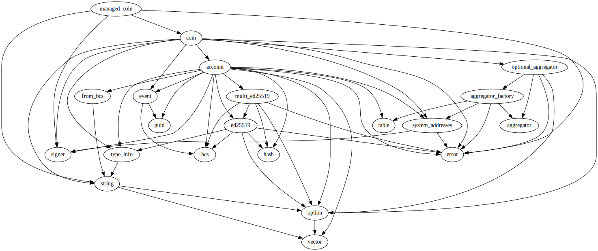
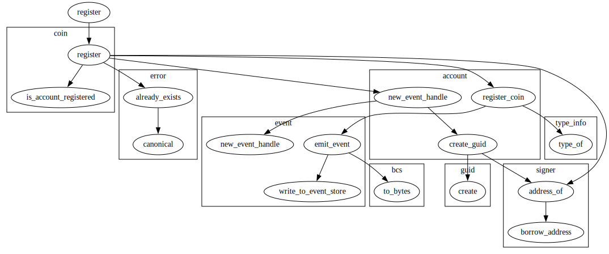

# Module `0x1::managed_coin`

ManagedCoin is built to make a simple walkthrough of the Coins module.
It contains scripts you will need to initialize, mint, burn, transfer coins.
By utilizing this current module, a developer can create his own coin and care less about mint and burn capabilities,

-  [Resource `Capabilities`](#0x1_managed_coin_Capabilities)
-  [Constants](#@Constants_0)
-  [Function `burn`](#0x1_managed_coin_burn)
-  [Function `initialize`](#0x1_managed_coin_initialize)
-  [Function `mint`](#0x1_managed_coin_mint)
-  [Function `register`](#0x1_managed_coin_register)

<pre><code><b>use</b> <a href="coin.md#0x1_coin">0x1::coin</a>;
<b>use</b> <a href="../../aptos-stdlib/../move-stdlib/doc/error.md#0x1_error">0x1::error</a>;
<b>use</b> <a href="../../aptos-stdlib/../move-stdlib/doc/signer.md#0x1_signer">0x1::signer</a>;
<b>use</b> <a href="../../aptos-stdlib/../move-stdlib/doc/string.md#0x1_string">0x1::string</a>;
</code></pre>

Show all the modules that "managed_coin" depends on directly or indirectly

Show all the modules that depend on "managed_coin" directly or indirectly

## Resource `Capabilities`

Capabilities resource storing mint and burn capabilities.
The resource is stored on the account that initialized coin <code>CoinType</code>.

<pre><code><b>struct</b> <a href="managed_coin.md#0x1_managed_coin_Capabilities">Capabilities</a>&lt;CoinType&gt; <b>has</b> key
</code></pre>

Fields

<dl>
<dt>
<code>burn_cap: <a href="coin.md#0x1_coin_BurnCapability">coin::BurnCapability</a>&lt;CoinType&gt;</code>
</dt>
<dd>

</dd>
<dt>
<code>freeze_cap: <a href="coin.md#0x1_coin_FreezeCapability">coin::FreezeCapability</a>&lt;CoinType&gt;</code>
</dt>
<dd>

</dd>
<dt>
<code>mint_cap: <a href="coin.md#0x1_coin_MintCapability">coin::MintCapability</a>&lt;CoinType&gt;</code>
</dt>
<dd>

</dd>
</dl>

## Constants

Account has no capabilities (burn/mint).

<pre><code><b>const</b> <a href="managed_coin.md#0x1_managed_coin_ENO_CAPABILITIES">ENO_CAPABILITIES</a>: u64 = 1;
</code></pre>

## Function `burn`

Withdraw an <code>amount</code> of coin <code>CoinType</code> from <code><a href="account.md#0x1_account">account</a></code> and burn it.

<pre><code><b>public</b> <b>fun</b> <a href="managed_coin.md#0x1_managed_coin_burn">burn</a>&lt;CoinType&gt;(<a href="account.md#0x1_account">account</a>: &<a href="../../aptos-stdlib/../move-stdlib/doc/signer.md#0x1_signer">signer</a>, amount: u64)
</code></pre>

Implementation

<pre><code><b>public</b> entry <b>fun</b> <a href="managed_coin.md#0x1_managed_coin_burn">burn</a>&lt;CoinType&gt;(
    <a href="account.md#0x1_account">account</a>: &<a href="../../aptos-stdlib/../move-stdlib/doc/signer.md#0x1_signer">signer</a>,
    amount: u64,
) <b>acquires</b> <a href="managed_coin.md#0x1_managed_coin_Capabilities">Capabilities</a> {
    <b>let</b> account_addr = <a href="../../aptos-stdlib/../move-stdlib/doc/signer.md#0x1_signer_address_of">signer::address_of</a>(<a href="account.md#0x1_account">account</a>);

    <b>assert</b>!(
        <b>exists</b>&lt;<a href="managed_coin.md#0x1_managed_coin_Capabilities">Capabilities</a>&lt;CoinType&gt;&gt;(account_addr),
        <a href="../../aptos-stdlib/../move-stdlib/doc/error.md#0x1_error_not_found">error::not_found</a>(<a href="managed_coin.md#0x1_managed_coin_ENO_CAPABILITIES">ENO_CAPABILITIES</a>),
    );

    <b>let</b> capabilities = <b>borrow_global</b>&lt;<a href="managed_coin.md#0x1_managed_coin_Capabilities">Capabilities</a>&lt;CoinType&gt;&gt;(account_addr);

    <b>let</b> to_burn = <a href="coin.md#0x1_coin_withdraw">coin::withdraw</a>&lt;CoinType&gt;(<a href="account.md#0x1_account">account</a>, amount);
    <a href="coin.md#0x1_coin_burn">coin::burn</a>(to_burn, &capabilities.burn_cap);
}
</code></pre>

Show all the functions that "burn" calls

Show all the functions that call "burn"

## Function `initialize`

Initialize new coin <code>CoinType</code> in Aptos Blockchain.
Mint and Burn Capabilities will be stored under <code><a href="account.md#0x1_account">account</a></code> in <code><a href="managed_coin.md#0x1_managed_coin_Capabilities">Capabilities</a></code> resource.

<pre><code><b>public</b> <b>fun</b> <a href="managed_coin.md#0x1_managed_coin_initialize">initialize</a>&lt;CoinType&gt;(<a href="account.md#0x1_account">account</a>: &<a href="../../aptos-stdlib/../move-stdlib/doc/signer.md#0x1_signer">signer</a>, name: <a href="../../aptos-stdlib/../move-stdlib/doc/vector.md#0x1_vector">vector</a>&lt;u8&gt;, symbol: <a href="../../aptos-stdlib/../move-stdlib/doc/vector.md#0x1_vector">vector</a>&lt;u8&gt;, decimals: u8, monitor_supply: bool)
</code></pre>

Implementation

<pre><code><b>public</b> entry <b>fun</b> <a href="managed_coin.md#0x1_managed_coin_initialize">initialize</a>&lt;CoinType&gt;(
    <a href="account.md#0x1_account">account</a>: &<a href="../../aptos-stdlib/../move-stdlib/doc/signer.md#0x1_signer">signer</a>,
    name: <a href="../../aptos-stdlib/../move-stdlib/doc/vector.md#0x1_vector">vector</a>&lt;u8&gt;,
    symbol: <a href="../../aptos-stdlib/../move-stdlib/doc/vector.md#0x1_vector">vector</a>&lt;u8&gt;,
    decimals: u8,
    monitor_supply: bool,
) {
    <b>let</b> (burn_cap, freeze_cap, mint_cap) = <a href="coin.md#0x1_coin_initialize">coin::initialize</a>&lt;CoinType&gt;(
        <a href="account.md#0x1_account">account</a>,
        <a href="../../aptos-stdlib/../move-stdlib/doc/string.md#0x1_string_utf8">string::utf8</a>(name),
        <a href="../../aptos-stdlib/../move-stdlib/doc/string.md#0x1_string_utf8">string::utf8</a>(symbol),
        decimals,
        monitor_supply,
    );

    <b>move_to</b>(<a href="account.md#0x1_account">account</a>, <a href="managed_coin.md#0x1_managed_coin_Capabilities">Capabilities</a>&lt;CoinType&gt; {
        burn_cap,
        freeze_cap,
        mint_cap,
    });
}
</code></pre>

Show all the functions that "initialize" calls

Show all the functions that call "initialize"

## Function `mint`

Create new coins <code>CoinType</code> and deposit them into dst_addr's account.

<pre><code><b>public</b> <b>fun</b> <a href="managed_coin.md#0x1_managed_coin_mint">mint</a>&lt;CoinType&gt;(<a href="account.md#0x1_account">account</a>: &<a href="../../aptos-stdlib/../move-stdlib/doc/signer.md#0x1_signer">signer</a>, dst_addr: <b>address</b>, amount: u64)
</code></pre>

Implementation

<pre><code><b>public</b> entry <b>fun</b> <a href="managed_coin.md#0x1_managed_coin_mint">mint</a>&lt;CoinType&gt;(
    <a href="account.md#0x1_account">account</a>: &<a href="../../aptos-stdlib/../move-stdlib/doc/signer.md#0x1_signer">signer</a>,
    dst_addr: <b>address</b>,
    amount: u64,
) <b>acquires</b> <a href="managed_coin.md#0x1_managed_coin_Capabilities">Capabilities</a> {
    <b>let</b> account_addr = <a href="../../aptos-stdlib/../move-stdlib/doc/signer.md#0x1_signer_address_of">signer::address_of</a>(<a href="account.md#0x1_account">account</a>);

    <b>assert</b>!(
        <b>exists</b>&lt;<a href="managed_coin.md#0x1_managed_coin_Capabilities">Capabilities</a>&lt;CoinType&gt;&gt;(account_addr),
        <a href="../../aptos-stdlib/../move-stdlib/doc/error.md#0x1_error_not_found">error::not_found</a>(<a href="managed_coin.md#0x1_managed_coin_ENO_CAPABILITIES">ENO_CAPABILITIES</a>),
    );

    <b>let</b> capabilities = <b>borrow_global</b>&lt;<a href="managed_coin.md#0x1_managed_coin_Capabilities">Capabilities</a>&lt;CoinType&gt;&gt;(account_addr);
    <b>let</b> coins_minted = <a href="coin.md#0x1_coin_mint">coin::mint</a>(amount, &capabilities.mint_cap);
    <a href="coin.md#0x1_coin_deposit">coin::deposit</a>(dst_addr, coins_minted);
}
</code></pre>

Show all the functions that "mint" calls

Show all the functions that call "mint"

## Function `register`

Creating a resource that stores balance of <code>CoinType</code> on user's account, withdraw and deposit event handlers.
Required if user wants to start accepting deposits of <code>CoinType</code> in his account.

<pre><code><b>public</b> <b>fun</b> <a href="managed_coin.md#0x1_managed_coin_register">register</a>&lt;CoinType&gt;(<a href="account.md#0x1_account">account</a>: &<a href="../../aptos-stdlib/../move-stdlib/doc/signer.md#0x1_signer">signer</a>)
</code></pre>

Implementation

<pre><code><b>public</b> entry <b>fun</b> <a href="managed_coin.md#0x1_managed_coin_register">register</a>&lt;CoinType&gt;(<a href="account.md#0x1_account">account</a>: &<a href="../../aptos-stdlib/../move-stdlib/doc/signer.md#0x1_signer">signer</a>) {
    <a href="coin.md#0x1_coin_register">coin::register</a>&lt;CoinType&gt;(<a href="account.md#0x1_account">account</a>);
}
</code></pre>

Show all the functions that "register" calls

Show all the functions that call "register"

[move-book]: https://move-language.github.io/move/introduction.html
