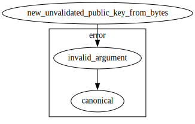
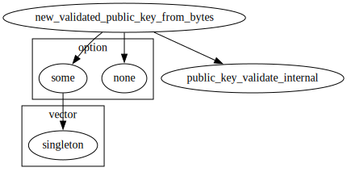
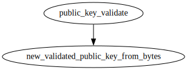
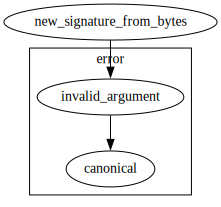
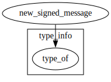
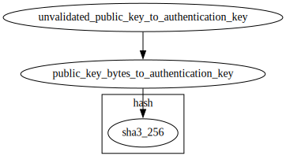
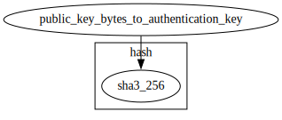

# Module `0x1::ed25519`

Contains functions for:

1. [Ed25519](https://en.wikipedia.org/wiki/EdDSA#Ed25519) digital signatures: i.e., EdDSA signatures over Edwards25519 curves with co-factor 8

-  [Struct `SignedMessage`](#0x1_ed25519_SignedMessage)
-  [Struct `UnvalidatedPublicKey`](#0x1_ed25519_UnvalidatedPublicKey)
-  [Struct `ValidatedPublicKey`](#0x1_ed25519_ValidatedPublicKey)
-  [Struct `Signature`](#0x1_ed25519_Signature)
-  [Constants](#@Constants_0)
-  [Function `new_unvalidated_public_key_from_bytes`](#0x1_ed25519_new_unvalidated_public_key_from_bytes)
-  [Function `new_validated_public_key_from_bytes`](#0x1_ed25519_new_validated_public_key_from_bytes)
-  [Function `new_signature_from_bytes`](#0x1_ed25519_new_signature_from_bytes)
-  [Function `public_key_to_unvalidated`](#0x1_ed25519_public_key_to_unvalidated)
-  [Function `public_key_into_unvalidated`](#0x1_ed25519_public_key_into_unvalidated)
-  [Function `unvalidated_public_key_to_bytes`](#0x1_ed25519_unvalidated_public_key_to_bytes)
-  [Function `validated_public_key_to_bytes`](#0x1_ed25519_validated_public_key_to_bytes)
-  [Function `signature_to_bytes`](#0x1_ed25519_signature_to_bytes)
-  [Function `public_key_validate`](#0x1_ed25519_public_key_validate)
-  [Function `signature_verify_strict`](#0x1_ed25519_signature_verify_strict)
-  [Function `signature_verify_strict_t`](#0x1_ed25519_signature_verify_strict_t)
-  [Function `new_signed_message`](#0x1_ed25519_new_signed_message)
-  [Function `unvalidated_public_key_to_authentication_key`](#0x1_ed25519_unvalidated_public_key_to_authentication_key)
-  [Function `validated_public_key_to_authentication_key`](#0x1_ed25519_validated_public_key_to_authentication_key)
-  [Function `public_key_bytes_to_authentication_key`](#0x1_ed25519_public_key_bytes_to_authentication_key)
-  [Function `public_key_validate_internal`](#0x1_ed25519_public_key_validate_internal)
-  [Function `signature_verify_strict_internal`](#0x1_ed25519_signature_verify_strict_internal)
-  [Specification](#@Specification_1)
    -  [Function `public_key_validate_internal`](#@Specification_1_public_key_validate_internal)
    -  [Function `signature_verify_strict_internal`](#@Specification_1_signature_verify_strict_internal)

<pre><code><b>use</b> <a href="../../move-stdlib/doc/bcs.md#0x1_bcs">0x1::bcs</a>;
<b>use</b> <a href="../../move-stdlib/doc/error.md#0x1_error">0x1::error</a>;
<b>use</b> <a href="../../move-stdlib/doc/hash.md#0x1_hash">0x1::hash</a>;
<b>use</b> <a href="../../move-stdlib/doc/option.md#0x1_option">0x1::option</a>;
<b>use</b> <a href="type_info.md#0x1_type_info">0x1::type_info</a>;
</code></pre>

Show all the modules that "ed25519" depends on directly or indirectly

Show all the modules that depend on "ed25519" directly or indirectly

## Struct `SignedMessage`

A BCS-serializable message, which one can verify signatures on via <code>verify_signature_t</code>

<pre><code><b>struct</b> <a href="ed25519.md#0x1_ed25519_SignedMessage">SignedMessage</a>&lt;MessageType&gt; <b>has</b> drop
</code></pre>

Fields

<dl>
<dt>
<code><a href="type_info.md#0x1_type_info">type_info</a>: <a href="type_info.md#0x1_type_info_TypeInfo">type_info::TypeInfo</a></code>
</dt>
<dd>

</dd>
<dt>
<code>inner: MessageType</code>
</dt>
<dd>

</dd>
</dl>

## Struct `UnvalidatedPublicKey`

An *unvalidated* Ed25519 public key: not necessarily an elliptic curve point, just a sequence of 32 bytes

<pre><code><b>struct</b> <a href="ed25519.md#0x1_ed25519_UnvalidatedPublicKey">UnvalidatedPublicKey</a> <b>has</b> <b>copy</b>, drop, store
</code></pre>

Fields

<dl>
<dt>
<code>bytes: <a href="../../move-stdlib/doc/vector.md#0x1_vector">vector</a>&lt;u8&gt;</code>
</dt>
<dd>

</dd>
</dl>

## Struct `ValidatedPublicKey`

A *validated* Ed25519 public key: not necessarily a prime-order point, could be mixed-order, but will never be
a small-order point.

For now, this struct is not used in any verification functions, but it might be in the future.

<pre><code><b>struct</b> <a href="ed25519.md#0x1_ed25519_ValidatedPublicKey">ValidatedPublicKey</a> <b>has</b> <b>copy</b>, drop, store
</code></pre>

Fields

<dl>
<dt>
<code>bytes: <a href="../../move-stdlib/doc/vector.md#0x1_vector">vector</a>&lt;u8&gt;</code>
</dt>
<dd>

</dd>
</dl>

## Struct `Signature`

A purported Ed25519 signature that can be verified via <code>verify_signature_strict</code> or <code>verify_signature_strict_t</code>.

<pre><code><b>struct</b> <a href="ed25519.md#0x1_ed25519_Signature">Signature</a> <b>has</b> <b>copy</b>, drop, store
</code></pre>

Fields

<dl>
<dt>
<code>bytes: <a href="../../move-stdlib/doc/vector.md#0x1_vector">vector</a>&lt;u8&gt;</code>
</dt>
<dd>

</dd>
</dl>

## Constants

The size of a serialized public key, in bytes.

<pre><code><b>const</b> <a href="ed25519.md#0x1_ed25519_PUBLIC_KEY_NUM_BYTES">PUBLIC_KEY_NUM_BYTES</a>: u64 = 32;
</code></pre>

Wrong number of bytes were given as input when deserializing an Ed25519 public key.

<pre><code><b>const</b> <a href="ed25519.md#0x1_ed25519_E_WRONG_PUBKEY_SIZE">E_WRONG_PUBKEY_SIZE</a>: u64 = 1;
</code></pre>

Wrong number of bytes were given as input when deserializing an Ed25519 signature.

<pre><code><b>const</b> <a href="ed25519.md#0x1_ed25519_E_WRONG_SIGNATURE_SIZE">E_WRONG_SIGNATURE_SIZE</a>: u64 = 2;
</code></pre>

The size of a serialized signature, in bytes.

<pre><code><b>const</b> <a href="ed25519.md#0x1_ed25519_SIGNATURE_NUM_BYTES">SIGNATURE_NUM_BYTES</a>: u64 = 64;
</code></pre>

The identifier of the Ed25519 signature scheme, which is used when deriving Aptos authentication keys by hashing
it together with an Ed25519 public key.

<pre><code><b>const</b> <a href="ed25519.md#0x1_ed25519_SIGNATURE_SCHEME_ID">SIGNATURE_SCHEME_ID</a>: u8 = 0;
</code></pre>

## Function `new_unvalidated_public_key_from_bytes`

Parses the input 32 bytes as an *unvalidated* Ed25519 public key.

<pre><code><b>public</b> <b>fun</b> <a href="ed25519.md#0x1_ed25519_new_unvalidated_public_key_from_bytes">new_unvalidated_public_key_from_bytes</a>(bytes: <a href="../../move-stdlib/doc/vector.md#0x1_vector">vector</a>&lt;u8&gt;): <a href="ed25519.md#0x1_ed25519_UnvalidatedPublicKey">ed25519::UnvalidatedPublicKey</a>
</code></pre>

Implementation

<pre><code><b>public</b> <b>fun</b> <a href="ed25519.md#0x1_ed25519_new_unvalidated_public_key_from_bytes">new_unvalidated_public_key_from_bytes</a>(bytes: <a href="../../move-stdlib/doc/vector.md#0x1_vector">vector</a>&lt;u8&gt;): <a href="ed25519.md#0x1_ed25519_UnvalidatedPublicKey">UnvalidatedPublicKey</a> {
    <b>assert</b>!(std::vector::length(&bytes) == <a href="ed25519.md#0x1_ed25519_PUBLIC_KEY_NUM_BYTES">PUBLIC_KEY_NUM_BYTES</a>, std::error::invalid_argument(<a href="ed25519.md#0x1_ed25519_E_WRONG_PUBKEY_SIZE">E_WRONG_PUBKEY_SIZE</a>));
    <a href="ed25519.md#0x1_ed25519_UnvalidatedPublicKey">UnvalidatedPublicKey</a> { bytes }
}
</code></pre>

Show all the functions that "new_unvalidated_public_key_from_bytes" calls

Show all the functions that call "new_unvalidated_public_key_from_bytes"

## Function `new_validated_public_key_from_bytes`

Parses the input 32 bytes as a *validated* Ed25519 public key.

<pre><code><b>public</b> <b>fun</b> <a href="ed25519.md#0x1_ed25519_new_validated_public_key_from_bytes">new_validated_public_key_from_bytes</a>(bytes: <a href="../../move-stdlib/doc/vector.md#0x1_vector">vector</a>&lt;u8&gt;): <a href="../../move-stdlib/doc/option.md#0x1_option_Option">option::Option</a>&lt;<a href="ed25519.md#0x1_ed25519_ValidatedPublicKey">ed25519::ValidatedPublicKey</a>&gt;
</code></pre>

Implementation

<pre><code><b>public</b> <b>fun</b> <a href="ed25519.md#0x1_ed25519_new_validated_public_key_from_bytes">new_validated_public_key_from_bytes</a>(bytes: <a href="../../move-stdlib/doc/vector.md#0x1_vector">vector</a>&lt;u8&gt;): Option&lt;<a href="ed25519.md#0x1_ed25519_ValidatedPublicKey">ValidatedPublicKey</a>&gt; {
    <b>if</b> (<a href="ed25519.md#0x1_ed25519_public_key_validate_internal">public_key_validate_internal</a>(bytes)) {
        <a href="../../move-stdlib/doc/option.md#0x1_option_some">option::some</a>(<a href="ed25519.md#0x1_ed25519_ValidatedPublicKey">ValidatedPublicKey</a> {
            bytes
        })
    } <b>else</b> {
        <a href="../../move-stdlib/doc/option.md#0x1_option_none">option::none</a>&lt;<a href="ed25519.md#0x1_ed25519_ValidatedPublicKey">ValidatedPublicKey</a>&gt;()
    }
}
</code></pre>

Show all the functions that "new_validated_public_key_from_bytes" calls

Show all the functions that call "new_validated_public_key_from_bytes"

## Function `new_signature_from_bytes`

Parses the input 64 bytes as a purported Ed25519 signature.

<pre><code><b>public</b> <b>fun</b> <a href="ed25519.md#0x1_ed25519_new_signature_from_bytes">new_signature_from_bytes</a>(bytes: <a href="../../move-stdlib/doc/vector.md#0x1_vector">vector</a>&lt;u8&gt;): <a href="ed25519.md#0x1_ed25519_Signature">ed25519::Signature</a>
</code></pre>

Implementation

<pre><code><b>public</b> <b>fun</b> <a href="ed25519.md#0x1_ed25519_new_signature_from_bytes">new_signature_from_bytes</a>(bytes: <a href="../../move-stdlib/doc/vector.md#0x1_vector">vector</a>&lt;u8&gt;): <a href="ed25519.md#0x1_ed25519_Signature">Signature</a> {
    <b>assert</b>!(std::vector::length(&bytes) == <a href="ed25519.md#0x1_ed25519_SIGNATURE_NUM_BYTES">SIGNATURE_NUM_BYTES</a>, std::error::invalid_argument(<a href="ed25519.md#0x1_ed25519_E_WRONG_SIGNATURE_SIZE">E_WRONG_SIGNATURE_SIZE</a>));
    <a href="ed25519.md#0x1_ed25519_Signature">Signature</a> { bytes }
}
</code></pre>

Show all the functions that "new_signature_from_bytes" calls

Show all the functions that call "new_signature_from_bytes"

## Function `public_key_to_unvalidated`

Converts a ValidatedPublicKey to an UnvalidatedPublicKey, which can be used in the strict verification APIs.

<pre><code><b>public</b> <b>fun</b> <a href="ed25519.md#0x1_ed25519_public_key_to_unvalidated">public_key_to_unvalidated</a>(pk: &<a href="ed25519.md#0x1_ed25519_ValidatedPublicKey">ed25519::ValidatedPublicKey</a>): <a href="ed25519.md#0x1_ed25519_UnvalidatedPublicKey">ed25519::UnvalidatedPublicKey</a>
</code></pre>

Implementation

<pre><code><b>public</b> <b>fun</b> <a href="ed25519.md#0x1_ed25519_public_key_to_unvalidated">public_key_to_unvalidated</a>(pk: &<a href="ed25519.md#0x1_ed25519_ValidatedPublicKey">ValidatedPublicKey</a>): <a href="ed25519.md#0x1_ed25519_UnvalidatedPublicKey">UnvalidatedPublicKey</a> {
    <a href="ed25519.md#0x1_ed25519_UnvalidatedPublicKey">UnvalidatedPublicKey</a> {
        bytes: pk.bytes
    }
}
</code></pre>

Show all the functions that "public_key_to_unvalidated" calls

Show all the functions that call "public_key_to_unvalidated"

## Function `public_key_into_unvalidated`

Moves a ValidatedPublicKey into an UnvalidatedPublicKey, which can be used in the strict verification APIs.

<pre><code><b>public</b> <b>fun</b> <a href="ed25519.md#0x1_ed25519_public_key_into_unvalidated">public_key_into_unvalidated</a>(pk: <a href="ed25519.md#0x1_ed25519_ValidatedPublicKey">ed25519::ValidatedPublicKey</a>): <a href="ed25519.md#0x1_ed25519_UnvalidatedPublicKey">ed25519::UnvalidatedPublicKey</a>
</code></pre>

Implementation

<pre><code><b>public</b> <b>fun</b> <a href="ed25519.md#0x1_ed25519_public_key_into_unvalidated">public_key_into_unvalidated</a>(pk: <a href="ed25519.md#0x1_ed25519_ValidatedPublicKey">ValidatedPublicKey</a>): <a href="ed25519.md#0x1_ed25519_UnvalidatedPublicKey">UnvalidatedPublicKey</a> {
    <a href="ed25519.md#0x1_ed25519_UnvalidatedPublicKey">UnvalidatedPublicKey</a> {
        bytes: pk.bytes
    }
}
</code></pre>

Show all the functions that "public_key_into_unvalidated" calls

Show all the functions that call "public_key_into_unvalidated"

## Function `unvalidated_public_key_to_bytes`

Serializes an UnvalidatedPublicKey struct to 32-bytes.

<pre><code><b>public</b> <b>fun</b> <a href="ed25519.md#0x1_ed25519_unvalidated_public_key_to_bytes">unvalidated_public_key_to_bytes</a>(pk: &<a href="ed25519.md#0x1_ed25519_UnvalidatedPublicKey">ed25519::UnvalidatedPublicKey</a>): <a href="../../move-stdlib/doc/vector.md#0x1_vector">vector</a>&lt;u8&gt;
</code></pre>

Implementation

<pre><code><b>public</b> <b>fun</b> <a href="ed25519.md#0x1_ed25519_unvalidated_public_key_to_bytes">unvalidated_public_key_to_bytes</a>(pk: &<a href="ed25519.md#0x1_ed25519_UnvalidatedPublicKey">UnvalidatedPublicKey</a>): <a href="../../move-stdlib/doc/vector.md#0x1_vector">vector</a>&lt;u8&gt; {
    pk.bytes
}
</code></pre>

Show all the functions that "unvalidated_public_key_to_bytes" calls

Show all the functions that call "unvalidated_public_key_to_bytes"

## Function `validated_public_key_to_bytes`

Serializes an ValidatedPublicKey struct to 32-bytes.

<pre><code><b>public</b> <b>fun</b> <a href="ed25519.md#0x1_ed25519_validated_public_key_to_bytes">validated_public_key_to_bytes</a>(pk: &<a href="ed25519.md#0x1_ed25519_ValidatedPublicKey">ed25519::ValidatedPublicKey</a>): <a href="../../move-stdlib/doc/vector.md#0x1_vector">vector</a>&lt;u8&gt;
</code></pre>

Implementation

<pre><code><b>public</b> <b>fun</b> <a href="ed25519.md#0x1_ed25519_validated_public_key_to_bytes">validated_public_key_to_bytes</a>(pk: &<a href="ed25519.md#0x1_ed25519_ValidatedPublicKey">ValidatedPublicKey</a>): <a href="../../move-stdlib/doc/vector.md#0x1_vector">vector</a>&lt;u8&gt; {
    pk.bytes
}
</code></pre>

Show all the functions that "validated_public_key_to_bytes" calls

Show all the functions that call "validated_public_key_to_bytes"

## Function `signature_to_bytes`

Serializes a Signature struct to 64-bytes.

<pre><code><b>public</b> <b>fun</b> <a href="ed25519.md#0x1_ed25519_signature_to_bytes">signature_to_bytes</a>(sig: &<a href="ed25519.md#0x1_ed25519_Signature">ed25519::Signature</a>): <a href="../../move-stdlib/doc/vector.md#0x1_vector">vector</a>&lt;u8&gt;
</code></pre>

Implementation

<pre><code><b>public</b> <b>fun</b> <a href="ed25519.md#0x1_ed25519_signature_to_bytes">signature_to_bytes</a>(sig: &<a href="ed25519.md#0x1_ed25519_Signature">Signature</a>): <a href="../../move-stdlib/doc/vector.md#0x1_vector">vector</a>&lt;u8&gt; {
    sig.bytes
}
</code></pre>

Show all the functions that "signature_to_bytes" calls

Show all the functions that call "signature_to_bytes"

## Function `public_key_validate`

Takes in an *unvalidated* public key and attempts to validate it.
Returns <code>Some(<a href="ed25519.md#0x1_ed25519_ValidatedPublicKey">ValidatedPublicKey</a>)</code> if successful and <code>None</code> otherwise.

<pre><code><b>public</b> <b>fun</b> <a href="ed25519.md#0x1_ed25519_public_key_validate">public_key_validate</a>(pk: &<a href="ed25519.md#0x1_ed25519_UnvalidatedPublicKey">ed25519::UnvalidatedPublicKey</a>): <a href="../../move-stdlib/doc/option.md#0x1_option_Option">option::Option</a>&lt;<a href="ed25519.md#0x1_ed25519_ValidatedPublicKey">ed25519::ValidatedPublicKey</a>&gt;
</code></pre>

Implementation

<pre><code><b>public</b> <b>fun</b> <a href="ed25519.md#0x1_ed25519_public_key_validate">public_key_validate</a>(pk: &<a href="ed25519.md#0x1_ed25519_UnvalidatedPublicKey">UnvalidatedPublicKey</a>): Option&lt;<a href="ed25519.md#0x1_ed25519_ValidatedPublicKey">ValidatedPublicKey</a>&gt; {
    <a href="ed25519.md#0x1_ed25519_new_validated_public_key_from_bytes">new_validated_public_key_from_bytes</a>(pk.bytes)
}
</code></pre>

Show all the functions that "public_key_validate" calls

Show all the functions that call "public_key_validate"

## Function `signature_verify_strict`

Verifies a purported Ed25519 <code>signature</code> under an *unvalidated* <code>public_key</code> on the specified <code>message</code>.
This call will validate the public key by checking it is NOT in the small subgroup.

<pre><code><b>public</b> <b>fun</b> <a href="ed25519.md#0x1_ed25519_signature_verify_strict">signature_verify_strict</a>(signature: &<a href="ed25519.md#0x1_ed25519_Signature">ed25519::Signature</a>, public_key: &<a href="ed25519.md#0x1_ed25519_UnvalidatedPublicKey">ed25519::UnvalidatedPublicKey</a>, message: <a href="../../move-stdlib/doc/vector.md#0x1_vector">vector</a>&lt;u8&gt;): bool
</code></pre>

Implementation

<pre><code><b>public</b> <b>fun</b> <a href="ed25519.md#0x1_ed25519_signature_verify_strict">signature_verify_strict</a>(
    signature: &<a href="ed25519.md#0x1_ed25519_Signature">Signature</a>,
    public_key: &<a href="ed25519.md#0x1_ed25519_UnvalidatedPublicKey">UnvalidatedPublicKey</a>,
    message: <a href="../../move-stdlib/doc/vector.md#0x1_vector">vector</a>&lt;u8&gt;
): bool {
    <a href="ed25519.md#0x1_ed25519_signature_verify_strict_internal">signature_verify_strict_internal</a>(signature.bytes, public_key.bytes, message)
}
</code></pre>

Show all the functions that "signature_verify_strict" calls

Show all the functions that call "signature_verify_strict"

## Function `signature_verify_strict_t`

This function is used to verify a signature on any BCS-serializable type T. For now, it is used to verify the
proof of private key ownership when rotating authentication keys.

<pre><code><b>public</b> <b>fun</b> <a href="ed25519.md#0x1_ed25519_signature_verify_strict_t">signature_verify_strict_t</a>&lt;T: drop&gt;(signature: &<a href="ed25519.md#0x1_ed25519_Signature">ed25519::Signature</a>, public_key: &<a href="ed25519.md#0x1_ed25519_UnvalidatedPublicKey">ed25519::UnvalidatedPublicKey</a>, data: T): bool
</code></pre>

Implementation

<pre><code><b>public</b> <b>fun</b> <a href="ed25519.md#0x1_ed25519_signature_verify_strict_t">signature_verify_strict_t</a>&lt;T: drop&gt;(signature: &<a href="ed25519.md#0x1_ed25519_Signature">Signature</a>, public_key: &<a href="ed25519.md#0x1_ed25519_UnvalidatedPublicKey">UnvalidatedPublicKey</a>, data: T): bool {
    <b>let</b> encoded = <a href="ed25519.md#0x1_ed25519_SignedMessage">SignedMessage</a> {
        <a href="type_info.md#0x1_type_info">type_info</a>: <a href="type_info.md#0x1_type_info_type_of">type_info::type_of</a>&lt;T&gt;(),
        inner: data,
    };

    <a href="ed25519.md#0x1_ed25519_signature_verify_strict_internal">signature_verify_strict_internal</a>(signature.bytes, public_key.bytes, <a href="../../move-stdlib/doc/bcs.md#0x1_bcs_to_bytes">bcs::to_bytes</a>(&encoded))
}
</code></pre>

Show all the functions that "signature_verify_strict_t" calls

Show all the functions that call "signature_verify_strict_t"

## Function `new_signed_message`

Helper method to construct a SignedMessage struct.

<pre><code><b>public</b> <b>fun</b> <a href="ed25519.md#0x1_ed25519_new_signed_message">new_signed_message</a>&lt;T: drop&gt;(data: T): <a href="ed25519.md#0x1_ed25519_SignedMessage">ed25519::SignedMessage</a>&lt;T&gt;
</code></pre>

Implementation

<pre><code><b>public</b> <b>fun</b> <a href="ed25519.md#0x1_ed25519_new_signed_message">new_signed_message</a>&lt;T: drop&gt;(data: T): <a href="ed25519.md#0x1_ed25519_SignedMessage">SignedMessage</a>&lt;T&gt; {
    <a href="ed25519.md#0x1_ed25519_SignedMessage">SignedMessage</a> {
        <a href="type_info.md#0x1_type_info">type_info</a>: <a href="type_info.md#0x1_type_info_type_of">type_info::type_of</a>&lt;T&gt;(),
        inner: data,
    }
}
</code></pre>

Show all the functions that "new_signed_message" calls

Show all the functions that call "new_signed_message"

## Function `unvalidated_public_key_to_authentication_key`

Derives the Aptos-specific authentication key of the given Ed25519 public key.

<pre><code><b>public</b> <b>fun</b> <a href="ed25519.md#0x1_ed25519_unvalidated_public_key_to_authentication_key">unvalidated_public_key_to_authentication_key</a>(pk: &<a href="ed25519.md#0x1_ed25519_UnvalidatedPublicKey">ed25519::UnvalidatedPublicKey</a>): <a href="../../move-stdlib/doc/vector.md#0x1_vector">vector</a>&lt;u8&gt;
</code></pre>

Implementation

<pre><code><b>public</b> <b>fun</b> <a href="ed25519.md#0x1_ed25519_unvalidated_public_key_to_authentication_key">unvalidated_public_key_to_authentication_key</a>(pk: &<a href="ed25519.md#0x1_ed25519_UnvalidatedPublicKey">UnvalidatedPublicKey</a>): <a href="../../move-stdlib/doc/vector.md#0x1_vector">vector</a>&lt;u8&gt; {
    <a href="ed25519.md#0x1_ed25519_public_key_bytes_to_authentication_key">public_key_bytes_to_authentication_key</a>(pk.bytes)
}
</code></pre>

Show all the functions that "unvalidated_public_key_to_authentication_key" calls

Show all the functions that call "unvalidated_public_key_to_authentication_key"

## Function `validated_public_key_to_authentication_key`

Derives the Aptos-specific authentication key of the given Ed25519 public key.

<pre><code><b>public</b> <b>fun</b> <a href="ed25519.md#0x1_ed25519_validated_public_key_to_authentication_key">validated_public_key_to_authentication_key</a>(pk: &<a href="ed25519.md#0x1_ed25519_ValidatedPublicKey">ed25519::ValidatedPublicKey</a>): <a href="../../move-stdlib/doc/vector.md#0x1_vector">vector</a>&lt;u8&gt;
</code></pre>

Implementation

<pre><code><b>public</b> <b>fun</b> <a href="ed25519.md#0x1_ed25519_validated_public_key_to_authentication_key">validated_public_key_to_authentication_key</a>(pk: &<a href="ed25519.md#0x1_ed25519_ValidatedPublicKey">ValidatedPublicKey</a>): <a href="../../move-stdlib/doc/vector.md#0x1_vector">vector</a>&lt;u8&gt; {
    <a href="ed25519.md#0x1_ed25519_public_key_bytes_to_authentication_key">public_key_bytes_to_authentication_key</a>(pk.bytes)
}
</code></pre>

Show all the functions that "validated_public_key_to_authentication_key" calls

Show all the functions that call "validated_public_key_to_authentication_key"

## Function `public_key_bytes_to_authentication_key`

Derives the Aptos-specific authentication key of the given Ed25519 public key.

<pre><code><b>fun</b> <a href="ed25519.md#0x1_ed25519_public_key_bytes_to_authentication_key">public_key_bytes_to_authentication_key</a>(pk_bytes: <a href="../../move-stdlib/doc/vector.md#0x1_vector">vector</a>&lt;u8&gt;): <a href="../../move-stdlib/doc/vector.md#0x1_vector">vector</a>&lt;u8&gt;
</code></pre>

Implementation

<pre><code><b>fun</b> <a href="ed25519.md#0x1_ed25519_public_key_bytes_to_authentication_key">public_key_bytes_to_authentication_key</a>(pk_bytes: <a href="../../move-stdlib/doc/vector.md#0x1_vector">vector</a>&lt;u8&gt;): <a href="../../move-stdlib/doc/vector.md#0x1_vector">vector</a>&lt;u8&gt; {
    std::vector::push_back(&<b>mut</b> pk_bytes, <a href="ed25519.md#0x1_ed25519_SIGNATURE_SCHEME_ID">SIGNATURE_SCHEME_ID</a>);
    std::hash::sha3_256(pk_bytes)
}
</code></pre>

Show all the functions that "public_key_bytes_to_authentication_key" calls

Show all the functions that call "public_key_bytes_to_authentication_key"

## Function `public_key_validate_internal`

Return <code><b>true</b></code> if the bytes in <code>public_key</code> can be parsed as a valid Ed25519 public key: i.e., it passes
points-on-curve and not-in-small-subgroup checks.
Returns <code><b>false</b></code> otherwise.

<pre><code><b>fun</b> <a href="ed25519.md#0x1_ed25519_public_key_validate_internal">public_key_validate_internal</a>(bytes: <a href="../../move-stdlib/doc/vector.md#0x1_vector">vector</a>&lt;u8&gt;): bool
</code></pre>

Implementation

<pre><code><b>native</b> <b>fun</b> <a href="ed25519.md#0x1_ed25519_public_key_validate_internal">public_key_validate_internal</a>(bytes: <a href="../../move-stdlib/doc/vector.md#0x1_vector">vector</a>&lt;u8&gt;): bool;
</code></pre>

Show all the functions that "public_key_validate_internal" calls

Show all the functions that call "public_key_validate_internal"

## Function `signature_verify_strict_internal`

Return true if the Ed25519 <code>signature</code> on <code>message</code> verifies against the Ed25519 <code>public_key</code>.
Returns <code><b>false</b></code> if either:
- <code>signature</code> or <code><b>public</b> key</code> are of wrong sizes
- <code>public_key</code> does not pass points-on-curve or not-in-small-subgroup checks,
- <code>signature</code> does not pass points-on-curve or not-in-small-subgroup checks,
- the signature on <code>message</code> does not verify.

<pre><code><b>fun</b> <a href="ed25519.md#0x1_ed25519_signature_verify_strict_internal">signature_verify_strict_internal</a>(signature: <a href="../../move-stdlib/doc/vector.md#0x1_vector">vector</a>&lt;u8&gt;, public_key: <a href="../../move-stdlib/doc/vector.md#0x1_vector">vector</a>&lt;u8&gt;, message: <a href="../../move-stdlib/doc/vector.md#0x1_vector">vector</a>&lt;u8&gt;): bool
</code></pre>

Implementation

<pre><code><b>native</b> <b>fun</b> <a href="ed25519.md#0x1_ed25519_signature_verify_strict_internal">signature_verify_strict_internal</a>(
    signature: <a href="../../move-stdlib/doc/vector.md#0x1_vector">vector</a>&lt;u8&gt;,
    public_key: <a href="../../move-stdlib/doc/vector.md#0x1_vector">vector</a>&lt;u8&gt;,
    message: <a href="../../move-stdlib/doc/vector.md#0x1_vector">vector</a>&lt;u8&gt;
): bool;
</code></pre>

Show all the functions that "signature_verify_strict_internal" calls

Show all the functions that call "signature_verify_strict_internal"

## Specification

### Function `public_key_validate_internal`

<pre><code><b>fun</b> <a href="ed25519.md#0x1_ed25519_public_key_validate_internal">public_key_validate_internal</a>(bytes: <a href="../../move-stdlib/doc/vector.md#0x1_vector">vector</a>&lt;u8&gt;): bool
</code></pre>

<pre><code><b>pragma</b> opaque;
</code></pre>

### Function `signature_verify_strict_internal`

<pre><code><b>fun</b> <a href="ed25519.md#0x1_ed25519_signature_verify_strict_internal">signature_verify_strict_internal</a>(signature: <a href="../../move-stdlib/doc/vector.md#0x1_vector">vector</a>&lt;u8&gt;, public_key: <a href="../../move-stdlib/doc/vector.md#0x1_vector">vector</a>&lt;u8&gt;, message: <a href="../../move-stdlib/doc/vector.md#0x1_vector">vector</a>&lt;u8&gt;): bool
</code></pre>

<pre><code><b>pragma</b> opaque;
</code></pre>

[move-book]: https://move-language.github.io/move/introduction.html
