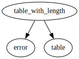
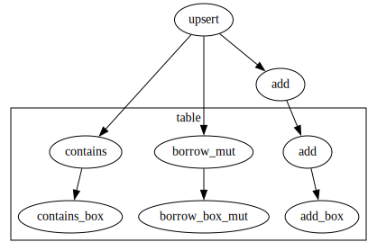
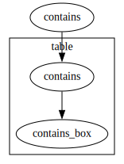

# Module `0x1::table_with_length`

Extends Table and provides functions such as length and the ability to be destroyed

-  [Struct `TableWithLength`](#0x1_table_with_length_TableWithLength)
-  [Constants](#@Constants_0)
-  [Function `new`](#0x1_table_with_length_new)
-  [Function `destroy_empty`](#0x1_table_with_length_destroy_empty)
-  [Function `add`](#0x1_table_with_length_add)
-  [Function `borrow`](#0x1_table_with_length_borrow)
-  [Function `borrow_mut`](#0x1_table_with_length_borrow_mut)
-  [Function `length`](#0x1_table_with_length_length)
-  [Function `empty`](#0x1_table_with_length_empty)
-  [Function `borrow_mut_with_default`](#0x1_table_with_length_borrow_mut_with_default)
-  [Function `upsert`](#0x1_table_with_length_upsert)
-  [Function `remove`](#0x1_table_with_length_remove)
-  [Function `contains`](#0x1_table_with_length_contains)

<pre><code><b>use</b> <a href="../../move-stdlib/doc/error.md#0x1_error">0x1::error</a>;
<b>use</b> <a href="table.md#0x1_table">0x1::table</a>;
</code></pre>

Show all the modules that "table_with_length" depends on directly or indirectly

Show all the modules that depend on "table_with_length" directly or indirectly

## Struct `TableWithLength`

Type of tables

<pre><code><b>struct</b> <a href="table_with_length.md#0x1_table_with_length_TableWithLength">TableWithLength</a>&lt;K: <b>copy</b>, drop, V&gt; <b>has</b> store
</code></pre>

Fields

<dl>
<dt>
<code>inner: <a href="table.md#0x1_table_Table">table::Table</a>&lt;K, V&gt;</code>
</dt>
<dd>

</dd>
<dt>
<code>length: u64</code>
</dt>
<dd>

</dd>
</dl>

## Constants

<pre><code><b>const</b> <a href="table_with_length.md#0x1_table_with_length_EALREADY_EXISTS">EALREADY_EXISTS</a>: u64 = 100;
</code></pre>

<pre><code><b>const</b> <a href="table_with_length.md#0x1_table_with_length_ENOT_EMPTY">ENOT_EMPTY</a>: u64 = 102;
</code></pre>

<pre><code><b>const</b> <a href="table_with_length.md#0x1_table_with_length_ENOT_FOUND">ENOT_FOUND</a>: u64 = 101;
</code></pre>

## Function `new`

Create a new Table.

<pre><code><b>public</b> <b>fun</b> <a href="table_with_length.md#0x1_table_with_length_new">new</a>&lt;K: <b>copy</b>, drop, V: store&gt;(): <a href="table_with_length.md#0x1_table_with_length_TableWithLength">table_with_length::TableWithLength</a>&lt;K, V&gt;
</code></pre>

Implementation

<pre><code><b>public</b> <b>fun</b> <a href="table_with_length.md#0x1_table_with_length_new">new</a>&lt;K: <b>copy</b> + drop, V: store&gt;(): <a href="table_with_length.md#0x1_table_with_length_TableWithLength">TableWithLength</a>&lt;K, V&gt; {
    <a href="table_with_length.md#0x1_table_with_length_TableWithLength">TableWithLength</a> {
        inner: <a href="table.md#0x1_table_new">table::new</a>&lt;K, V&gt;(),
        length: 0,
    }
}
</code></pre>

Show all the functions that "new" calls

Show all the functions that call "new"

## Function `destroy_empty`

Destroy a table. The table must be empty to succeed.

<pre><code><b>public</b> <b>fun</b> <a href="table_with_length.md#0x1_table_with_length_destroy_empty">destroy_empty</a>&lt;K: <b>copy</b>, drop, V&gt;(<a href="table.md#0x1_table">table</a>: <a href="table_with_length.md#0x1_table_with_length_TableWithLength">table_with_length::TableWithLength</a>&lt;K, V&gt;)
</code></pre>

Implementation

<pre><code><b>public</b> <b>fun</b> <a href="table_with_length.md#0x1_table_with_length_destroy_empty">destroy_empty</a>&lt;K: <b>copy</b> + drop, V&gt;(<a href="table.md#0x1_table">table</a>: <a href="table_with_length.md#0x1_table_with_length_TableWithLength">TableWithLength</a>&lt;K, V&gt;) {
    <b>assert</b>!(<a href="table.md#0x1_table">table</a>.length == 0, <a href="../../move-stdlib/doc/error.md#0x1_error_invalid_state">error::invalid_state</a>(<a href="table_with_length.md#0x1_table_with_length_ENOT_EMPTY">ENOT_EMPTY</a>));
    <b>let</b> <a href="table_with_length.md#0x1_table_with_length_TableWithLength">TableWithLength</a> { inner, length: _ } = <a href="table.md#0x1_table">table</a>;
    <a href="table.md#0x1_table_destroy">table::destroy</a>(inner)
}
</code></pre>

Show all the functions that "destroy_empty" calls

Show all the functions that call "destroy_empty"

## Function `add`

Add a new entry to the table. Aborts if an entry for this
key already exists. The entry itself is not stored in the
table, and cannot be discovered from it.

<pre><code><b>public</b> <b>fun</b> <a href="table_with_length.md#0x1_table_with_length_add">add</a>&lt;K: <b>copy</b>, drop, V&gt;(<a href="table.md#0x1_table">table</a>: &<b>mut</b> <a href="table_with_length.md#0x1_table_with_length_TableWithLength">table_with_length::TableWithLength</a>&lt;K, V&gt;, key: K, val: V)
</code></pre>

Implementation

<pre><code><b>public</b> <b>fun</b> <a href="table_with_length.md#0x1_table_with_length_add">add</a>&lt;K: <b>copy</b> + drop, V&gt;(<a href="table.md#0x1_table">table</a>: &<b>mut</b> <a href="table_with_length.md#0x1_table_with_length_TableWithLength">TableWithLength</a>&lt;K, V&gt;, key: K, val: V) {
    <a href="table.md#0x1_table_add">table::add</a>(&<b>mut</b> <a href="table.md#0x1_table">table</a>.inner, key, val);
    <a href="table.md#0x1_table">table</a>.length = <a href="table.md#0x1_table">table</a>.length + 1;
}
</code></pre>

Show all the functions that "add" calls

Show all the functions that call "add"

## Function `borrow`

Acquire an immutable reference to the value which <code>key</code> maps to.
Aborts if there is no entry for <code>key</code>.

<pre><code><b>public</b> <b>fun</b> <a href="table_with_length.md#0x1_table_with_length_borrow">borrow</a>&lt;K: <b>copy</b>, drop, V&gt;(<a href="table.md#0x1_table">table</a>: &<a href="table_with_length.md#0x1_table_with_length_TableWithLength">table_with_length::TableWithLength</a>&lt;K, V&gt;, key: K): &V
</code></pre>

Implementation

<pre><code><b>public</b> <b>fun</b> <a href="table_with_length.md#0x1_table_with_length_borrow">borrow</a>&lt;K: <b>copy</b> + drop, V&gt;(<a href="table.md#0x1_table">table</a>: &<a href="table_with_length.md#0x1_table_with_length_TableWithLength">TableWithLength</a>&lt;K, V&gt;, key: K): &V {
    <a href="table.md#0x1_table_borrow">table::borrow</a>(&<a href="table.md#0x1_table">table</a>.inner, key)
}
</code></pre>

Show all the functions that "borrow" calls

Show all the functions that call "borrow"

## Function `borrow_mut`

Acquire a mutable reference to the value which <code>key</code> maps to.
Aborts if there is no entry for <code>key</code>.

<pre><code><b>public</b> <b>fun</b> <a href="table_with_length.md#0x1_table_with_length_borrow_mut">borrow_mut</a>&lt;K: <b>copy</b>, drop, V&gt;(<a href="table.md#0x1_table">table</a>: &<b>mut</b> <a href="table_with_length.md#0x1_table_with_length_TableWithLength">table_with_length::TableWithLength</a>&lt;K, V&gt;, key: K): &<b>mut</b> V
</code></pre>

Implementation

<pre><code><b>public</b> <b>fun</b> <a href="table_with_length.md#0x1_table_with_length_borrow_mut">borrow_mut</a>&lt;K: <b>copy</b> + drop, V&gt;(<a href="table.md#0x1_table">table</a>: &<b>mut</b> <a href="table_with_length.md#0x1_table_with_length_TableWithLength">TableWithLength</a>&lt;K, V&gt;, key: K): &<b>mut</b> V {
    <a href="table.md#0x1_table_borrow_mut">table::borrow_mut</a>(&<b>mut</b> <a href="table.md#0x1_table">table</a>.inner, key)
}
</code></pre>

Show all the functions that "borrow_mut" calls

Show all the functions that call "borrow_mut"

## Function `length`

Returns the length of the table, i.e. the number of entries.

<pre><code><b>public</b> <b>fun</b> <a href="table_with_length.md#0x1_table_with_length_length">length</a>&lt;K: <b>copy</b>, drop, V&gt;(<a href="table.md#0x1_table">table</a>: &<a href="table_with_length.md#0x1_table_with_length_TableWithLength">table_with_length::TableWithLength</a>&lt;K, V&gt;): u64
</code></pre>

Implementation

<pre><code><b>public</b> <b>fun</b> <a href="table_with_length.md#0x1_table_with_length_length">length</a>&lt;K: <b>copy</b> + drop, V&gt;(<a href="table.md#0x1_table">table</a>: &<a href="table_with_length.md#0x1_table_with_length_TableWithLength">TableWithLength</a>&lt;K, V&gt;): u64 {
    <a href="table.md#0x1_table">table</a>.length
}
</code></pre>

Show all the functions that "length" calls

Show all the functions that call "length"

## Function `empty`

Returns true if this table is empty.

<pre><code><b>public</b> <b>fun</b> <a href="table_with_length.md#0x1_table_with_length_empty">empty</a>&lt;K: <b>copy</b>, drop, V&gt;(<a href="table.md#0x1_table">table</a>: &<a href="table_with_length.md#0x1_table_with_length_TableWithLength">table_with_length::TableWithLength</a>&lt;K, V&gt;): bool
</code></pre>

Implementation

<pre><code><b>public</b> <b>fun</b> <a href="table_with_length.md#0x1_table_with_length_empty">empty</a>&lt;K: <b>copy</b> + drop, V&gt;(<a href="table.md#0x1_table">table</a>: &<a href="table_with_length.md#0x1_table_with_length_TableWithLength">TableWithLength</a>&lt;K, V&gt;): bool {
    <a href="table.md#0x1_table">table</a>.length == 0
}
</code></pre>

Show all the functions that "empty" calls

Show all the functions that call "empty"

## Function `borrow_mut_with_default`

Acquire a mutable reference to the value which <code>key</code> maps to.
Insert the pair (<code>key</code>, <code>default</code>) first if there is no entry for <code>key</code>.

<pre><code><b>public</b> <b>fun</b> <a href="table_with_length.md#0x1_table_with_length_borrow_mut_with_default">borrow_mut_with_default</a>&lt;K: <b>copy</b>, drop, V: drop&gt;(<a href="table.md#0x1_table">table</a>: &<b>mut</b> <a href="table_with_length.md#0x1_table_with_length_TableWithLength">table_with_length::TableWithLength</a>&lt;K, V&gt;, key: K, default: V): &<b>mut</b> V
</code></pre>

Implementation

<pre><code><b>public</b> <b>fun</b> <a href="table_with_length.md#0x1_table_with_length_borrow_mut_with_default">borrow_mut_with_default</a>&lt;K: <b>copy</b> + drop, V: drop&gt;(<a href="table.md#0x1_table">table</a>: &<b>mut</b> <a href="table_with_length.md#0x1_table_with_length_TableWithLength">TableWithLength</a>&lt;K, V&gt;, key: K, default: V): &<b>mut</b> V {
    <b>if</b> (<a href="table.md#0x1_table_contains">table::contains</a>(&<a href="table.md#0x1_table">table</a>.inner, key)) {
        <a href="table.md#0x1_table_borrow_mut">table::borrow_mut</a>(&<b>mut</b> <a href="table.md#0x1_table">table</a>.inner, key)
    } <b>else</b> {
        <a href="table.md#0x1_table_add">table::add</a>(&<b>mut</b> <a href="table.md#0x1_table">table</a>.inner, key, default);
        <a href="table.md#0x1_table">table</a>.length = <a href="table.md#0x1_table">table</a>.length + 1;
        <a href="table.md#0x1_table_borrow_mut">table::borrow_mut</a>(&<b>mut</b> <a href="table.md#0x1_table">table</a>.inner, key)
    }
}
</code></pre>

Show all the functions that "borrow_mut_with_default" calls

Show all the functions that call "borrow_mut_with_default"

## Function `upsert`

Insert the pair (<code>key</code>, <code>value</code>) if there is no entry for <code>key</code>.
update the value of the entry for <code>key</code> to <code>value</code> otherwise

<pre><code><b>public</b> <b>fun</b> <a href="table_with_length.md#0x1_table_with_length_upsert">upsert</a>&lt;K: <b>copy</b>, drop, V: drop&gt;(<a href="table.md#0x1_table">table</a>: &<b>mut</b> <a href="table_with_length.md#0x1_table_with_length_TableWithLength">table_with_length::TableWithLength</a>&lt;K, V&gt;, key: K, value: V)
</code></pre>

Implementation

<pre><code><b>public</b> <b>fun</b> <a href="table_with_length.md#0x1_table_with_length_upsert">upsert</a>&lt;K: <b>copy</b> + drop, V: drop&gt;(<a href="table.md#0x1_table">table</a>: &<b>mut</b> <a href="table_with_length.md#0x1_table_with_length_TableWithLength">TableWithLength</a>&lt;K, V&gt;, key: K, value: V) {
    <b>if</b> (!<a href="table.md#0x1_table_contains">table::contains</a>(&<a href="table.md#0x1_table">table</a>.inner, key)) {
        <a href="table_with_length.md#0x1_table_with_length_add">add</a>(<a href="table.md#0x1_table">table</a>, <b>copy</b> key, value)
    } <b>else</b> {
        <b>let</b> ref = <a href="table.md#0x1_table_borrow_mut">table::borrow_mut</a>(&<b>mut</b> <a href="table.md#0x1_table">table</a>.inner, key);
        *ref = value;
    };
}
</code></pre>

Show all the functions that "upsert" calls

Show all the functions that call "upsert"

## Function `remove`

Remove from <code><a href="table.md#0x1_table">table</a></code> and return the value which <code>key</code> maps to.
Aborts if there is no entry for <code>key</code>.

<pre><code><b>public</b> <b>fun</b> <a href="table_with_length.md#0x1_table_with_length_remove">remove</a>&lt;K: <b>copy</b>, drop, V&gt;(<a href="table.md#0x1_table">table</a>: &<b>mut</b> <a href="table_with_length.md#0x1_table_with_length_TableWithLength">table_with_length::TableWithLength</a>&lt;K, V&gt;, key: K): V
</code></pre>

Implementation

<pre><code><b>public</b> <b>fun</b> <a href="table_with_length.md#0x1_table_with_length_remove">remove</a>&lt;K: <b>copy</b> + drop, V&gt;(<a href="table.md#0x1_table">table</a>: &<b>mut</b> <a href="table_with_length.md#0x1_table_with_length_TableWithLength">TableWithLength</a>&lt;K, V&gt;, key: K): V {
    <b>let</b> val = <a href="table.md#0x1_table_remove">table::remove</a>(&<b>mut</b> <a href="table.md#0x1_table">table</a>.inner, key);
    <a href="table.md#0x1_table">table</a>.length = <a href="table.md#0x1_table">table</a>.length - 1;
    val
}
</code></pre>

Show all the functions that "remove" calls

Show all the functions that call "remove"

## Function `contains`

Returns true iff <code><a href="table.md#0x1_table">table</a></code> contains an entry for <code>key</code>.

<pre><code><b>public</b> <b>fun</b> <a href="table_with_length.md#0x1_table_with_length_contains">contains</a>&lt;K: <b>copy</b>, drop, V&gt;(<a href="table.md#0x1_table">table</a>: &<a href="table_with_length.md#0x1_table_with_length_TableWithLength">table_with_length::TableWithLength</a>&lt;K, V&gt;, key: K): bool
</code></pre>

Implementation

<pre><code><b>public</b> <b>fun</b> <a href="table_with_length.md#0x1_table_with_length_contains">contains</a>&lt;K: <b>copy</b> + drop, V&gt;(<a href="table.md#0x1_table">table</a>: &<a href="table_with_length.md#0x1_table_with_length_TableWithLength">TableWithLength</a>&lt;K, V&gt;, key: K): bool {
    <a href="table.md#0x1_table_contains">table::contains</a>(&<a href="table.md#0x1_table">table</a>.inner, key)
}
</code></pre>

Show all the functions that "contains" calls

Show all the functions that call "contains"

[move-book]: https://move-language.github.io/move/introduction.html
