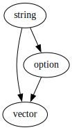
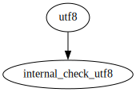
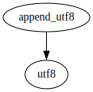
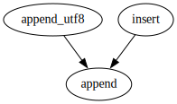
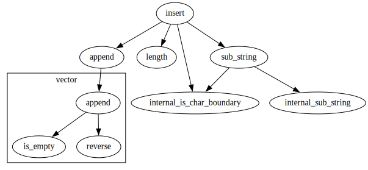
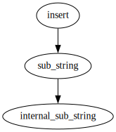
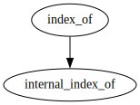

# Module `0x1::string`

The <code><a href="string.md#0x1_string">string</a></code> module defines the <code><a href="string.md#0x1_string_String">String</a></code> type which represents UTF8 encoded strings.

-  [Struct `String`](#0x1_string_String)
-  [Constants](#@Constants_0)
-  [Function `utf8`](#0x1_string_utf8)
-  [Function `try_utf8`](#0x1_string_try_utf8)
-  [Function `bytes`](#0x1_string_bytes)
-  [Function `is_empty`](#0x1_string_is_empty)
-  [Function `length`](#0x1_string_length)
-  [Function `append`](#0x1_string_append)
-  [Function `append_utf8`](#0x1_string_append_utf8)
-  [Function `insert`](#0x1_string_insert)
-  [Function `sub_string`](#0x1_string_sub_string)
-  [Function `index_of`](#0x1_string_index_of)
-  [Function `internal_check_utf8`](#0x1_string_internal_check_utf8)
-  [Function `internal_is_char_boundary`](#0x1_string_internal_is_char_boundary)
-  [Function `internal_sub_string`](#0x1_string_internal_sub_string)
-  [Function `internal_index_of`](#0x1_string_internal_index_of)

<pre><code><b>use</b> <a href="option.md#0x1_option">0x1::option</a>;
<b>use</b> <a href="vector.md#0x1_vector">0x1::vector</a>;
</code></pre>

Show all the modules that "string" depends on directly or indirectly

Show all the modules that depend on "string" directly or indirectly

## Struct `String`

A <code><a href="string.md#0x1_string_String">String</a></code> holds a sequence of bytes which is guaranteed to be in utf8 format.

<pre><code><b>struct</b> <a href="string.md#0x1_string_String">String</a> <b>has</b> <b>copy</b>, drop, store
</code></pre>

Fields

<dl>
<dt>
<code>bytes: <a href="vector.md#0x1_vector">vector</a>&lt;u8&gt;</code>
</dt>
<dd>

</dd>
</dl>

## Constants

Index out of range.

<pre><code><b>const</b> <a href="string.md#0x1_string_EINVALID_INDEX">EINVALID_INDEX</a>: u64 = 2;
</code></pre>

An invalid UTF8 encoding.

<pre><code><b>const</b> <a href="string.md#0x1_string_EINVALID_UTF8">EINVALID_UTF8</a>: u64 = 1;
</code></pre>

## Function `utf8`

Creates a new string from a sequence of bytes. Aborts if the bytes do not represent valid utf8.

<pre><code><b>public</b> <b>fun</b> <a href="string.md#0x1_string_utf8">utf8</a>(bytes: <a href="vector.md#0x1_vector">vector</a>&lt;u8&gt;): <a href="string.md#0x1_string_String">string::String</a>
</code></pre>

Implementation

<pre><code><b>public</b> <b>fun</b> <a href="string.md#0x1_string_utf8">utf8</a>(bytes: <a href="vector.md#0x1_vector">vector</a>&lt;u8&gt;): <a href="string.md#0x1_string_String">String</a> {
    <b>assert</b>!(<a href="string.md#0x1_string_internal_check_utf8">internal_check_utf8</a>(&bytes), <a href="string.md#0x1_string_EINVALID_UTF8">EINVALID_UTF8</a>);
    <a href="string.md#0x1_string_String">String</a>{bytes}
}
</code></pre>

Show all the functions that "utf8" calls

Show all the functions that call "utf8"

## Function `try_utf8`

Tries to create a new string from a sequence of bytes.

<pre><code><b>public</b> <b>fun</b> <a href="string.md#0x1_string_try_utf8">try_utf8</a>(bytes: <a href="vector.md#0x1_vector">vector</a>&lt;u8&gt;): <a href="option.md#0x1_option_Option">option::Option</a>&lt;<a href="string.md#0x1_string_String">string::String</a>&gt;
</code></pre>

Implementation

<pre><code><b>public</b> <b>fun</b> <a href="string.md#0x1_string_try_utf8">try_utf8</a>(bytes: <a href="vector.md#0x1_vector">vector</a>&lt;u8&gt;): Option&lt;<a href="string.md#0x1_string_String">String</a>&gt; {
    <b>if</b> (<a href="string.md#0x1_string_internal_check_utf8">internal_check_utf8</a>(&bytes)) {
        <a href="option.md#0x1_option_some">option::some</a>(<a href="string.md#0x1_string_String">String</a>{bytes})
    } <b>else</b> {
        <a href="option.md#0x1_option_none">option::none</a>()
    }
}
</code></pre>

Show all the functions that "try_utf8" calls

Show all the functions that call "try_utf8"

## Function `bytes`

Returns a reference to the underlying byte vector.

<pre><code><b>public</b> <b>fun</b> <a href="string.md#0x1_string_bytes">bytes</a>(s: &<a href="string.md#0x1_string_String">string::String</a>): &<a href="vector.md#0x1_vector">vector</a>&lt;u8&gt;
</code></pre>

Implementation

<pre><code><b>public</b> <b>fun</b> <a href="string.md#0x1_string_bytes">bytes</a>(s: &<a href="string.md#0x1_string_String">String</a>): &<a href="vector.md#0x1_vector">vector</a>&lt;u8&gt; {
    &s.bytes
}
</code></pre>

Show all the functions that "bytes" calls

Show all the functions that call "bytes"

## Function `is_empty`

Checks whether this string is empty.

<pre><code><b>public</b> <b>fun</b> <a href="string.md#0x1_string_is_empty">is_empty</a>(s: &<a href="string.md#0x1_string_String">string::String</a>): bool
</code></pre>

Implementation

<pre><code><b>public</b> <b>fun</b> <a href="string.md#0x1_string_is_empty">is_empty</a>(s: &<a href="string.md#0x1_string_String">String</a>): bool {
    <a href="vector.md#0x1_vector_is_empty">vector::is_empty</a>(&s.bytes)
}
</code></pre>

Show all the functions that "is_empty" calls

Show all the functions that call "is_empty"

## Function `length`

Returns the length of this string, in bytes.

<pre><code><b>public</b> <b>fun</b> <a href="string.md#0x1_string_length">length</a>(s: &<a href="string.md#0x1_string_String">string::String</a>): u64
</code></pre>

Implementation

<pre><code><b>public</b> <b>fun</b> <a href="string.md#0x1_string_length">length</a>(s: &<a href="string.md#0x1_string_String">String</a>): u64 {
    <a href="vector.md#0x1_vector_length">vector::length</a>(&s.bytes)
}
</code></pre>

Show all the functions that "length" calls

Show all the functions that call "length"

## Function `append`

Appends a string.

<pre><code><b>public</b> <b>fun</b> <a href="string.md#0x1_string_append">append</a>(s: &<b>mut</b> <a href="string.md#0x1_string_String">string::String</a>, r: <a href="string.md#0x1_string_String">string::String</a>)
</code></pre>

Implementation

<pre><code><b>public</b> <b>fun</b> <a href="string.md#0x1_string_append">append</a>(s: &<b>mut</b> <a href="string.md#0x1_string_String">String</a>, r: <a href="string.md#0x1_string_String">String</a>) {
    <a href="vector.md#0x1_vector_append">vector::append</a>(&<b>mut</b> s.bytes, r.bytes)
}
</code></pre>

Show all the functions that "append" calls

Show all the functions that call "append"

## Function `append_utf8`

Appends bytes which must be in valid utf8 format.

<pre><code><b>public</b> <b>fun</b> <a href="string.md#0x1_string_append_utf8">append_utf8</a>(s: &<b>mut</b> <a href="string.md#0x1_string_String">string::String</a>, bytes: <a href="vector.md#0x1_vector">vector</a>&lt;u8&gt;)
</code></pre>

Implementation

<pre><code><b>public</b> <b>fun</b> <a href="string.md#0x1_string_append_utf8">append_utf8</a>(s: &<b>mut</b> <a href="string.md#0x1_string_String">String</a>, bytes: <a href="vector.md#0x1_vector">vector</a>&lt;u8&gt;) {
    <a href="string.md#0x1_string_append">append</a>(s, <a href="string.md#0x1_string_utf8">utf8</a>(bytes))
}
</code></pre>

Show all the functions that "append_utf8" calls

Show all the functions that call "append_utf8"

## Function `insert`

Insert the other string at the byte index in given string. The index must be at a valid utf8 char
boundary.

<pre><code><b>public</b> <b>fun</b> <a href="string.md#0x1_string_insert">insert</a>(s: &<b>mut</b> <a href="string.md#0x1_string_String">string::String</a>, at: u64, o: <a href="string.md#0x1_string_String">string::String</a>)
</code></pre>

Implementation

<pre><code><b>public</b> <b>fun</b> <a href="string.md#0x1_string_insert">insert</a>(s: &<b>mut</b> <a href="string.md#0x1_string_String">String</a>, at: u64, o: <a href="string.md#0x1_string_String">String</a>) {
    <b>let</b> bytes = &s.bytes;
    <b>assert</b>!(at &lt;= <a href="vector.md#0x1_vector_length">vector::length</a>(bytes) && <a href="string.md#0x1_string_internal_is_char_boundary">internal_is_char_boundary</a>(bytes, at), <a href="string.md#0x1_string_EINVALID_INDEX">EINVALID_INDEX</a>);
    <b>let</b> l = <a href="string.md#0x1_string_length">length</a>(s);
    <b>let</b> front = <a href="string.md#0x1_string_sub_string">sub_string</a>(s, 0, at);
    <b>let</b> end = <a href="string.md#0x1_string_sub_string">sub_string</a>(s, at, l);
    <a href="string.md#0x1_string_append">append</a>(&<b>mut</b> front, o);
    <a href="string.md#0x1_string_append">append</a>(&<b>mut</b> front, end);
    *s = front;
}
</code></pre>

Show all the functions that "insert" calls

Show all the functions that call "insert"

## Function `sub_string`

Returns a sub-string using the given byte indices, where <code>i</code> is the first byte position and <code>j</code> is the start
of the first byte not included (or the length of the string). The indices must be at valid utf8 char boundaries,
guaranteeing that the result is valid utf8.

<pre><code><b>public</b> <b>fun</b> <a href="string.md#0x1_string_sub_string">sub_string</a>(s: &<a href="string.md#0x1_string_String">string::String</a>, i: u64, j: u64): <a href="string.md#0x1_string_String">string::String</a>
</code></pre>

Implementation

<pre><code><b>public</b> <b>fun</b> <a href="string.md#0x1_string_sub_string">sub_string</a>(s: &<a href="string.md#0x1_string_String">String</a>, i: u64, j: u64): <a href="string.md#0x1_string_String">String</a> {
    <b>let</b> bytes = &s.bytes;
    <b>let</b> l = <a href="vector.md#0x1_vector_length">vector::length</a>(bytes);
    <b>assert</b>!(
        j &lt;= l && i &lt;= j && <a href="string.md#0x1_string_internal_is_char_boundary">internal_is_char_boundary</a>(bytes, i) && <a href="string.md#0x1_string_internal_is_char_boundary">internal_is_char_boundary</a>(bytes, j),
        <a href="string.md#0x1_string_EINVALID_INDEX">EINVALID_INDEX</a>
    );
    <a href="string.md#0x1_string_String">String</a>{bytes: <a href="string.md#0x1_string_internal_sub_string">internal_sub_string</a>(bytes, i, j)}
}
</code></pre>

Show all the functions that "sub_string" calls

Show all the functions that call "sub_string"

## Function `index_of`

Computes the index of the first occurrence of a string. Returns <code><a href="string.md#0x1_string_length">length</a>(s)</code> if no occurrence found.

<pre><code><b>public</b> <b>fun</b> <a href="string.md#0x1_string_index_of">index_of</a>(s: &<a href="string.md#0x1_string_String">string::String</a>, r: &<a href="string.md#0x1_string_String">string::String</a>): u64
</code></pre>

Implementation

<pre><code><b>public</b> <b>fun</b> <a href="string.md#0x1_string_index_of">index_of</a>(s: &<a href="string.md#0x1_string_String">String</a>, r: &<a href="string.md#0x1_string_String">String</a>): u64 {
    <a href="string.md#0x1_string_internal_index_of">internal_index_of</a>(&s.bytes, &r.bytes)
}
</code></pre>

Show all the functions that "index_of" calls

Show all the functions that call "index_of"

## Function `internal_check_utf8`

<pre><code><b>public</b> <b>fun</b> <a href="string.md#0x1_string_internal_check_utf8">internal_check_utf8</a>(v: &<a href="vector.md#0x1_vector">vector</a>&lt;u8&gt;): bool
</code></pre>

Implementation

<pre><code><b>public</b> <b>native</b> <b>fun</b> <a href="string.md#0x1_string_internal_check_utf8">internal_check_utf8</a>(v: &<a href="vector.md#0x1_vector">vector</a>&lt;u8&gt;): bool;
</code></pre>

Show all the functions that "internal_check_utf8" calls

Show all the functions that call "internal_check_utf8"

## Function `internal_is_char_boundary`

<pre><code><b>fun</b> <a href="string.md#0x1_string_internal_is_char_boundary">internal_is_char_boundary</a>(v: &<a href="vector.md#0x1_vector">vector</a>&lt;u8&gt;, i: u64): bool
</code></pre>

Implementation

<pre><code><b>native</b> <b>fun</b> <a href="string.md#0x1_string_internal_is_char_boundary">internal_is_char_boundary</a>(v: &<a href="vector.md#0x1_vector">vector</a>&lt;u8&gt;, i: u64): bool;
</code></pre>

Show all the functions that "internal_is_char_boundary" calls

Show all the functions that call "internal_is_char_boundary"

## Function `internal_sub_string`

<pre><code><b>fun</b> <a href="string.md#0x1_string_internal_sub_string">internal_sub_string</a>(v: &<a href="vector.md#0x1_vector">vector</a>&lt;u8&gt;, i: u64, j: u64): <a href="vector.md#0x1_vector">vector</a>&lt;u8&gt;
</code></pre>

Implementation

<pre><code><b>native</b> <b>fun</b> <a href="string.md#0x1_string_internal_sub_string">internal_sub_string</a>(v: &<a href="vector.md#0x1_vector">vector</a>&lt;u8&gt;, i: u64, j: u64): <a href="vector.md#0x1_vector">vector</a>&lt;u8&gt;;
</code></pre>

Show all the functions that "internal_sub_string" calls

Show all the functions that call "internal_sub_string"

## Function `internal_index_of`

<pre><code><b>fun</b> <a href="string.md#0x1_string_internal_index_of">internal_index_of</a>(v: &<a href="vector.md#0x1_vector">vector</a>&lt;u8&gt;, r: &<a href="vector.md#0x1_vector">vector</a>&lt;u8&gt;): u64
</code></pre>

Implementation

<pre><code><b>native</b> <b>fun</b> <a href="string.md#0x1_string_internal_index_of">internal_index_of</a>(v: &<a href="vector.md#0x1_vector">vector</a>&lt;u8&gt;, r: &<a href="vector.md#0x1_vector">vector</a>&lt;u8&gt;): u64;
</code></pre>

Show all the functions that "internal_index_of" calls

Show all the functions that call "internal_index_of"

[move-book]: https://move-language.github.io/move/introduction.html
